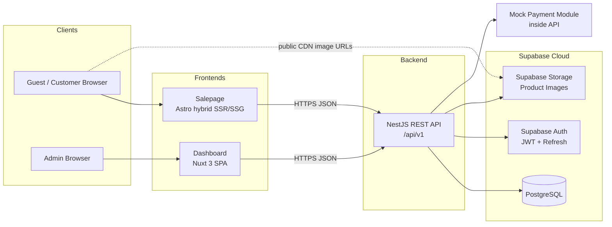
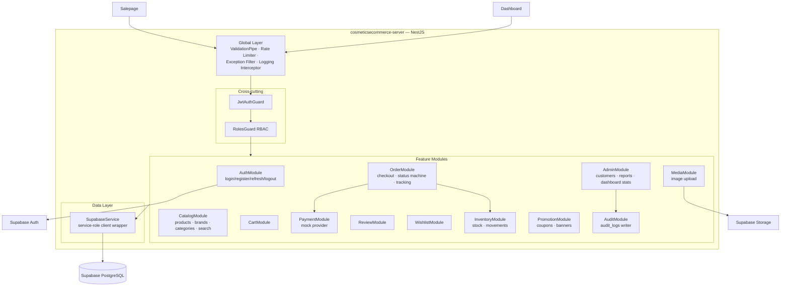
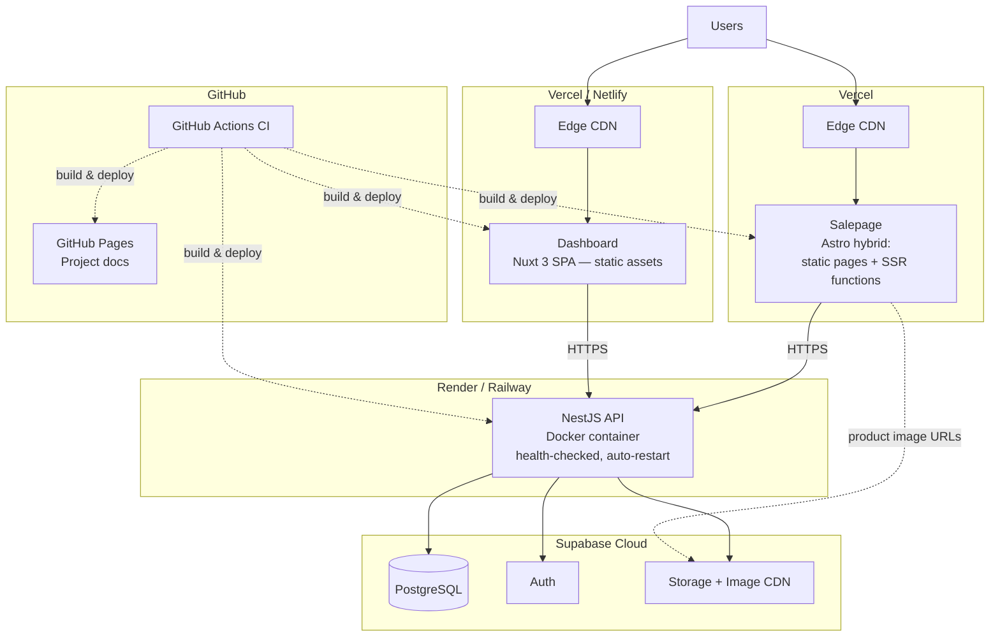

# cosmeticsecommerce-salepage

เว็บไซต์สำหรับลูกค้า (Customer Website) ของ **Cosmetics E-Commerce Platform** (ร้านขายน้ำหอม)

## ภาพรวมโปรเจกต์ (Project Overview)

หน้าร้านสาธารณะที่ลูกค้าใช้เลือกดูและซื้อสินค้าน้ำหอม เชื่อมต่อกับ REST API ของ
`cosmeticsecommerce-server` นอกจากนี้ repo นี้ยังเก็บ **เอกสารโครงการ** (`docs/`)
และเผยแพร่ผ่าน **GitHub Pages**
เป็นส่วนหนึ่งของระบบที่ประกอบด้วย 3 Repository ได้แก่ `cosmeticsecommerce-dashboard`,
`cosmeticsecommerce-server` และ **salepage** (repo นี้)

### สรุประบบ (System Summary)

Cosmetics E-Commerce Platform คือระบบร้านขายน้ำหอมออนไลน์ ที่แยกเป็น 3 แอปพลิเคชัน
ซึ่ง deploy อิสระต่อกัน โดยมี Supabase เป็น managed backend (PostgreSQL, Auth, Storage)

| Repository | เทคโนโลยี | บทบาท |
|---|---|---|
| `cosmeticsecommerce-server` | NestJS + TypeScript | REST API ที่ `/api/v1` — เป็น **component เดียว** ที่คุยกับ Supabase |
| `cosmeticsecommerce-salepage` | Astro + TypeScript + Tailwind | หน้าร้านสำหรับลูกค้า (hybrid SSR/SSG, เน้น SEO) |
| `cosmeticsecommerce-dashboard` | Nuxt 3 + Vue 3 + TypeScript + Tailwind | หน้า Admin แบบ SPA |

**หลักการออกแบบสำคัญ**

- **Single trust boundary** — ทุก read/write ไปยัง database ผ่าน NestJS API เท่านั้น frontend ไม่ถือ credential ของ Supabase
- **แยกตามกลุ่มผู้ใช้** — หน้าร้านลูกค้ากับ dashboard admin มีความต้องการด้าน rendering/SEO/security ต่างกัน จึงแยกเป็นคนละแอป
- **Managed infrastructure** — ใช้ Supabase + PaaS (Vercel, Render/Railway) ลดภาระ ops
- Roles: `guest`, `customer`, `admin` — Payment เป็น **mock** เท่านั้น (ยังไม่เชื่อม payment gateway จริง)

## สถาปัตยกรรมระบบ (System Architecture)

### ภาพรวมสถาปัตยกรรม (High-Level Architecture)



### โครงสร้างภายใน NestJS API (Component View)



### การ Deploy (Deployment View)



> รายละเอียดเชิงลึก (C4 diagrams, checkout/auth/RBAC sequence, API conventions, ตาราง Risk)
> อยู่ใน [`docs/03-system-architecture.md`](./docs/03-system-architecture.md)

## เทคโนโลยีที่ใช้ (Technology Stack)

- **Astro**
- **TypeScript**
- **Tailwind CSS**
- **Supabase** — ดึงข้อมูลผ่าน Backend API

## โครงสร้างโฟลเดอร์ (Folder Structure)

```
cosmeticsecommerce-salepage/
├── README.md
├── LICENSE
├── .gitignore
├── .env.example
├── docs/                 # เอกสารโครงการ (แหล่งข้อมูลสำหรับ GitHub Pages)
│   ├── index.md
│   ├── analysis.md
│   ├── design.md
│   ├── prd.md
│   └── architecture.md   # แผนภาพระบบด้วย Mermaid
└── (ซอร์สโค้ดของแอป — จะเพิ่มใน Workshop 2)
```

## การติดตั้ง (Installation)

```bash
git clone https://github.com/<owner>/cosmeticsecommerce-salepage.git
cd cosmeticsecommerce-salepage
cp .env.example .env   # ใส่ค่า SUPABASE_URL / SUPABASE_ANON_KEY
npm install
```

## การพัฒนา (Development)

```bash
npm run dev      # เริ่มเซิร์ฟเวอร์สำหรับพัฒนา
npm run build    # build สำหรับ production
npm run preview  # พรีวิวผลลัพธ์ที่ build แล้ว
```

> โครงสร้างของแอปจะเริ่มสร้างใน Workshop 2 ปัจจุบัน repo นี้มีเพียงส่วน
> Foundation ของโปรเจกต์และเอกสารเท่านั้น

## เอกสารและ GitHub Pages (Documentation & GitHub Pages)

เอกสารอยู่ในโฟลเดอร์ [`docs/`](./docs/) วิธีเผยแพร่ผ่าน GitHub Pages:
**Settings → Pages → Source: `Deploy from a branch` → Branch `main` / folder `/docs`**
URL ที่เผยแพร่: `https://<owner>.github.io/cosmeticsecommerce-salepage/`

GitHub จะเรนเดอร์ไฟล์ Markdown (รวมถึงแผนภาพ Mermaid) ให้โดยอัตโนมัติ

## กลยุทธ์การใช้ Branch (Branch Strategy)

- `main` — พร้อมขึ้น production, มีการป้องกัน (protected)
- `develop` — branch สำหรับรวมงาน (integration)
- `feature/*` — หนึ่ง branch ต่อหนึ่งฟีเจอร์ แล้ว merge เข้า `develop`

ข้อความ commit ใช้รูปแบบ [Conventional Commits](https://www.conventionalcommits.org/)
(`feat:`, `fix:`, `docs:`, `chore:` …)

## ฟีเจอร์ในอนาคต (Future Features)

- หน้ารายการสินค้าและหน้ารายละเอียดสินค้า
- ตะกร้าสินค้าและการชำระเงิน
- ระบบสมาชิกลูกค้า (Supabase Auth)
- การค้นหาและการกรองสินค้า
- ติดตามสถานะคำสั่งซื้อ
