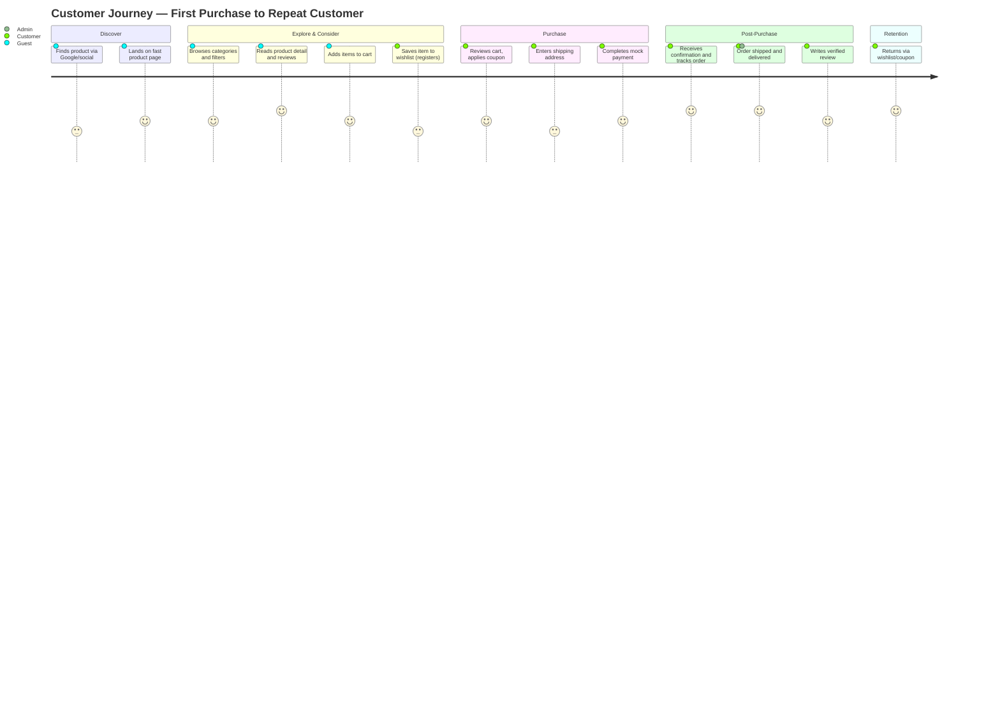
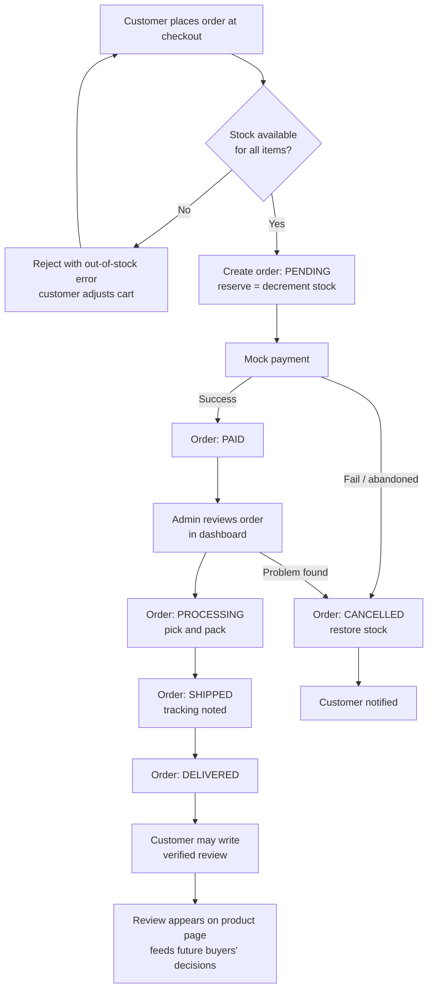

# Phase 1 — Business Analysis

## 1. Objectives

This document establishes the business foundation for the Cosmetics E-Commerce Platform (an online perfume store) before any technical design work. Its purpose is to:

1. Define **who** we sell to and **why** they would buy from us instead of a marketplace or a physical counter.
2. Map the end-to-end customer and business processes so that the system analysis (Phase 2) can derive requirements from real workflows rather than assumptions.
3. Set measurable goals (KPIs) so that "success" is a number, not an opinion.

The platform consists of a customer-facing sale page (`cosmeticsecommerce-salepage`), an admin dashboard (`cosmeticsecommerce-dashboard`), and a single backend API (`cosmeticsecommerce-server`). Payment is **mocked** — this is a university project built to production standards, so the business analysis treats payment as if it were real, while the implementation simulates it.

## 2. Business Model

**Model: B2C direct-to-consumer online retail of perfumes and cosmetics.**

The store buys (or is assumed to buy) branded perfume inventory and resells it online with a retail margin. Revenue comes from product sales; there are no subscriptions, commissions, or advertising revenue streams.

### Reasoning

- **Why B2C retail and not a marketplace?** A marketplace requires seller onboarding, payout systems, dispute resolution, and trust mechanisms — an order of magnitude more scope. A single-merchant store keeps the domain focused: catalog, cart, orders, fulfillment. This matches both the project timeline and the reality of most small perfume retailers.
- **Why perfume specifically?** Perfume is a high-margin (typically 40–60% retail markup), low-SKU-complexity category. Products don't expire quickly, don't need size/fit logic like apparel, and have strong brand-driven demand — customers search by brand and fragrance family, which shapes the catalog model (brands, categories, fragrance notes as attributes).
- **The key business problem of selling perfume online:** the customer cannot smell the product. Every business decision below (rich product detail, reviews, fragrance-note descriptions, trusted-brand positioning) exists to compensate for this single fact.

### Revenue and cost structure (assumed for planning)

| Element | Assumption | Why it matters to the system |
|---|---|---|
| Average order value (AOV) | ~1,800 THB (mid-range perfume) | Checkout must support multi-item carts to push AOV up (cross-sell) |
| Gross margin | ~45% | Coupons/discounts must be capped and admin-controlled |
| Fulfillment | Single warehouse, courier shipping | Inventory is a single stock number per product variant, no multi-warehouse logic needed |
| Marketing | SEO + social traffic | The sale page must be SEO-first (drives the Astro hybrid-rendering decision) |

## 3. Target Audience

Primary market: **urban consumers aged 20–40 who buy fragrance online**, segmented into three groups:

1. **Fragrance enthusiasts** — know exactly what they want (brand + specific scent), price-compare, read reviews, buy repeatedly. They arrive via search ("buy Dior Sauvage 100ml"). *They demand accurate stock, authenticity signals, and fast checkout.*
2. **Gift buyers** — buy 2–4 times a year for occasions, don't know fragrance vocabulary, need guidance. *They demand curated categories ("gifts for him"), clear price bands, and reassurance (reviews, return policy).*
3. **Casual browsers / first-time buyers** — arrive from social media or SEO content, exploring. *They demand an attractive, fast, mobile-first browsing experience and a low-friction path from discovery to cart.*

### Reasoning

Segmenting by **buying intent** (know-what-they-want vs. need-guidance vs. exploring) rather than demographics directly drives feature priority: search + filters serve segment 1, curated categories + banners serve segment 2, SEO landing pages + wishlist serve segment 3. Every customer-facing feature in the shared feature list maps to at least one segment.

## 4. User Personas

### Persona 1 — "Mint" • The Enthusiast

| Attribute | Detail |
|---|---|
| Profile | 28, marketing officer, Bangkok, buys 6–8 fragrances/year |
| Goal | Find a specific scent at a fair price, verify it's authentic and in stock |
| Behavior | Searches by exact product name, reads reviews before buying, compares across 2–3 stores |
| Frustrations | Out-of-stock after adding to cart; vague product descriptions; fake reviews |
| Features she depends on | Search with brand filter, accurate stock display, verified-purchase reviews, order tracking |

### Persona 2 — "Ton" • The Gift Buyer

| Attribute | Detail |
|---|---|
| Profile | 35, engineer, buys perfume 3×/year as gifts for wife/mother |
| Goal | Buy a safe, well-received gift within a budget, with minimal research |
| Behavior | Browses category pages ("women's perfume", "best sellers"), sorts by popularity, decides within 15 minutes |
| Frustrations | Overwhelming choice; not knowing whether a scent suits the recipient; complicated checkout |
| Features he depends on | Curated categories and banners, price filters, best-seller sorting, guest-friendly browsing, simple checkout |

### Persona 3 — "Praew" • The Explorer

| Attribute | Detail |
|---|---|
| Profile | 22, university student, discovers products via TikTok/Instagram |
| Goal | Discover affordable niche scents; save candidates for payday |
| Behavior | Mobile-only, lands on product pages from social links, wishlists heavily, converts weeks later |
| Frustrations | Slow mobile pages; forced registration before exploring; losing saved items |
| Features she depends on | Fast mobile pages (SEO/social landing), wishlist tied to her account, coupons, review browsing |

### Persona 4 — "Khun Nok" • The Store Admin

| Attribute | Detail |
|---|---|
| Profile | 40, store owner/operator, manages the whole business, moderate computer skills |
| Goal | Keep the catalog and inventory accurate, process orders daily, understand what's selling |
| Behavior | Uses the dashboard 1–2 hours/day: updates stock, confirms orders, sets promotions |
| Frustrations | Overselling out-of-stock items; manual sales tallying; not knowing which products/banners perform |
| Features she depends on | Product/inventory management, order status workflow, coupon/banner tools, sales reports and dashboard |

### Reasoning

Three customer personas cover the three intent segments (§3); the admin persona exists because the dashboard is half the system, and admin usability failures (e.g., clumsy inventory updates) directly cause customer-facing failures (overselling). Persona frustrations become non-functional requirements in Phase 2 (speed, stock accuracy, guest browsing).

## 5. User Journey

The canonical journey, from unknown visitor to repeat customer:

1. **Discover** — Arrives via Google search, social link, or direct URL. *(Guest — no login required; SEO-rendered pages.)*
2. **Explore** — Browses categories/brands, searches, filters by price/brand, views product details (images, description, notes, reviews, stock).
3. **Consider** — Reads reviews, adds to wishlist (prompts registration) or cart (guest cart allowed until checkout).
4. **Decide** — Reviews cart, applies coupon, registers/logs in at checkout.
5. **Purchase** — Enters shipping address, confirms order, completes mock payment.
6. **Wait & track** — Receives order confirmation; tracks status (pending → paid → shipped → delivered).
7. **Receive & review** — Gets the product; writes a review (verified purchase).
8. **Return** — Comes back via wishlist reminders, coupons, or new arrivals; repeat purchase.

### Reasoning

Two deliberate friction decisions shape this journey:

- **Login is deferred to checkout, not required to browse or fill the cart.** Forcing early registration is the top cause of abandonment for segments 2 and 3. The system therefore needs a guest cart (client-side) that merges into the account cart at login.
- **Reviews are gated to purchasers.** This costs review volume but protects trust — the single most important asset when customers can't smell the product (persona Mint's core frustration is fake reviews).

## 6. Customer Journey Diagram

The low points (score 3) are the known friction moments — registration and address entry — and are exactly where Phase 2 requirements invest in reducing effort (saved addresses, minimal registration fields).

## 7. Business Process

The business runs four core processes. Each has a clear owner and system touchpoint:

| # | Process | Owner | System touchpoint |
|---|---|---|---|
| P1 | **Catalog management** — add/edit products, brands, categories, images, prices | Admin | Dashboard → API → Supabase (Postgres + Storage) |
| P2 | **Inventory control** — set stock levels, prevent overselling, restock | Admin | Dashboard; stock decremented atomically at order placement |
| P3 | **Order fulfillment** — confirm payment (mock), pack, ship, update status | Admin | Order status workflow: pending → paid → processing → shipped → delivered / cancelled |
| P4 | **Marketing & promotion** — banners, coupons, monitor sales reports | Admin | Banner/coupon CRUD; dashboard analytics |

### Reasoning

- **Stock is decremented at order placement (with payment), not at add-to-cart.** Reserving stock in carts sounds customer-friendly but lets abandoned carts freeze inventory — a real cost for a small retailer. The tradeoff (rare "sold out at checkout") is accepted and surfaced with a clear error, and it directly informs the checkout validation rules in Phase 2.
- **Order status is a strict, admin-driven state machine.** Because payment is mock, "paid" is set by the mock payment flow, but every subsequent transition (processing/shipped/delivered) is a deliberate admin action. This keeps the fulfillment process auditable and makes the state machine a first-class business rule.

## 8. Business Workflow

### Reasoning

The workflow encodes the two guarantees the business cannot break: **never oversell** (stock check + atomic decrement before order creation) and **always restore stock on cancellation** (otherwise inventory silently leaks and the admin loses trust in the system). The review loop at the end is intentional — it closes the flywheel that generates the trust content future customers need.

## 9. Value Proposition

> **"A curated, trustworthy place to buy authentic perfume online — with the depth of information you need to buy a scent you've never smelled."**

Broken down:

1. **Authenticity and trust** — curated brand catalog, verified-purchase reviews, professional presentation. *Compensates for the no-smell problem.*
2. **Depth of product information** — fragrance notes, detailed descriptions, multiple images, real customer reviews. *Serves enthusiasts and reassures gift buyers.*
3. **Effortless buying** — guest browsing, fast mobile pages, simple checkout, order tracking. *Removes the friction that kills conversion in segments 2–3.*
4. **Reasons to return** — wishlist, coupons, new-arrival banners. *Retention is cheaper than acquisition; repeat rate is a headline KPI.*

## 10. Competitive Advantages

| Advantage | vs. marketplaces (Shopee/Lazada) | vs. physical counters | Why it's defensible |
|---|---|---|---|
| Curated, authentic-only catalog | Marketplaces are flooded with grey/fake goods | — | Trust compounds through verified reviews over time |
| Fragrance-specific product data (notes, families) | Generic product templates | Depends on salesperson | Structured data also powers SEO long-tail traffic |
| SEO-first architecture | Marketplace pages rank for the marketplace, not you | No online presence | Owned traffic = no commission fees, own customer data |
| Direct customer relationship (wishlist, coupons, order history) | Platform owns the customer | No CRM | Enables targeted retention at near-zero cost |

### Reasoning

A small store cannot win on price or delivery speed against marketplaces. It wins on **trust and specialization** — which is why the architecture privileges SEO (Astro hybrid rendering on the sale page) and why reviews/wishlist are core features rather than nice-to-haves.

## 11. Business Goals

| # | Goal | Horizon | Rationale |
|---|---|---|---|
| G1 | Launch a fully functional store: browse → checkout → fulfillment → review loop | Launch (semester end) | The complete loop, not partial features, is what demonstrates a viable business |
| G2 | Achieve organic discoverability: product/category pages indexed and ranking for long-tail queries | 3 months post-launch | SEO is the chosen acquisition channel; without it the model fails |
| G3 | Convert browsers to buyers at industry-baseline rates | 6 months | Conversion validates the UX investment (guest cart, fast pages) |
| G4 | Build a repeat-customer base | 12 months | Retention proves the trust/value proposition; repeat buyers have ~0 acquisition cost |
| G5 | Give the admin full operational self-sufficiency (no developer needed for daily ops) | Launch | Catalog, inventory, orders, promos all manageable via dashboard |

## 12. Success Metrics (KPIs)

| KPI | Target | Measured how | Why this target |
|---|---|---|---|
| Conversion rate (sessions → orders) | ≥ 1.5% | Orders / sessions | E-commerce baseline is 1–3%; 1.5% is realistic for a new niche store |
| Average order value | ≥ 1,800 THB | Revenue / orders | Matches mid-range perfume pricing; cross-sell should hold it above single-item price |
| Cart abandonment rate | ≤ 70% | 1 − (orders / carts created) | Industry average is ~70%; guest cart + short checkout should keep us at or below it |
| Repeat purchase rate | ≥ 20% within 6 months | Customers with ≥2 orders / all customers | Validates retention features (wishlist, coupons) |
| Organic traffic share | ≥ 40% of sessions | Analytics channel report | Proves the SEO-first bet; below this, paid acquisition would be required |
| Product page load (mobile, LCP) | ≤ 2.5 s | Core Web Vitals | Directly correlated with conversion and SEO ranking; becomes NFR in Phase 2 |
| Review rate | ≥ 10% of delivered orders | Reviews / delivered orders | Sustains the trust flywheel; needs post-delivery prompting |
| Oversell incidents | 0 | Orders exceeding stock | Non-negotiable trust guarantee; becomes a business rule in Phase 2 |
| Admin order-processing time | ≤ 5 min/order | Dashboard workflow timing | Measures dashboard usability (Persona 4) |

### Reasoning

Each KPI traces back to a goal: G2 → organic share and LCP; G3 → conversion and abandonment; G4 → repeat rate and reviews; G5 → processing time and oversells. KPIs that we cannot measure with this system (e.g., brand awareness) are deliberately excluded — a KPI without instrumentation is decoration.

## 13. Risks

| Risk | Likelihood | Impact | Mitigation |
|---|---|---|---|
| Customers won't buy fragrance unseen/unsmelled | High | High | Deep product info + verified reviews + generous descriptions (the core value proposition) |
| SEO takes longer than 3 months to deliver traffic | Medium | High | Structured data, fast pages from day one; social channels as bridge acquisition |
| Overselling destroys trust early | Medium | High | Atomic stock decrement at order time; oversell KPI = 0 |
| Admin operational errors (wrong price/stock) | Medium | Medium | Validation rules in dashboard (Phase 2 VR-xx); confirmation on destructive actions |
| Fake/low-quality reviews | Low | Medium | Reviews restricted to verified purchasers |
| Mock payment masks real payment complexity | Certain (by design) | Low now, High later | Payment isolated behind a service boundary so a real gateway can replace the mock without touching order logic |

## 14. Recommendations

1. **Treat the product detail page as the flagship.** It is where the no-smell problem is won or lost; invest content quality (notes, imagery, reviews) there before anywhere else.
2. **Instrument KPIs from day one.** Conversion, abandonment, and LCP must be measurable at launch, or Phase 1 targets are unverifiable.
3. **Keep the coupon system simple at launch** (percentage/fixed discount with expiry and usage limits). Complex promotion engines are a common scope trap.
4. **Design the mock payment as a real gateway stand-in** — same states (initiated/succeeded/failed), same order-side effects — so the business workflow is already correct when a real provider is added.
5. **Carry the two hard guarantees into Phase 2 as explicit business rules:** no overselling, and stock restoration on cancellation.
