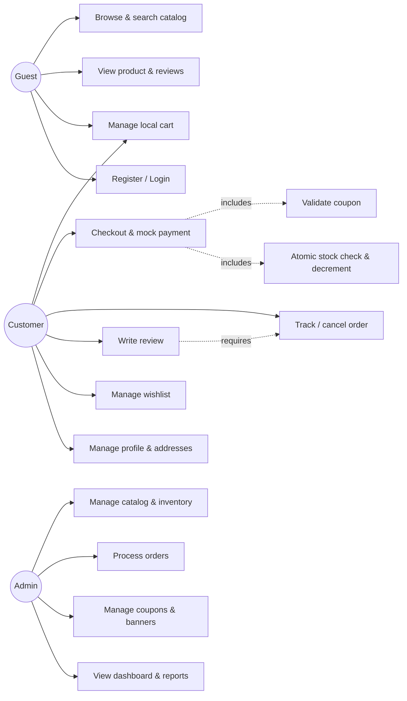

# Phase 2 — System Analysis

## 1. Objectives

This phase translates the business analysis (Phase 1) into a verifiable specification: every requirement below traces to a business goal, persona, or KPI, and every requirement is testable. It covers the three components of the system — the NestJS REST API (`cosmeticsecommerce-server`, the only component that talks to Supabase), the Astro customer sale page (`cosmeticsecommerce-salepage`), and the Nuxt admin dashboard (`cosmeticsecommerce-dashboard`) — plus the three roles: **guest**, **customer**, **admin**. Payment is mock; the API is REST versioned at `/api/v1`.

## 2. Functional Requirements

Grouped by domain. Each requirement states *why it exists* — a requirement without a business justification was cut.

### 2.1 Authentication & Account (AUTH)

| ID | Requirement | Why |
|---|---|---|
| FR-01 | Register with email + password; login returns JWT access + refresh tokens (via Supabase Auth, brokered by the API) | Enables customer identity for orders, wishlist, reviews |
| FR-02 | Refresh token flow to renew access tokens without re-login | Session continuity; short-lived access tokens limit token-theft impact |
| FR-03 | Logout invalidates the refresh token | Basic session hygiene |
| FR-04 | Customer can view/update profile (name, phone) and manage shipping addresses (CRUD, one default) | Saved addresses cut the highest-friction checkout step (Phase 1 journey low point) |
| FR-05 | Guests can browse, search, view products/reviews, and hold a cart without an account; login required only at checkout, wishlist, and review | Deferred registration is a core conversion decision (Phase 1 §5) |

### 2.2 Catalog (CAT)

| ID | Requirement | Why |
|---|---|---|
| FR-10 | Public product listing with pagination, filtering (brand, category, price range, in-stock), and sorting (price, newest, best-selling) | Serves all three intent segments: search-driven, guided, exploratory |
| FR-11 | Full-text search on product name, brand, and description | Enthusiasts arrive with exact queries (Persona Mint) |
| FR-12 | Product detail: images, price, discount price, stock status, description, fragrance notes, brand, category, average rating, reviews | The product page compensates for the no-smell problem — the flagship page |
| FR-13 | Public brand and category listings; each resolvable to a landing page with its products | SEO landing pages for long-tail queries (Goal G2) |
| FR-14 | Products can be flagged featured/new-arrival for homepage merchandising | Powers banners/curation for gift buyers (Persona Ton) |

### 2.3 Cart (CART)

| ID | Requirement | Why |
|---|---|---|
| FR-20 | Add/update-quantity/remove items; cart persists for logged-in customers server-side | Cross-device continuity for returning customers |
| FR-21 | Guest cart held client-side; merged into the account cart at login (sum quantities, cap at stock) | Preserves work done before registration — abandonment protection |
| FR-22 | Cart displays line totals, subtotal, and live stock validation (item flagged if stock dropped below quantity) | Prevents checkout surprises; supports the zero-oversell guarantee |

### 2.4 Checkout & Orders (ORD)

| ID | Requirement | Why |
|---|---|---|
| FR-30 | Checkout: select/enter shipping address, optionally apply one coupon, review totals, place order | The single revenue-generating flow |
| FR-31 | Order placement atomically validates and decrements stock for all items; any shortfall rejects the whole order with per-item detail | Business rule: never oversell (Phase 1 KPI = 0 incidents) |
| FR-32 | Mock payment: order enters PENDING; mock gateway returns success → PAID or failure → CANCELLED (stock restored) | Simulates a real gateway's states so order logic is production-shaped |
| FR-33 | Order snapshot: line items store product name and unit price at purchase time | Later price/product edits must not rewrite order history (financial integrity) |
| FR-34 | Customer views order history and per-order detail with status timeline (pending → paid → processing → shipped → delivered / cancelled) | Order tracking is a trust feature (Persona Mint) |
| FR-35 | Customer may cancel an order while status is PENDING or PAID (before processing); stock is restored | Reduces support burden; matches small-retailer practice |

### 2.5 Reviews & Wishlist (ENG)

| ID | Requirement | Why |
|---|---|---|
| FR-40 | Customer can review (rating 1–5 + text) only products from own DELIVERED orders; one review per product per customer | Verified-purchase reviews are the trust flywheel (Phase 1 §9) |
| FR-41 | Product pages show reviews, average rating, and count; reviews readable by guests | Review content must be public to influence buyers and feed SEO |
| FR-42 | Customer can add/remove products to a wishlist and view it | Retention mechanism for explorers (Persona Praew); feeds repeat-purchase KPI |

### 2.6 Admin (ADM)

| ID | Requirement | Why |
|---|---|---|
| FR-50 | Admin CRUD for products (incl. image upload to Supabase Storage via the API), brands, categories | Core catalog operations (Process P1) |
| FR-51 | Admin sets/adjusts stock per product; low-stock indicator (below configurable threshold) in the dashboard | Inventory control (Process P2); prevents silent stockouts |
| FR-52 | Admin lists/filters orders and advances status along the state machine; invalid transitions rejected | Fulfillment workflow (Process P3) with auditability |
| FR-53 | Admin views customers (list, detail, order history) and can deactivate an account | Basic CRM and abuse handling |
| FR-54 | Admin CRUD for banners (image, link, active period, ordering) and coupons (code, % or fixed discount, min order, expiry, usage limit, active flag) | Marketing operations (Process P4) |
| FR-55 | Dashboard overview: revenue, order counts by status, top products, low-stock list, recent orders | Admin self-sufficiency (Goal G5) |
| FR-56 | Sales report: revenue and order volume by day/week/month over a selectable range, exportable | Feeds KPI measurement (AOV, conversion inputs) |

## 3. Non-Functional Requirements

Every NFR has a measurable target — otherwise it cannot be accepted or rejected.

| ID | Category | Requirement & target | Why |
|---|---|---|---|
| NFR-01 | Performance | Sale-page LCP ≤ 2.5 s on mobile 4G; product/category pages statically or server-rendered | Directly a Phase 1 KPI; correlates with conversion and SEO rank |
| NFR-02 | Performance | API p95 latency ≤ 300 ms for reads, ≤ 800 ms for order placement | Keeps interactive flows (cart, checkout) responsive |
| NFR-03 | SEO | Product/brand/category pages server-rendered with unique title/meta/OpenGraph and Product structured data (JSON-LD); sitemap.xml | Goal G2 (organic acquisition) depends on it; the reason Astro hybrid rendering was chosen |
| NFR-04 | Security | All Supabase access only from the NestJS API; service keys never shipped to any frontend | Single trust boundary; frontends are untrusted clients |
| NFR-05 | Security | JWT access tokens ≤ 15 min lifetime; refresh tokens rotated on use; passwords handled solely by Supabase Auth | Limits stolen-token blast radius; no custom password storage |
| NFR-06 | Security | All admin endpoints require the admin role, enforced server-side (guards), never only in the UI | UI checks are cosmetic; the API is the enforcement point |
| NFR-07 | Security | Input validation on every API endpoint (DTO validation); rate limiting on auth and checkout endpoints (e.g., 10 req/min/IP on login) | Trust-boundary validation; brute-force and abuse protection |
| NFR-08 | Reliability | Order placement + stock decrement executes in a single DB transaction | The zero-oversell guarantee is impossible without atomicity |
| NFR-09 | Availability | 99.5% uptime target for API and sale page (bounded by Supabase/hosting SLAs) | Realistic for the hosting tier; honest rather than aspirational |
| NFR-10 | Usability | Sale page and dashboard responsive from 360 px; WCAG 2.1 AA basics (contrast, labels, keyboard navigation on forms) | Mobile-first personas; accessibility is a launch requirement, not debt |
| NFR-11 | Maintainability | TypeScript strict mode in all three repos; API changes versioned under `/api/v1` with additive-only changes within a version | Protects two independent frontends from breaking API changes |
| NFR-12 | Observability | Structured API logs with request IDs; all 5xx errors logged with stack traces | Diagnosability — you cannot fix what you cannot see |
| NFR-13 | Data | Product images stored in Supabase Storage, served via public URLs/CDN, ≤ 500 KB per optimized image | Image weight is the main LCP threat (NFR-01) |

## 4. User Roles

| Role | Description | Trust level |
|---|---|---|
| **Guest** | Unauthenticated visitor. Browses, searches, reads reviews, holds a local cart. | Untrusted; read-only on public data |
| **Customer** | Registered user. Everything a guest can, plus checkout, orders, reviews, wishlist, profile. | Authenticated; access strictly scoped to own resources |
| **Admin** | Store operator. Full management via the dashboard. | Authenticated + role check on every admin endpoint |

Roles are deliberately minimal. A finer-grained staff model (packer, marketer) is out of scope: one operator persona (Khun Nok) runs the store, and premature RBAC is complexity with no user.

## 5. Permission Matrix

C = create, R = read, U = update, D = delete. "Own" = only resources owned by the caller, enforced server-side.

| Resource | Guest | Customer | Admin |
|---|---|---|---|
| Products / Brands / Categories | R | R | CRUD |
| Product images | R | R | CRUD |
| Reviews | R | R, C/U/D (own, verified purchase) | R, D (moderation) |
| Cart | — (local only) | CRUD (own) | — |
| Wishlist | — | CRUD (own) | — |
| Orders | — | C, R (own), U (cancel own, pre-processing) | R (all), U (status transitions) |
| Customer profiles / addresses | — | R/U (own), addresses CRUD (own) | R (all), U (deactivate) |
| Coupons | R (validate code at checkout) | R (validate), apply at checkout | CRUD |
| Banners | R (active only) | R (active only) | CRUD |
| Dashboard analytics / reports | — | — | R |

Two rules define the matrix: **guests read public data only**, and **customers never touch another customer's resources** — ownership checks live in the API layer (NFR-06), because the frontends cannot be trusted to enforce them.

## 6. User Stories

| ID | Story | Traces to |
|---|---|---|
| US-01 | As a **guest**, I want to search and filter products by brand and price, so that I can quickly find the fragrance I came for. | FR-10/11, Persona Mint |
| US-02 | As a **guest**, I want to read verified reviews on a product page, so that I can judge a scent I cannot smell. | FR-41, Value proposition |
| US-03 | As a **guest**, I want to add items to a cart without creating an account, so that I'm not forced to commit before deciding. | FR-05/21, Journey §5 |
| US-04 | As a **customer**, I want my guest cart kept when I log in, so that I don't rebuild it from scratch. | FR-21 |
| US-05 | As a **customer**, I want to check out with a saved address and a coupon, so that buying takes under a minute. | FR-04/30, abandonment KPI |
| US-06 | As a **customer**, I want to see my order's status timeline, so that I know when it will arrive without contacting support. | FR-34 |
| US-07 | As a **customer**, I want to cancel an order before it ships, so that a mistaken purchase isn't final. | FR-35 |
| US-08 | As a **customer**, I want to review products I've received, so that I can share my experience (and only real buyers can). | FR-40 |
| US-09 | As a **customer**, I want a wishlist, so that I can save discoveries and buy later. | FR-42, Persona Praew |
| US-10 | As an **admin**, I want to manage products with images and stock in one place, so that the catalog is always accurate. | FR-50/51 |
| US-11 | As an **admin**, I want to move orders through pending → shipped → delivered, so that fulfillment is trackable and mistakes are visible. | FR-52 |
| US-12 | As an **admin**, I want coupons with expiry and usage limits, so that promotions can't be abused into margin loss. | FR-54 |
| US-13 | As an **admin**, I want a sales dashboard and reports, so that I know what sells without manual tallying. | FR-55/56, Persona Nok |

## 7. Use Cases

### 7.1 Use-case overview



### 7.2 UC-05 — Checkout & Mock Payment (the critical path)

| Element | Detail |
|---|---|
| **Actor** | Customer |
| **Precondition** | Authenticated; cart has ≥ 1 item |
| **Main flow** | 1. Customer opens checkout; system shows cart lines, revalidated against current stock and price. 2. Customer selects a saved address (or adds one). 3. Customer optionally enters a coupon code; system validates (exists, active, not expired, min order met, usage limit not reached) and shows the discounted total. 4. Customer confirms; system, in one transaction, re-checks stock, decrements it, creates the order (PENDING) with snapshotted prices, and records coupon usage. 5. System invokes mock payment. 6. On success, order → PAID; cart is cleared; confirmation shown with order number. |
| **Alternate flows** | A1 (step 4): any item under-stocked → transaction aborts, no order created, response lists the offending items; customer adjusts cart. A2 (step 3): coupon invalid → error with reason; checkout continues without coupon. A3 (step 6): mock payment fails → order → CANCELLED, stock restored, customer offered retry (new order). |
| **Postcondition** | Success: PAID order exists, stock reduced, cart empty. Failure: no PENDING order lingers holding stock. |

**Why this design:** stock is checked twice (display-time and transactionally at placement) because only the transactional check is authoritative — the display check merely improves UX. The mock gateway mirrors real gateway states so swapping in a real provider changes no order logic (Phase 1 risk mitigation).

### 7.3 UC-11 — Admin Processes an Order

| Element | Detail |
|---|---|
| **Actor** | Admin |
| **Precondition** | Admin authenticated; order exists in PAID |
| **Main flow** | 1. Admin opens the order queue filtered to PAID. 2. Opens an order: items, customer, address, totals. 3. Marks PROCESSING (packing). 4. Marks SHIPPED, optionally noting a tracking reference. 5. Marks DELIVERED on confirmation. Each transition is timestamped for the customer's timeline (FR-34). |
| **Alternate flows** | A1: problem found (e.g., damaged stock) → admin cancels; system restores stock and the customer sees CANCELLED. A2: admin attempts a skip/backward transition → API rejects with a validation error (state machine enforced server-side). |
| **Postcondition** | Order status advanced exactly one legal step; timeline updated. |

### 7.4 UC-07 — Write a Verified Review

| Element | Detail |
|---|---|
| **Actor** | Customer |
| **Precondition** | Customer has a DELIVERED order containing the product; no existing review by this customer on it |
| **Main flow** | 1. Customer opens the product (from order history or product page). 2. System confirms eligibility. 3. Customer submits rating (1–5) and text. 4. Review is published; product average rating recalculates. |
| **Alternate flows** | A1: not eligible → the review form is not offered (UI) and the API rejects direct calls (authoritative). A2: duplicate → API rejects; customer may edit the existing review instead. |
| **Postcondition** | One verified review exists; aggregates updated. |

## 8. Business Rules

| ID | Rule | Why |
|---|---|---|
| BR-01 | Stock may never go negative; order placement and stock decrement are one atomic transaction. | Zero-oversell KPI — the store's core trust guarantee |
| BR-02 | Order status transitions only along: PENDING → PAID → PROCESSING → SHIPPED → DELIVERED; CANCELLED reachable only from PENDING or PAID. | Auditable fulfillment; prevents impossible states (e.g., delivering an unpaid order) |
| BR-03 | Cancellation (customer or admin) restores stock for all order lines. | Prevents silent inventory leaks (Phase 1 workflow guarantee) |
| BR-04 | Order lines snapshot product name and unit price at placement; later catalog edits never alter existing orders. | Financial history is immutable |
| BR-05 | Only customers with a DELIVERED order containing the product may review it; max one review per product per customer. | Verified-review trust flywheel |
| BR-06 | At most one coupon per order; a coupon must be active, unexpired, above its minimum order value, and under its usage limit at the moment of placement. | Caps promotion cost (margin protection, US-12) |
| BR-07 | A discount can never reduce an order total below zero; fixed discounts are capped at the order subtotal. | Arithmetic sanity for margins and reports |
| BR-08 | Products with dependent data (existing order lines) are soft-deleted/archived, never hard-deleted; brands/categories with products cannot be deleted. | Referential integrity of order history and reports |
| BR-09 | A deactivated customer account cannot log in or place orders; existing orders remain visible to admin. | Abuse handling without destroying records |
| BR-10 | Only banners within their active period and marked active are served to the sale page. | Marketing content is time-boxed by definition |

## 9. Validation Rules

Enforced at the API boundary via DTO validation (NFR-07); the frontends duplicate them only for UX.

| ID | Entity | Rules |
|---|---|---|
| VR-01 | User (register) | Email: valid format, unique. Password: ≥ 8 chars, ≥ 1 letter and 1 number. Name: 1–100 chars. |
| VR-02 | Address | Recipient name, phone (Thai format, 9–10 digits), line 1, district, province, postal code (5 digits) all required; ≤ 5 addresses per customer. |
| VR-03 | Product | Name 1–200 chars, unique per brand. Price > 0, ≤ 1,000,000; discount price, if set, < price. Stock: integer ≥ 0. ≥ 1 image; image ≤ 500 KB, JPEG/PNG/WebP. Brand and category must reference existing records. |
| VR-04 | Brand / Category | Name 1–100 chars, unique; slug unique, URL-safe. |
| VR-05 | Cart item | Product must exist and be active; quantity: integer 1–99 and ≤ current stock. |
| VR-06 | Order | ≥ 1 line item; shipping address must belong to the customer; coupon (if given) passes BR-06. |
| VR-07 | Review | Rating: integer 1–5. Text: 10–2,000 chars. Eligibility per BR-05. |
| VR-08 | Coupon | Code: 3–20 chars, alphanumeric, unique, stored uppercase. Percentage: 1–90. Fixed amount: > 0. Expiry ≥ today at creation. Usage limit ≥ 1. |
| VR-09 | Banner | Image required (≤ 1 MB); link must be a relative path or same-site URL; start date < end date. |

**Why explicit VRs:** the percentage cap (90) and price bounds are margin guards, not arbitrary numbers; the address limit and text lengths bound storage abuse; "≤ current stock" at cart-time is a UX check whose authoritative twin is BR-01.

## 10. Error Handling Strategy

### 10.1 Error categories

| Category | HTTP | Examples | Client behavior |
|---|---|---|---|
| Validation | 400 | VR violations, malformed body | Show field-level messages from `details` |
| Authentication | 401 | Missing/expired token | Attempt token refresh; else redirect to login |
| Authorization | 403 | Customer accessing another's order; non-admin on admin route | Show "not allowed"; never leak resource existence details |
| Not found | 404 | Unknown product/order id | Friendly 404 page (SEO-correct on the sale page) |
| Conflict / business rule | 409 | Out-of-stock at checkout (BR-01), illegal status transition (BR-02), duplicate review (BR-05) | Show the specific business message; offer the corrective action (e.g., adjust cart) |
| Rate limited | 429 | Login brute force | Show retry-after |
| Server | 500 | Unhandled exceptions | Generic message; full detail only in server logs (NFR-12) |

### 10.2 Unified API error envelope

Every non-2xx response from `/api/v1` uses one shape, so both frontends implement a single error handler:

```json
{
  "statusCode": 409,
  "error": "OUT_OF_STOCK",
  "message": "Some items exceed available stock.",
  "details": [
    { "productId": "…", "requested": 3, "available": 1 }
  ],
  "path": "/api/v1/orders",
  "timestamp": "2026-07-02T10:15:00Z",
  "requestId": "b1f4…"
}
```

- `error` is a stable machine-readable code (frontends branch on it, never on `message`).
- `details` is optional structured data (field errors for 400, per-item shortfalls for stock conflicts).
- `requestId` correlates with server logs (NFR-12) — a user-reported error becomes findable.
- 500s never expose stack traces or SQL; internal detail stays in logs.

**Why one envelope:** two independent frontends against one API means any inconsistency in error shape is paid for twice. A NestJS global exception filter produces this shape once, centrally.

## 11. Acceptance Criteria (key stories)

**US-03/04 — Guest cart and merge**
- Given a guest with 2 items in a local cart, when they log in, then the account cart contains those items merged with any prior account items (quantities summed, capped at stock), and nothing is lost.
- Given a guest, when they attempt checkout, then they are sent to login/register and returned to checkout afterward with the cart intact.

**US-05 / UC-05 — Checkout**
- Given a cart where one item's stock has dropped below its quantity, when the customer places the order, then the API returns 409 `OUT_OF_STOCK` naming that item, and no order exists and no stock changed.
- Given a valid cart and a valid coupon, when the order is placed and mock payment succeeds, then the order is PAID, its lines carry the prices shown at confirmation, stock is reduced accordingly, the coupon's usage count is incremented, and the cart is empty.
- Given mock payment fails, then the order is CANCELLED and stock is fully restored (verifiable by re-reading product stock).

**US-06/07 — Tracking and cancellation**
- Given a PAID order, when the customer cancels it, then status becomes CANCELLED and stock is restored; given a PROCESSING (or later) order, the cancel action is absent in the UI and the API returns 409 on direct calls.
- The order detail page shows every status change with its timestamp, oldest first.

**US-08 — Verified review**
- Given a customer with a DELIVERED order containing product P and no prior review of P, when they submit rating 4 with valid text, then the review appears on P's page and P's average rating updates.
- Given a customer who never purchased P (or whose order isn't DELIVERED), when they POST a review directly to the API, then it returns 403 with error code `REVIEW_NOT_ELIGIBLE`.

**US-11 — Order processing**
- Given a PAID order, the admin can advance it only to PROCESSING or CANCELLED; attempting SHIPPED directly returns 409 `INVALID_STATUS_TRANSITION`.

**US-12 — Coupons**
- Given a coupon at its usage limit, when applied at checkout, then the API rejects it with a specific reason and the order can still proceed without it.
- A fixed-amount coupon larger than the subtotal yields a total of exactly the shipping-free floor (≥ 0), never negative.

## 12. Design Decisions & Reasoning (summary)

1. **All authorization lives in the API.** Frontends are untrusted; guards + ownership checks in NestJS are the single enforcement point (NFR-04/06, permission matrix).
2. **Stock correctness is transactional, not procedural.** BR-01/03 + NFR-08 encode the two Phase 1 guarantees at the database-transaction level, the only place they can actually be guaranteed.
3. **Guest-first browsing, login at commitment points.** FR-05/21 implement the Phase 1 friction decisions that protect conversion.
4. **One error envelope, machine-readable codes.** Halves frontend error-handling cost and makes acceptance criteria precisely testable.
5. **Order data is snapshotted and append-only.** BR-04/08 keep financial history immutable — a prerequisite for trustworthy reports (FR-56).
6. **Mock payment mirrors real gateway semantics.** Same states and side effects, so productionizing payment is a provider swap, not an order-logic rewrite.

## 13. Risks

| Risk | Mitigation |
|---|---|
| Race condition: two customers buy the last unit simultaneously | Conditional decrement inside the placement transaction (`stock >= qty`); one order wins, the other gets 409 |
| Guest→account cart merge edge cases (duplicates, stale items) | Deterministic merge rule (sum, cap at stock, drop inactive products) covered by acceptance tests |
| Scope creep in promotions (stacking, product-scoped coupons) | BR-06 pins one simple coupon per order at launch; extensions are additive |
| Requirement drift between the two frontends | Single versioned API contract (`/api/v1`, NFR-11) is the source of truth for both |
| Review spam within eligibility rules | One review per product per customer (BR-05) plus admin delete (moderation) |

## 14. Recommendations

1. **Implement UC-05 (checkout) first, end to end**, including its failure paths — it exercises auth, cart, stock, coupons, orders, and the error envelope at once; everything else attaches to it.
2. **Write the acceptance criteria in §11 as automated API tests** before building the frontends; they define the contract both UIs consume.
3. **Generate the state machine (BR-02) from a single definition** used by both the API (enforcement) and the dashboard (which buttons to show), so they can never disagree.
4. **Defer** email notifications, multi-warehouse stock, staff sub-roles, and real payment — all are additive on top of this specification and none is needed to meet a Phase 1 KPI.
