# Phase 3 — System Architecture Design

## 1. Overview

The Cosmetics E-Commerce Platform (online perfume store) is composed of three independently deployed applications backed by Supabase managed services:

| Repository | Technology | Role |
|---|---|---|
| `cosmeticsecommerce-server` | NestJS + TypeScript | REST API at `/api/v1` — the **only** component that talks to Supabase |
| `cosmeticsecommerce-salepage` | Astro + TypeScript + Tailwind | Customer-facing storefront, hybrid rendering, SEO-first |
| `cosmeticsecommerce-dashboard` | Nuxt 3 + Vue 3 + TypeScript + Tailwind | Admin single-page application |

Supabase provides PostgreSQL (data), Auth (JWT access + refresh tokens), and Storage (product images). Payment is **mock only** — no real payment gateway is integrated.

Roles: `guest`, `customer`, `admin`.

### 1.1 Guiding Principles

1. **Single trust boundary.** All reads and writes to the database go through the NestJS API. Frontends hold no Supabase credentials.
2. **Separation of audiences.** Customer storefront and admin dashboard have different rendering, SEO, and security needs, so they are separate apps.
3. **Managed infrastructure.** Supabase and PaaS hosting (Vercel, Render/Railway) remove operational burden appropriate to a small team.
4. **Production discipline in a university scope.** Real auth, real RBAC, real audit trail — only the payment provider is mocked.

---

## 2. High-Level Architecture

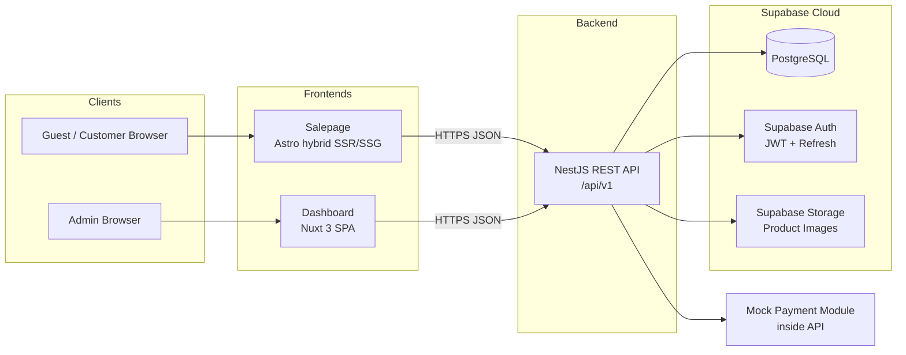

### 2.1 Decision: Three Repositories vs Monorepo

**Chosen:** three separate repositories.

- **Why:** independent deploy pipelines (each PaaS builds from its own repo root with zero config), independent versioning, clear ownership boundaries, and no shared-tooling overhead (Turborepo/Nx setup, remote caching) for a three-person-scale project.
- **Alternatives considered:**
  - *Monorepo (Turborepo/Nx/pnpm workspaces):* better for shared types and atomic cross-app changes. Rejected — the only realistic shared artifact is the API type contract, which is served better by an OpenAPI spec generated from NestJS decorators than by a shared package.
  - *Two repos (frontends together):* Astro and Nuxt share almost no code; combining them saves nothing.
- **Trade-offs accepted:** API contract drift is possible between repos; mitigated by the generated OpenAPI (Swagger) document as the single source of truth and versioned endpoints (`/api/v1`).

### 2.2 Decision: API Gateway Pattern vs Direct Supabase Client

**Chosen:** frontends call the NestJS API only; the API is the sole Supabase client.

- **Why:**
  - Business rules (stock reservation, coupon validation, order state machine, price snapshotting) must run server-side and cannot be trusted to browsers.
  - One place for validation, rate limiting, logging, and RBAC instead of duplicating Row Level Security policies plus client logic in two frontends.
  - The frontends are decoupled from Supabase — the database or auth provider can be swapped without touching frontend code.
- **Alternative considered:** *Direct `supabase-js` from frontends with RLS.* Faster to prototype and removes a network hop. Rejected because complex invariants (e.g., "decrement stock atomically at checkout and record a movement row") are awkward in RLS/edge functions, and admin logic in a browser bundle is an audit-trail and security liability.
- **Trade-offs accepted:** extra network hop (browser → API → Supabase) adds latency; the API is a single point of failure. Both are acceptable at this scale and mitigated by caching and PaaS health-checked restarts.

### 2.3 Decision: Modular Monolith vs Microservices

**Chosen:** a single NestJS application organized into feature modules.

- **Why:** one deployable, one database, transactional consistency for free (orders + stock + payments in one DB transaction), trivial local development. NestJS modules give microservice-like internal boundaries without network seams.
- **Alternative considered:** *Microservices (catalog, orders, auth services).* Rejected — the team size, traffic, and domain complexity do not justify distributed transactions, service discovery, and per-service pipelines. The module boundaries mean extraction later is a refactor, not a rewrite.
- **Trade-offs accepted:** the whole API scales as one unit; a hot endpoint (catalog browse) scales together with cold ones (admin reports). Acceptable; mitigated by HTTP caching on catalog reads.

---

## 3. System Context Diagram (C4 Level 1)

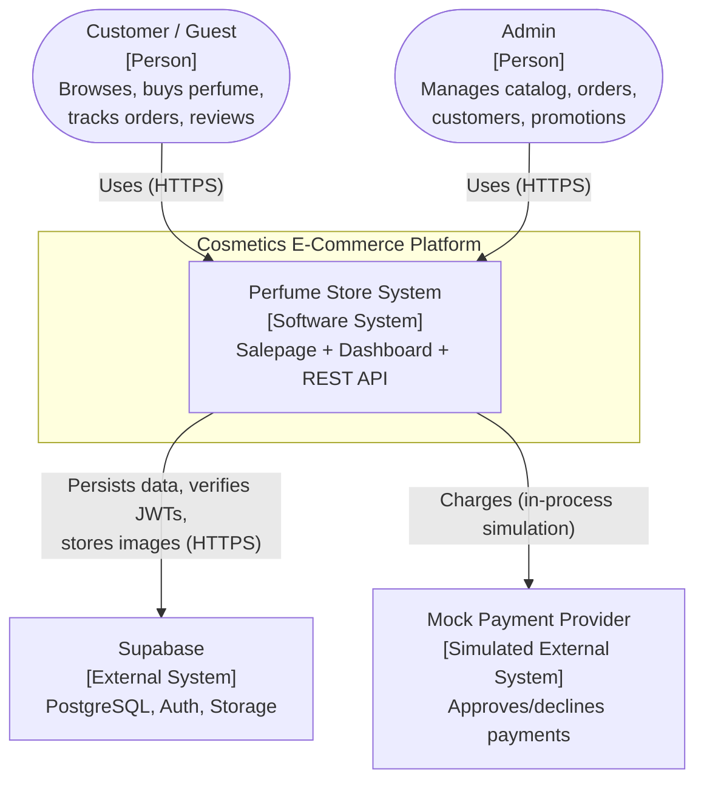

The mock payment provider is drawn as external to document where a real gateway (Stripe, Omise) would slot in; today it is an in-process NestJS module behind a `PaymentProvider` interface-shaped service.

---

## 4. Component Diagram — NestJS API (C4 Level 2/3)

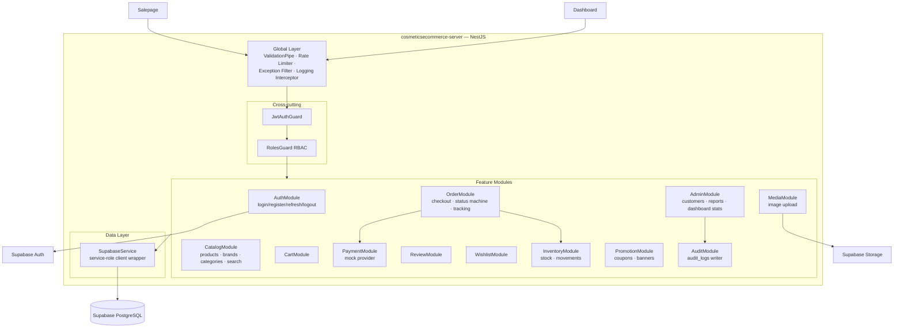

**Component decisions:**

- **One `SupabaseService` wrapper** holds the service-role key and exposes typed query helpers. Modules never construct their own clients — a single choke point for connection config and query logging.
- **Guards over per-route checks:** `JwtAuthGuard` + `RolesGuard` with a `@Roles('admin')` decorator keep authorization declarative and impossible to forget on new routes (fail-closed default on admin controllers).
- **PaymentModule behind a provider interface:** the mock implements the same `charge/refund/verify` surface a real gateway adapter would, so replacing it is a one-module change.
- **AuditModule as a shared writer:** admin mutations call it explicitly; this is simpler and more portable than DB triggers, at the cost of trusting the app layer to call it (acceptable — the API is the only writer).

---

## 5. Deployment Diagram

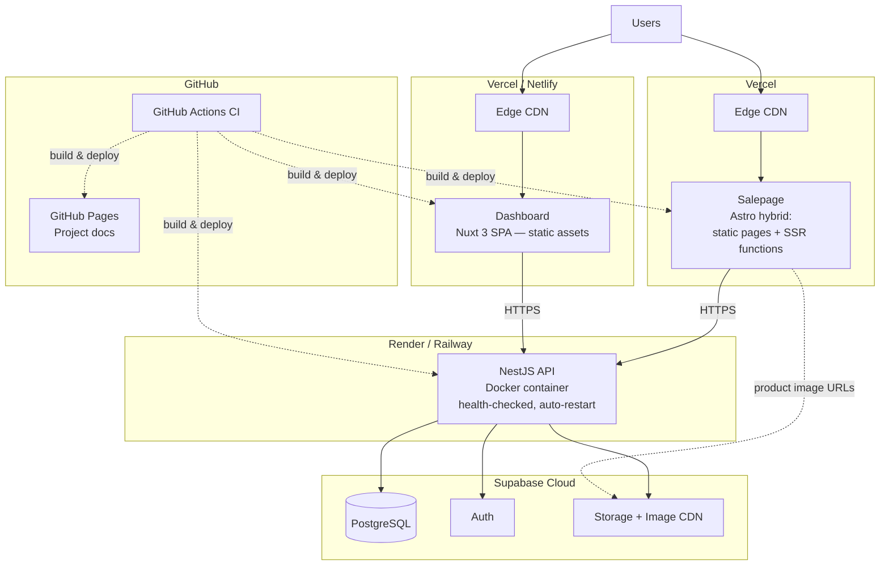

**Deployment decisions:**

- **Salepage on Vercel:** first-class Astro support; static product/category pages served from edge CDN for SEO and speed, with SSR functions for dynamic pages (cart, checkout, account).
- **Dashboard on Vercel/Netlify:** it is a pure SPA — any static host works; picked for zero-cost, zero-ops parity with the salepage. *Alternative:* serving it from the NestJS server — rejected to keep the API stateless and frontend deploys independent.
- **API on Render/Railway via Docker:** NestJS needs a long-running Node process (not serverless) because of in-memory rate limiting and to avoid cold starts on checkout paths. Docker makes the environment reproducible and host-portable. *Alternative:* serverless functions (Vercel/AWS Lambda) — rejected due to cold starts and connection-pool pressure on Postgres.
- **Supabase cloud:** managed Postgres + Auth + Storage with a generous free tier. *Alternative:* self-hosted Postgres + custom JWT auth — rejected as pure operational cost with no learning or product benefit here.
- **Docs on GitHub Pages:** versioned with the code, free, no infrastructure.
- **Image delivery bypasses the API:** browsers load product images directly from Supabase Storage's public CDN URLs. Uploads still go through the API (Section 10.1) — read path is public and cacheable, write path is guarded.

---

## 6. Service Communication Diagram

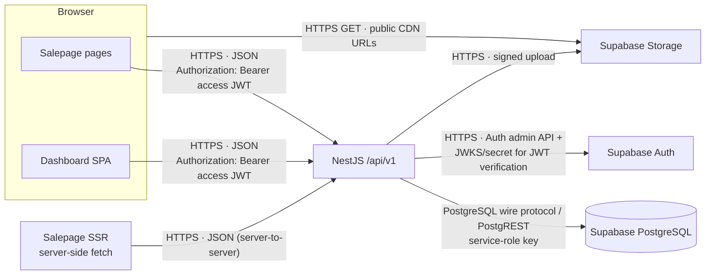

**Communication decisions:**

- **REST + JSON, versioned at `/api/v1`.** *Alternatives:* GraphQL (rejected — two known clients, no over-fetching problem worth a resolver layer), tRPC (rejected — couples repos, and Astro/Nuxt clients differ).
- **Auth tokens:** access JWT in the `Authorization` header; refresh token in an `HttpOnly Secure SameSite=Lax` cookie so it never touches JavaScript. Access token kept in memory (not `localStorage`) to reduce XSS blast radius.
- **CORS:** API allows exactly the salepage and dashboard origins; everything else is denied.
- **Synchronous only.** No message queue — the one async-ish job (order confirmation side effects) runs in-process. *Alternative:* Redis/BullMQ — deferred until a real need (emails, webhooks) appears.

---

## 7. Data Flow Diagram — Checkout

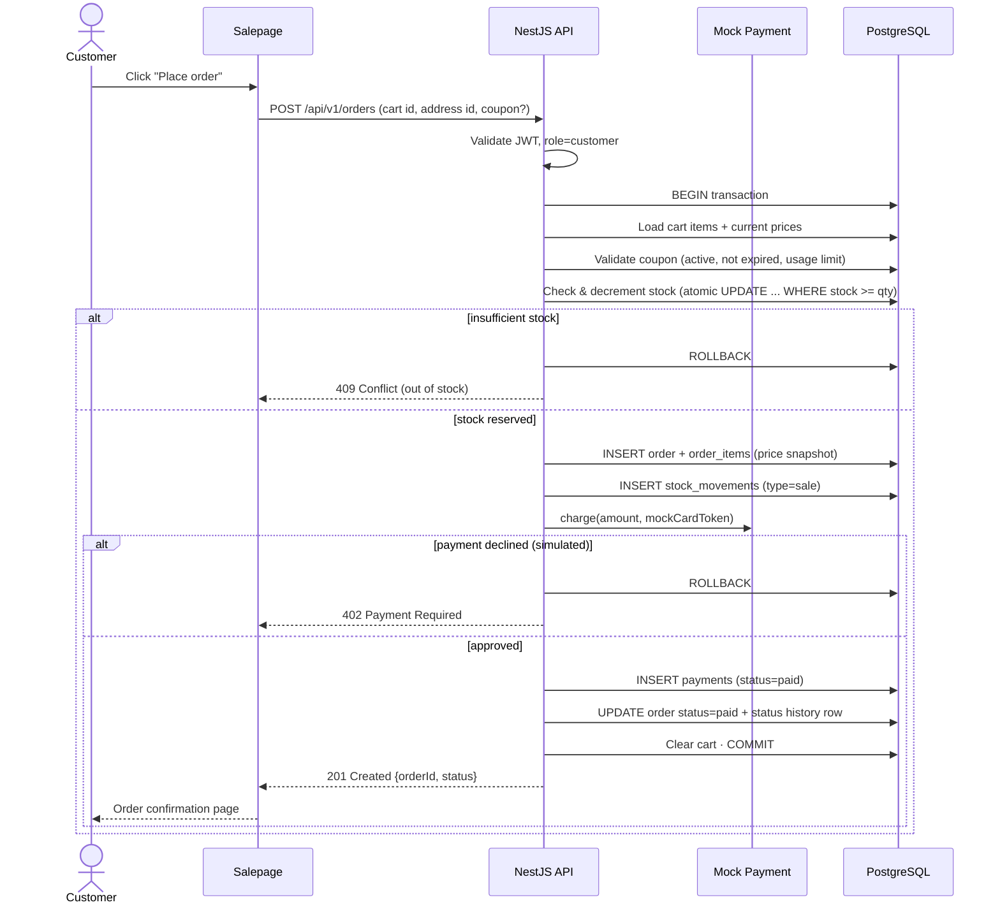

**Key decisions in this flow:**

- **Single DB transaction** wraps stock, order, and payment records — the strongest argument for the modular monolith (Section 2.3).
- **Atomic stock decrement** (`UPDATE ... SET stock = stock - qty WHERE stock >= qty`) prevents overselling under concurrency without explicit row locks.
- **Price snapshot on `order_items`** — the order records what the customer actually paid, immune to later catalog price edits (detailed in Phase 4).
- **Mock payment runs inside the transaction** because it is in-process and instant. With a real gateway this becomes a two-phase flow (order `pending_payment` → webhook → `paid`); the order status machine already models this so the swap is contained.

---

## 8. Authentication Flow (Supabase Auth: JWT + Refresh)

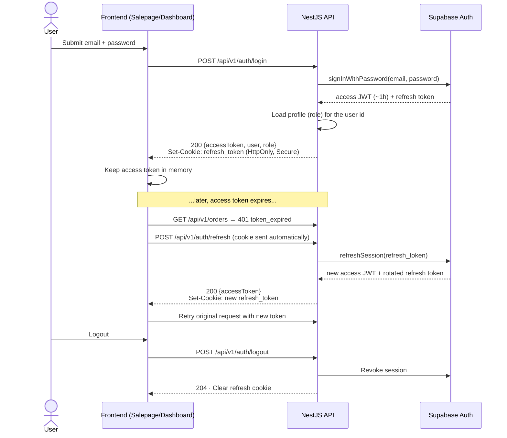

**Decisions:**

- **API proxies Supabase Auth** rather than frontends calling it directly — consistent with the single-trust-boundary rule, and it lets the API attach the application role to the login response and set the cookie with the right domain/flags.
- **Refresh token in `HttpOnly` cookie, access token in memory.** *Alternative:* both tokens in `localStorage` (simpler, survives reloads) — rejected: any XSS then yields long-lived account takeover. Reload UX is recovered via a silent refresh call on app boot.
- **Verification is stateless:** the API verifies the JWT signature with Supabase's JWT secret locally on every request — no Auth round trip per request.

---

## 9. Authorization Flow (RBAC Guard)

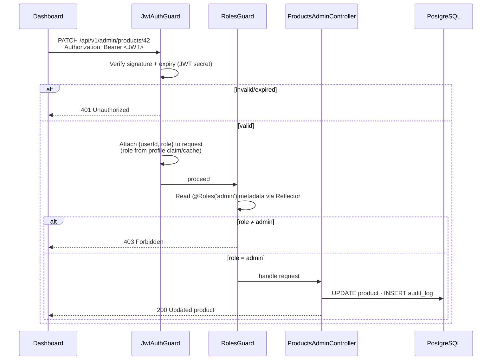

**Decisions:**

- **Role lives in the `profiles` table**, mirrored into the request context after JWT verification. *Alternative:* role inside JWT custom claims — faster (no lookup) but a demoted admin keeps power until token expiry. With a short-TTL in-process cache the lookup cost is negligible and revocation is near-immediate.
- **Guests need no token:** public catalog endpoints simply have no guard; ownership-scoped endpoints (my orders, my cart) filter by `userId` from the token — customers can never address another customer's resources.
- **Deny by default on `/admin/*`:** guards are applied at controller level so a newly added route cannot accidentally ship unguarded.

---

## 10. API Communication Flow

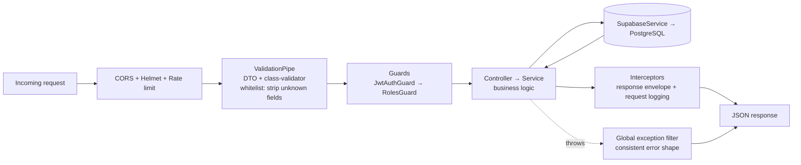

**Conventions (uniform across all endpoints):**

- Base path `/api/v1`; plural resource nouns (`/products`, `/orders/:id`).
- Success envelope: `{ "data": ..., "meta": { pagination? } }`; error envelope: `{ "error": { "code", "message", "details?" } }`.
- Standard status codes: 200/201/204, 400 validation, 401 unauthenticated, 403 forbidden, 404, 409 conflict (stock, duplicate), 429 rate-limited.
- List endpoints: `?page`, `?limit` (capped), `?sort`, resource-specific filters (`?brand=`, `?category=`, `?q=` for search).
- **Every** input crosses a validated DTO — validation at the trust boundary is never skipped.
- OpenAPI/Swagger auto-generated from decorators at `/api/v1/docs`; this document is the cross-repo contract.

---

## 11. External Service Integration

### 11.1 Supabase Storage — Product Image Upload

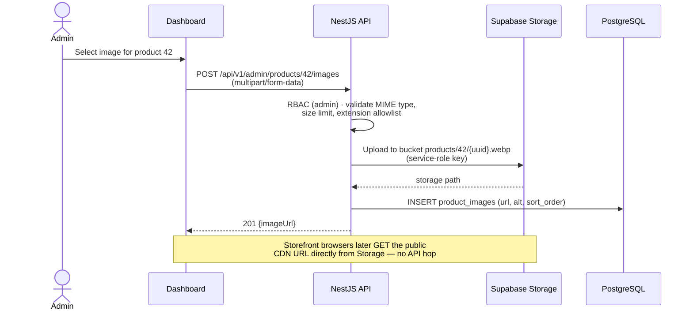

- **Upload through the API** (not a signed URL from the browser) so file validation, RBAC, and the `product_images` row stay in one transaction-shaped operation. *Alternative:* presigned direct upload — better for large files/high volume; unnecessary for admin-scale product photos.
- **Public read bucket:** product images are public marketing content; serving them via Storage CDN keeps image bytes off the API entirely.

### 11.2 Mock Payment

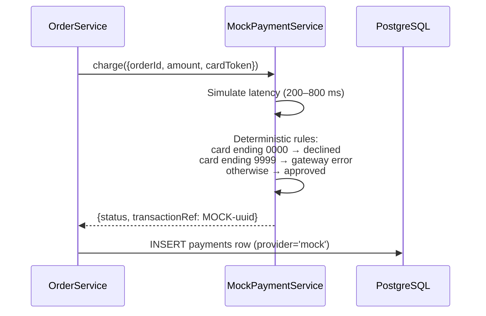

- **Deterministic failure cards** make decline and error paths testable and demoable — a mock that always succeeds would leave the failure handling unproven.
- **Gateway-shaped interface** (`charge`, `refund`, `verify`, provider-agnostic result type) documents exactly where Stripe/Omise would be integrated; the `payments` table already stores `provider` and `transaction_ref` for that future.

---

## 12. Risks and Recommendations

| # | Risk | Impact | Likelihood | Mitigation / Recommendation |
|---|------|--------|------------|------------------------------|
| 1 | API is a single point of failure (monolith on one PaaS instance) | Storefront browsing and checkout both go down | Medium | PaaS health checks + auto-restart now; add a second instance behind the platform load balancer if uptime matters; static salepage pages keep serving from CDN during API outages. |
| 2 | API contract drift across three repos | Broken frontends after a backend change | Medium | Generated OpenAPI spec as the contract; version endpoints (`/v1`); never make breaking changes without a new version; smoke tests in frontend CI against a staging API. |
| 3 | Supabase vendor lock-in (Auth semantics, Storage URLs) | Costly migration if Supabase is abandoned | Low | Lock-in is confined to the server repo (`SupabaseService`, AuthModule, MediaModule); schema is plain PostgreSQL and portable. Accept the risk; document the seams. |
| 4 | Overselling under concurrent checkouts | Negative stock, cancelled orders, trust damage | Low | Already mitigated by atomic conditional stock decrement inside a transaction; add a periodic stock-vs-movements reconciliation query as a safety net. |
| 5 | Mock payment hides real-gateway complexity (webhooks, async settlement, idempotency) | Rework at real-payment integration time | Certain (by design) | Order status machine already models `pending_payment`; payments table stores provider refs; document that real integration requires webhook endpoint + idempotency keys. |
| 6 | XSS in either frontend leaks access tokens | Session hijack until token expiry | Low–Medium | Refresh token already HttpOnly; keep access token TTL ≤ 1h; CSP headers on both frontends; framework auto-escaping (Astro/Vue) — never use raw HTML injection for user content (reviews). |
| 7 | Cold-start/slow free-tier PaaS instances | Slow first request, poor demo experience | Medium | Use a paid always-on instance for demos, or an uptime pinger; keep salepage catalog pages static so the CDN masks API latency. |
| 8 | No async infrastructure (queue) as features grow (emails, webhooks) | Long request times, lost side effects | Low now | Deliberately deferred (YAGNI). Recommendation: adopt BullMQ + Redis only when the first real async requirement (transactional email) lands. |
| 9 | Admin dashboard is a public URL | Attack surface for credential stuffing | Medium | Rate limiting on `/auth/login`, strong password policy via Supabase Auth, and recommend enabling MFA for admin accounts before any real use. |

**Summary recommendation:** the architecture is intentionally the simplest shape that satisfies the requirements — one API, two static-first frontends, managed backend services. Every deferred complexity (microservices, queues, presigned uploads, GraphQL) has a documented trigger condition; none should be adopted before its trigger fires.
