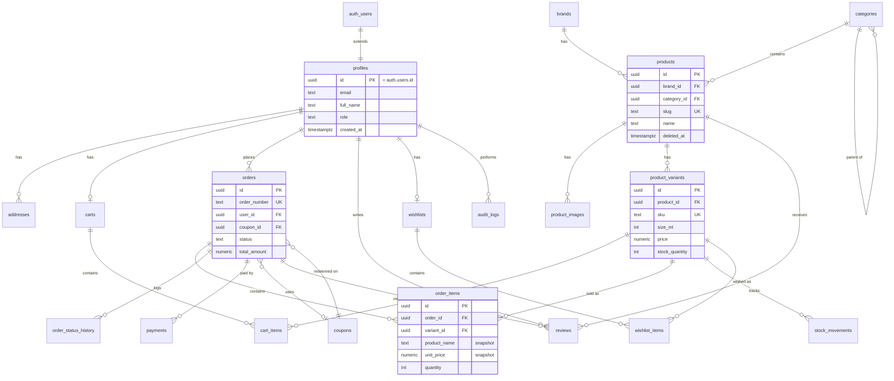

# Phase 4 — Database Design

## 1. Overview

The platform uses a single **PostgreSQL** database hosted on **Supabase**. The NestJS API is the only client (service-role access); frontends never query the database directly, so Row Level Security is not the enforcement layer — the API's RBAC guards are. RLS is left enabled with deny-all policies as defense in depth.

Design goals:

1. **Integrity in the schema, not the app.** Foreign keys, `CHECK`, `UNIQUE`, and `NOT NULL` constraints enforce every invariant the database can express.
2. **Orders are immutable history.** Anything a completed order references (price, product name, address, coupon effect) is snapshotted at purchase time.
3. **Traceability.** Stock changes, order status changes, and admin mutations each have an append-only trail.
4. **Sell by variant.** Perfume is sold in sizes (30/50/100 ml); the sellable unit — the thing with a price, SKU, and stock — is the `product_variant`, not the product.

---

## 2. Entity-Relationship Diagram

(The diagram shows key columns only; full definitions follow.)

---

## 3. Conventions

### 3.1 Naming Convention

- **snake_case** for all identifiers; **plural table names** (`products`, `order_items`).
- Junction/child tables: `parent_child` (`cart_items`, `wishlist_items`).
- FK columns: `<singular>_id` (`brand_id`, `order_id`). Booleans prefixed `is_` (`is_active`). Timestamps suffixed `_at`.
- Indexes: `idx_<table>_<cols>`; unique constraints `uq_<table>_<cols>`; checks `ck_<table>_<rule>`.

### 3.2 Keys

- **PKs are `uuid` (default `gen_random_uuid()`)** everywhere. Why: IDs are safe to expose in URLs (no enumeration of orders/customers), safe to generate app-side, and merge-friendly. Trade-off: 16 bytes and worse index locality than `bigint` — irrelevant at this scale. `orders` additionally carries a human-friendly `order_number` for customers and support.

### 3.3 Audit Fields

Every table carries:

| Column | Type | Notes |
|---|---|---|
| `created_at` | `timestamptz NOT NULL DEFAULT now()` | all tables |
| `updated_at` | `timestamptz NOT NULL DEFAULT now()` | maintained by a shared `set_updated_at()` trigger; omitted on append-only tables (`stock_movements`, `order_status_history`, `audit_logs`) |
| `created_by` | `uuid REFERENCES profiles(id)` | only on admin-managed tables (`products`, `brands`, `categories`, `coupons`, `banners`) where "who created this" matters; customer-owned rows already have an owner FK |

### 3.4 Soft Delete Strategy

`deleted_at timestamptz NULL` (null = live) on tables whose rows are **referenced by order history or user content** and therefore must never physically disappear:

- **Gets `deleted_at`:** `products`, `product_variants`, `brands`, `categories`, `profiles` (account closure), `coupons`, `reviews` (moderation removal).
- **Hard delete instead:** `cart_items`/`carts`, `wishlist_items` (transient, reference nothing), `banners` (pure marketing, nothing references them), `product_images` (replaceable assets), `addresses` (see order snapshot below).
- **Never deleted at all:** `orders`, `order_items`, `payments`, `stock_movements`, `order_status_history`, `audit_logs` — financial/audit history is append-only.

Why: an admin "deleting" a discontinued perfume must not break `order_items` FKs or vanish it from past orders. Soft-deleted rows are excluded from catalog queries via `WHERE deleted_at IS NULL` (baked into partial indexes, Section 5). Trade-off: every catalog query must remember the filter — centralized in the API's repository layer, and unique constraints must be partial (`UNIQUE ... WHERE deleted_at IS NULL`) so a deleted slug/SKU can be reused.

---

## 4. Table Definitions

Types below are PostgreSQL. `PK` = primary key, `FK →` = foreign key. All monetary values are `numeric(10,2)` — **never float** — currency is a single-currency assumption (THB) recorded per order.

### 4.1 `profiles` — application users

**Purpose:** application-level user data extending Supabase `auth.users` (which owns credentials, email verification, and refresh sessions). Exists because `auth.users` is Supabase-managed and should not be altered; the app needs role and profile fields it controls.

| Column | Type | Constraints |
|---|---|---|
| `id` | `uuid` | PK, FK → `auth.users(id)` ON DELETE CASCADE |
| `email` | `text` | NOT NULL (mirrored from auth for query convenience) |
| `full_name` | `text` | NOT NULL |
| `phone` | `text` | NULL |
| `role` | `text` | NOT NULL DEFAULT `'customer'`, CHECK `role IN ('customer','admin')` |
| `avatar_url` | `text` | NULL |
| `deleted_at` | `timestamptz` | NULL — account closure keeps order history intact |
| `created_at` / `updated_at` | `timestamptz` | audit pair |

**Design notes:** the PK **is** the auth user id (1:1, no separate surrogate) — every JWT `sub` claim maps directly to a profile row with no join. `guest` is not a role value: guests simply have no row/token. Role lives here, not in JWT claims, so demotion takes effect immediately (Phase 3, Section 9).

### 4.2 `addresses` — customer shipping addresses

**Purpose:** reusable address book per customer; exists so checkout can offer saved addresses instead of retyping.

| Column | Type | Constraints |
|---|---|---|
| `id` | `uuid` | PK |
| `user_id` | `uuid` | NOT NULL, FK → `profiles(id)` ON DELETE CASCADE |
| `recipient_name` | `text` | NOT NULL |
| `phone` | `text` | NOT NULL |
| `line1` | `text` | NOT NULL |
| `line2` | `text` | NULL |
| `district` / `province` | `text` | NOT NULL |
| `postal_code` | `text` | NOT NULL |
| `is_default` | `boolean` | NOT NULL DEFAULT false |
| `created_at` / `updated_at` | `timestamptz` | audit pair |

**Design notes:** at most one default per user, enforced by a partial unique index `uq_addresses_default UNIQUE (user_id) WHERE is_default`. Addresses are hard-deletable because **orders snapshot the address as `jsonb`** (Section 4.12) — deleting an address never corrupts an order.

### 4.3 `brands`

**Purpose:** perfume houses (Dior, Jo Malone…); a first-class filter/browse dimension and admin-managed entity.

| Column | Type | Constraints |
|---|---|---|
| `id` | `uuid` | PK |
| `name` | `text` | NOT NULL |
| `slug` | `text` | NOT NULL, partial UNIQUE (live rows) — SEO URLs `/brands/jo-malone` |
| `logo_url` | `text` | NULL |
| `description` | `text` | NULL |
| `is_active` | `boolean` | NOT NULL DEFAULT true |
| `deleted_at` | `timestamptz` | NULL |
| `created_at` / `updated_at` / `created_by` | | audit trio |

### 4.4 `categories`

**Purpose:** browse taxonomy (Eau de Parfum, Unisex, Gift Sets…). Self-referencing for one level of subcategories.

| Column | Type | Constraints |
|---|---|---|
| `id` | `uuid` | PK |
| `name` | `text` | NOT NULL |
| `slug` | `text` | NOT NULL, partial UNIQUE |
| `parent_id` | `uuid` | NULL, FK → `categories(id)`, CHECK `parent_id <> id` |
| `sort_order` | `int` | NOT NULL DEFAULT 0 |
| `is_active` | `boolean` | NOT NULL DEFAULT true |
| `deleted_at` | `timestamptz` | NULL |
| `created_at` / `updated_at` / `created_by` | | audit trio |

**Design notes:** adjacency list (`parent_id`) over ltree/closure table — the taxonomy is ~2 levels deep; recursive CTEs cover any future need. Products link to **one** category (simple `category_id` FK); a many-to-many `product_categories` junction was considered and rejected as YAGNI for this catalog size.

### 4.5 `products`

**Purpose:** the perfume as a marketing entity — name, story, notes, brand. **Not** the sellable unit (that is the variant).

| Column | Type | Constraints |
|---|---|---|
| `id` | `uuid` | PK |
| `brand_id` | `uuid` | NOT NULL, FK → `brands(id)` ON DELETE RESTRICT |
| `category_id` | `uuid` | NOT NULL, FK → `categories(id)` ON DELETE RESTRICT |
| `name` | `text` | NOT NULL |
| `slug` | `text` | NOT NULL, partial UNIQUE — SEO URLs `/products/dior-sauvage-edp` |
| `description` | `text` | NULL |
| `fragrance_notes` | `jsonb` | NULL — `{top:[], middle:[], base:[]}` |
| `gender` | `text` | NOT NULL DEFAULT `'unisex'`, CHECK IN (`'men','women','unisex'`) |
| `is_featured` | `boolean` | NOT NULL DEFAULT false |
| `is_active` | `boolean` | NOT NULL DEFAULT true — hide without deleting |
| `rating_avg` | `numeric(3,2)` | NOT NULL DEFAULT 0 — denormalized (Section 7) |
| `rating_count` | `int` | NOT NULL DEFAULT 0 — denormalized |
| `deleted_at` | `timestamptz` | NULL |
| `created_at` / `updated_at` / `created_by` | | audit trio |

**Design notes:** `ON DELETE RESTRICT` on brand/category forces admins to reassign or soft-delete products first — no orphaned catalog. `fragrance_notes` is `jsonb` because note lists are display-only and never queried relationally; a `notes` table would be pure ceremony. `is_active` (temporary hide) is deliberately separate from `deleted_at` (gone).

### 4.6 `product_images`

**Purpose:** ordered gallery per product, rows pointing at Supabase Storage URLs. Exists as a table (not an array column) so images have per-row metadata and stable ids for admin CRUD.

| Column | Type | Constraints |
|---|---|---|
| `id` | `uuid` | PK |
| `product_id` | `uuid` | NOT NULL, FK → `products(id)` ON DELETE CASCADE |
| `url` | `text` | NOT NULL — public Storage CDN URL |
| `alt_text` | `text` | NULL — accessibility/SEO |
| `sort_order` | `int` | NOT NULL DEFAULT 0 — position 0 = cover image |
| `created_at` | `timestamptz` | |

### 4.7 `product_variants` — the sellable unit

**Purpose:** a concrete purchasable SKU: product × size (30 ml / 50 ml / 100 ml) with its own price and stock. Exists because pricing and inventory per size on the product row is impossible without column explosion.

| Column | Type | Constraints |
|---|---|---|
| `id` | `uuid` | PK |
| `product_id` | `uuid` | NOT NULL, FK → `products(id)` ON DELETE CASCADE |
| `sku` | `text` | NOT NULL, partial UNIQUE |
| `size_ml` | `int` | NOT NULL, CHECK `size_ml > 0` |
| `price` | `numeric(10,2)` | NOT NULL, CHECK `price >= 0` |
| `compare_at_price` | `numeric(10,2)` | NULL, CHECK `compare_at_price > price` — strikethrough "was" price |
| `stock_quantity` | `int` | NOT NULL DEFAULT 0, CHECK `stock_quantity >= 0` |
| `low_stock_threshold` | `int` | NOT NULL DEFAULT 5 — drives admin alerts |
| `is_active` | `boolean` | NOT NULL DEFAULT true |
| `deleted_at` | `timestamptz` | NULL |
| `created_at` / `updated_at` | `timestamptz` | audit pair |

**Design notes:** `UNIQUE (product_id, size_ml) WHERE deleted_at IS NULL` — no duplicate sizes. **Inventory as a column, not a table:** `stock_quantity` lives here (current truth) with `stock_movements` (Section 4.8) as the history — a separate `inventory` table would be a 1:1 join with no benefit. The `CHECK (stock_quantity >= 0)` plus the API's conditional decrement makes overselling impossible even under a buggy code path — the DB is the last line of defense.

### 4.8 `stock_movements` — inventory ledger (append-only)

**Purpose:** every stock change as a signed ledger entry. Exists because a bare quantity answers "how many?" but never "why?" — shrinkage, restock errors, and reconciliation need history.

| Column | Type | Constraints |
|---|---|---|
| `id` | `uuid` | PK |
| `variant_id` | `uuid` | NOT NULL, FK → `product_variants(id)` |
| `movement_type` | `text` | NOT NULL, CHECK IN (`'restock','sale','cancellation_return','adjustment'`) |
| `quantity_change` | `int` | NOT NULL, CHECK `quantity_change <> 0` — signed: sale = negative |
| `quantity_after` | `int` | NOT NULL — snapshot for cheap point-in-time reads |
| `order_id` | `uuid` | NULL, FK → `orders(id)` — set for sale/return movements |
| `note` | `text` | NULL — required by the API for `adjustment` |
| `created_by` | `uuid` | NULL, FK → `profiles(id)` — admin for manual moves, null for system |
| `created_at` | `timestamptz` | NOT NULL |

**Design notes:** no `updated_at` — rows are never modified. Invariant: `SUM(quantity_change)` per variant must equal `stock_quantity`; a reconciliation query checks this periodically.

### 4.9 `carts` and `cart_items`

**Purpose:** server-side persistent cart so a customer's cart survives devices and sessions. Guests keep a `localStorage` cart in the salepage, merged into the server cart at login — a design decision that keeps anonymous cart rows out of the database entirely.

`carts`:

| Column | Type | Constraints |
|---|---|---|
| `id` | `uuid` | PK |
| `user_id` | `uuid` | NOT NULL, UNIQUE, FK → `profiles(id)` ON DELETE CASCADE — exactly one cart per customer |
| `created_at` / `updated_at` | `timestamptz` | audit pair |

`cart_items`:

| Column | Type | Constraints |
|---|---|---|
| `id` | `uuid` | PK |
| `cart_id` | `uuid` | NOT NULL, FK → `carts(id)` ON DELETE CASCADE |
| `variant_id` | `uuid` | NOT NULL, FK → `product_variants(id)` ON DELETE CASCADE |
| `quantity` | `int` | NOT NULL, CHECK `quantity BETWEEN 1 AND 10` |
| `created_at` / `updated_at` | `timestamptz` | audit pair |

**Design notes:** `UNIQUE (cart_id, variant_id)` — adding the same variant twice increments quantity (upsert). **No price column**: carts always display live prices; snapshotting happens only at order time. Deleting a variant cascades it out of carts — correct behavior, the item is no longer buyable.

### 4.10 `orders`

**Purpose:** the purchase record and the root of the fulfillment lifecycle. The system's most protected table: never deleted, monetary columns snapshotted.

| Column | Type | Constraints |
|---|---|---|
| `id` | `uuid` | PK |
| `order_number` | `text` | NOT NULL UNIQUE — e.g. `ORD-20260702-0042`, human-friendly |
| `user_id` | `uuid` | NOT NULL, FK → `profiles(id)` ON DELETE RESTRICT |
| `status` | `text` | NOT NULL DEFAULT `'pending'`, CHECK IN (`'pending','paid','processing','shipped','delivered','cancelled'`) |
| `subtotal` | `numeric(10,2)` | NOT NULL, CHECK `>= 0` |
| `discount_amount` | `numeric(10,2)` | NOT NULL DEFAULT 0, CHECK `>= 0` |
| `shipping_fee` | `numeric(10,2)` | NOT NULL DEFAULT 0, CHECK `>= 0` |
| `total_amount` | `numeric(10,2)` | NOT NULL, CHECK `total_amount = subtotal - discount_amount + shipping_fee` |
| `currency` | `char(3)` | NOT NULL DEFAULT `'THB'` |
| `coupon_id` | `uuid` | NULL, FK → `coupons(id)` |
| `coupon_code` | `text` | NULL — **snapshot** of the code as used |
| `shipping_address` | `jsonb` | NOT NULL — **snapshot** of the full address at checkout |
| `note` | `text` | NULL — customer note to store |
| `created_at` / `updated_at` | `timestamptz` | audit pair |

**Design notes:** the arithmetic `CHECK` on `total_amount` makes a miscomputed total unrepresentable. The address is `jsonb`, not an FK — an order must show where it *was* shipped forever, regardless of address-book edits (the classic snapshot-vs-reference decision, resolved the same way as prices). Status transitions are enforced in the API's order state machine and logged in `order_status_history`.

### 4.11 `order_items` — with price snapshot

**Purpose:** line items of an order, frozen at purchase time.

| Column | Type | Constraints |
|---|---|---|
| `id` | `uuid` | PK |
| `order_id` | `uuid` | NOT NULL, FK → `orders(id)` ON DELETE RESTRICT |
| `variant_id` | `uuid` | NOT NULL, FK → `product_variants(id)` ON DELETE RESTRICT |
| `product_name` | `text` | NOT NULL — **snapshot** |
| `variant_size_ml` | `int` | NOT NULL — **snapshot** |
| `sku` | `text` | NOT NULL — **snapshot** |
| `image_url` | `text` | NULL — **snapshot** of cover image |
| `unit_price` | `numeric(10,2)` | NOT NULL, CHECK `>= 0` — **snapshot** |
| `quantity` | `int` | NOT NULL, CHECK `> 0` |
| `line_total` | `numeric(10,2)` | NOT NULL, CHECK `line_total = unit_price * quantity` |
| `created_at` | `timestamptz` | |

**Why the snapshot (key denormalization decision):** if `order_items` merely referenced the variant, any later price change, rename, or soft delete would silently rewrite historical orders — wrong totals on old invoices, legally and analytically unacceptable. The row therefore copies name, size, SKU, image, and `unit_price` at the moment of sale. The `variant_id` FK is *kept alongside* the snapshot for analytics joins ("top-selling variants") — reference for linkage, copy for truth. Cost: a few duplicated text columns per line; benefit: immutable financial history. This is deliberate denormalization, not a normalization mistake.

### 4.12 `order_status_history` (append-only)

**Purpose:** timestamped trail of every status transition, powering the customer's order-tracking timeline and admin accountability.

| Column | Type | Constraints |
|---|---|---|
| `id` | `uuid` | PK |
| `order_id` | `uuid` | NOT NULL, FK → `orders(id)` ON DELETE CASCADE |
| `from_status` | `text` | NULL — null for the initial `pending` row |
| `to_status` | `text` | NOT NULL, same CHECK domain as `orders.status` |
| `note` | `text` | NULL — e.g. tracking number on `shipped` |
| `changed_by` | `uuid` | NULL, FK → `profiles(id)` — null = system transition |
| `created_at` | `timestamptz` | NOT NULL |

### 4.13 `payments` (mock)

**Purpose:** one row per payment attempt against an order. Modeled exactly as a real gateway integration would be, so swapping the mock for Stripe/Omise changes no schema.

| Column | Type | Constraints |
|---|---|---|
| `id` | `uuid` | PK |
| `order_id` | `uuid` | NOT NULL, FK → `orders(id)` ON DELETE RESTRICT |
| `provider` | `text` | NOT NULL DEFAULT `'mock'` |
| `transaction_ref` | `text` | NOT NULL UNIQUE — `MOCK-<uuid>` today, gateway id later |
| `amount` | `numeric(10,2)` | NOT NULL, CHECK `> 0` |
| `currency` | `char(3)` | NOT NULL DEFAULT `'THB'` |
| `status` | `text` | NOT NULL, CHECK IN (`'pending','paid','failed','refunded'`) |
| `method` | `text` | NOT NULL, CHECK IN (`'mock_card','mock_transfer'`) |
| `paid_at` | `timestamptz` | NULL — set on success |
| `created_at` / `updated_at` | `timestamptz` | audit pair |

**Design notes:** separate table (not columns on `orders`) because retries and future refunds mean payment:order is 1:N. At most one *successful* payment per order: partial unique index `UNIQUE (order_id) WHERE status = 'paid'`.

### 4.14 `reviews`

**Purpose:** verified-purchase product reviews with ratings.

| Column | Type | Constraints |
|---|---|---|
| `id` | `uuid` | PK |
| `product_id` | `uuid` | NOT NULL, FK → `products(id)` ON DELETE CASCADE |
| `user_id` | `uuid` | NOT NULL, FK → `profiles(id)` ON DELETE CASCADE |
| `order_id` | `uuid` | NOT NULL, FK → `orders(id)` — proof of purchase |
| `rating` | `smallint` | NOT NULL, CHECK `rating BETWEEN 1 AND 5` |
| `title` | `text` | NULL |
| `body` | `text` | NULL |
| `is_approved` | `boolean` | NOT NULL DEFAULT true — admin can unpublish |
| `deleted_at` | `timestamptz` | NULL — moderation removal, recoverable |
| `created_at` / `updated_at` | `timestamptz` | audit pair |

**Design notes:** `UNIQUE (product_id, user_id)` — one review per customer per product (editable, not repeatable). The required `order_id` FK makes "verified purchase" a structural guarantee, with the API additionally checking the order contains that product and is `delivered`.

### 4.15 `wishlists` and `wishlist_items`

**Purpose:** saved-for-later products per customer.

`wishlists`: `id uuid PK` · `user_id uuid NOT NULL UNIQUE FK → profiles ON DELETE CASCADE` · `created_at`.

`wishlist_items`: `id uuid PK` · `wishlist_id uuid NOT NULL FK → wishlists ON DELETE CASCADE` · `variant_id uuid NOT NULL FK → product_variants ON DELETE CASCADE` · `created_at` · `UNIQUE (wishlist_id, variant_id)`.

**Design notes:** two tables (rather than a single `user_id + variant_id` junction) mirror the cart's shape so the API treats both collections uniformly; one wishlist per user is enforced by the unique `user_id`. Items reference the **variant** so "notify when the 50 ml is back" is possible later.

### 4.16 `coupons`

**Purpose:** admin-managed discount codes applied at checkout.

| Column | Type | Constraints |
|---|---|---|
| `id` | `uuid` | PK |
| `code` | `text` | NOT NULL, partial UNIQUE (live rows), stored uppercase |
| `discount_type` | `text` | NOT NULL, CHECK IN (`'percentage','fixed'`) |
| `discount_value` | `numeric(10,2)` | NOT NULL, CHECK `> 0` and `(discount_type <> 'percentage' OR discount_value <= 100)` |
| `min_order_amount` | `numeric(10,2)` | NOT NULL DEFAULT 0 |
| `max_discount_amount` | `numeric(10,2)` | NULL — cap for percentage coupons |
| `usage_limit` | `int` | NULL — null = unlimited |
| `used_count` | `int` | NOT NULL DEFAULT 0 — denormalized counter (Section 7) |
| `starts_at` / `expires_at` | `timestamptz` | NOT NULL, CHECK `expires_at > starts_at` |
| `is_active` | `boolean` | NOT NULL DEFAULT true |
| `deleted_at` | `timestamptz` | NULL |
| `created_at` / `updated_at` / `created_by` | | audit trio |

**Design notes:** redemption count is incremented atomically inside the checkout transaction with `WHERE usage_limit IS NULL OR used_count < usage_limit` — same conditional-update pattern as stock. Orders snapshot `coupon_code` and the computed `discount_amount`, so editing a coupon never changes past orders.

### 4.17 `banners`

**Purpose:** homepage/campaign hero banners managed by admins.

| Column | Type | Constraints |
|---|---|---|
| `id` | `uuid` | PK |
| `title` | `text` | NOT NULL |
| `image_url` | `text` | NOT NULL — Supabase Storage |
| `link_url` | `text` | NULL — internal path or campaign URL |
| `sort_order` | `int` | NOT NULL DEFAULT 0 |
| `is_active` | `boolean` | NOT NULL DEFAULT true |
| `starts_at` / `ends_at` | `timestamptz` | NULL — optional scheduling window |
| `created_at` / `updated_at` / `created_by` | | audit trio |

Hard-deletable: nothing references banners and they carry no history value.

### 4.18 `audit_logs` (append-only)

**Purpose:** who did what to which admin-managed record — accountability for a multi-admin backoffice.

| Column | Type | Constraints |
|---|---|---|
| `id` | `uuid` | PK |
| `user_id` | `uuid` | NOT NULL, FK → `profiles(id)` |
| `action` | `text` | NOT NULL, CHECK IN (`'create','update','delete','status_change'`) |
| `entity_type` | `text` | NOT NULL — table name, e.g. `'products'` |
| `entity_id` | `uuid` | NOT NULL |
| `changes` | `jsonb` | NULL — `{before:{...}, after:{...}}` diff of changed fields |
| `ip_address` | `inet` | NULL |
| `created_at` | `timestamptz` | NOT NULL |

**Design notes:** polymorphic `entity_type + entity_id` (no real FK) is the right trade here — one log table over eighteen per-entity ones; referential integrity of the target is irrelevant for a log. Written by the API's AuditModule on every admin mutation; never updated or deleted.

---

## 5. Index Strategy

PKs and `UNIQUE` constraints create their indexes automatically. Additional indexes, each justified by a known query:

| Index | Reason |
|---|---|
| `idx_products_catalog ON products (category_id, brand_id) WHERE deleted_at IS NULL AND is_active` | the storefront's main browse/filter query; partial → smaller and always matches the live-catalog predicate |
| `idx_products_slug` (partial unique, from constraint) | every product-detail page load resolves a slug |
| `idx_products_search ON products USING gin (to_tsvector('simple', name \|\| ' ' \|\| coalesce(description,'')))` | full-text search box; GIN because trigram/tsvector lookups on `text` are seq scans otherwise |
| `idx_variants_product ON product_variants (product_id)` | every product page loads its variants |
| `idx_product_images_product ON product_images (product_id, sort_order)` | gallery load in display order |
| `idx_orders_user ON orders (user_id, created_at DESC)` | "my orders" list, newest first — composite covers filter + sort |
| `idx_orders_status ON orders (status, created_at DESC)` | admin order queue filtered by status |
| `idx_order_items_order ON order_items (order_id)` | order detail |
| `idx_order_items_variant ON order_items (variant_id)` | best-seller reports |
| `idx_stock_movements_variant ON stock_movements (variant_id, created_at DESC)` | per-variant stock history screen |
| `idx_reviews_product ON reviews (product_id) WHERE deleted_at IS NULL AND is_approved` | product-page review list |
| `idx_cart_items_cart ON cart_items (cart_id)` | cart load |
| `idx_audit_logs_entity ON audit_logs (entity_type, entity_id)` | "history of this record" admin view |
| `idx_coupons_code` (partial unique, from constraint) | coupon lookup at checkout |

**Deliberately not indexed:** FK columns only ever traversed from the parent side (e.g. `banners.created_by`), low-cardinality booleans alone, and anything without a known query — every index taxes writes and this is a write-light but not write-free system. Indexes are added when `EXPLAIN` shows a need, not speculatively.

---

## 6. Constraint Summary (beyond FKs)

- **Unique:** `products.slug`, `brands.slug`, `categories.slug`, `product_variants.sku` (all partial, live rows), `product_variants (product_id, size_ml)`, `orders.order_number`, `payments.transaction_ref`, one `paid` payment per order, `carts.user_id`, `wishlists.user_id`, `cart_items (cart_id, variant_id)`, `wishlist_items (wishlist_id, variant_id)`, `reviews (product_id, user_id)`, `coupons.code`, one default address per user.
- **Check:** non-negative stock and money everywhere; `rating 1–5`; `quantity 1–10` in carts; percentage coupons ≤ 100; order total arithmetic; status/enum domains via `CHECK ... IN` (chosen over Postgres `ENUM` types because adding a status is an `ALTER ... DROP/ADD CONSTRAINT`, not a type migration — same safety, less friction).
- **Not null by default:** columns are `NOT NULL` unless absence is meaningful.

---

## 7. Denormalization Decisions (explicit)

| What | Where | Why | Consistency mechanism |
|---|---|---|---|
| Price + product identity snapshot | `order_items` | historical/financial immutability (Section 4.11) | written once at checkout, never updated |
| Shipping address snapshot (`jsonb`) | `orders` | same immutability argument; address book is mutable | written once at checkout |
| Coupon code + discount amount | `orders` | order must show the deal as granted | written once at checkout |
| `rating_avg`, `rating_count` | `products` | shown on every product card — computing `AVG` over reviews per catalog page is wasteful | recomputed in the same transaction as review create/update/delete |
| `quantity_after` | `stock_movements` | point-in-time stock without replaying the ledger | written with the movement, inside the stock transaction |
| `used_count` | `coupons` | limit check must be one atomic conditional update, not a `COUNT` race | incremented in the checkout transaction |
| `profiles.email` mirror | `profiles` | avoids joining `auth.users` (a Supabase-managed schema) in app queries | synced on signup/email-change via the API |

Everything else stays normalized (3NF): brands, categories, variants, images are referenced, not copied, because they are living catalog data where updates *should* propagate.

---

## 8. Risks and Recommendations

| # | Risk | Impact | Mitigation / Recommendation |
|---|------|--------|------------------------------|
| 1 | Soft-delete filter (`deleted_at IS NULL`) forgotten in a new query | Deleted products leak into the storefront | Centralize catalog reads in one repository layer; partial indexes double as documentation; add an integration test that a soft-deleted product 404s. |
| 2 | Denormalized `rating_avg`/`used_count` drift from source rows | Wrong ratings, over-redeemed coupons | All counters updated inside the same transaction as the source change; scheduled reconciliation query compares counters to aggregates and alerts on mismatch. |
| 3 | Stock ledger and `stock_quantity` diverge (bug writes one, not the other) | Inventory reports untrustworthy | Both are written in one transaction by a single `InventoryService` method — the only code path allowed to touch stock; reconciliation query `SUM(quantity_change) = stock_quantity` runs periodically. |
| 4 | Status `CHECK` domains need new values (e.g. `refunded`) | Migration required mid-flight | `CHECK IN` constraints (not `ENUM` types) were chosen precisely to make this a cheap constraint swap; order state machine in the API is the single place transitions are defined. |
| 5 | `jsonb` snapshots (`shipping_address`, `changes`) have no schema enforcement | Malformed snapshots break rendering | Shape is enforced by the API's DTO validation before insert; acceptable — these columns are write-once display data, never queried structurally. |
| 6 | Single-currency assumption baked into `numeric` + `currency` default | Rework for multi-currency | `currency` column already exists on money-bearing tables; multi-currency would add exchange-rate snapshots — out of scope, seam documented. |
| 7 | Guest carts live only in `localStorage` | Guest loses cart on device change | Accepted trade-off: keeps anonymous rows and cleanup jobs out of the DB. If abandoned-cart analytics is ever wanted, introduce nullable `carts.session_id` then. |
| 8 | `audit_logs` and `stock_movements` grow unboundedly | Table bloat over years | Append-only tables partition cleanly by `created_at` — adopt monthly partitioning or archival when row counts warrant (millions, not thousands); no action needed at project scale. |
| 9 | Supabase `auth.users` coupling (profiles PK = auth id) | Migration away from Supabase Auth touches the users PK | The coupling is one FK; a migration would copy auth ids into a standalone `users` table. Accepted for the enormous simplification it buys today. |

**Summary recommendation:** the schema enforces every invariant the database can express (non-negative stock, one paid payment, arithmetic-checked totals, unique live slugs) and snapshots everything order history depends on. The deliberate denormalizations are few, named, and each carries its consistency mechanism. Future work — full-text search tuning, partitioning of ledgers, multi-currency — has documented seams and should wait for its trigger.
