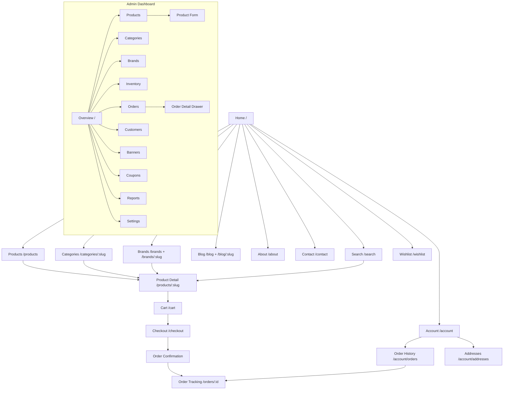
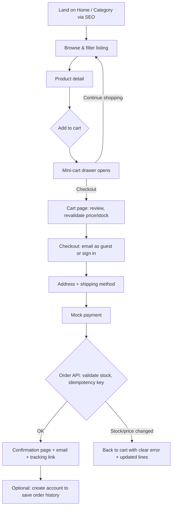
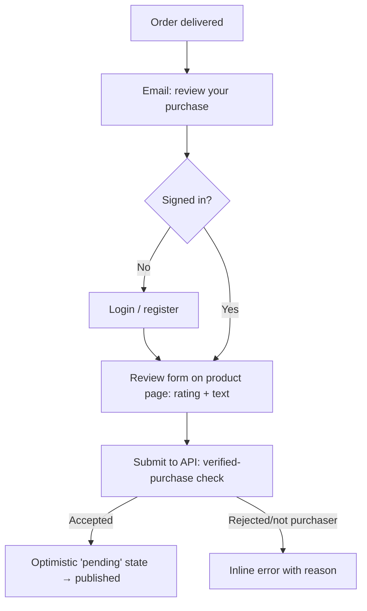
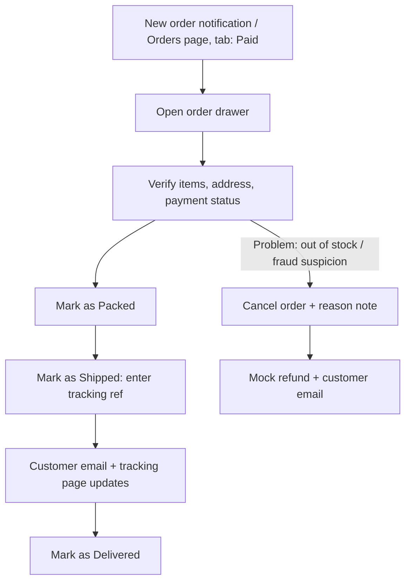

# Phase 7 — UI/UX Design

**Project:** Cosmetics E-Commerce Platform (Online Perfume Store)
**Scope:** Customer website (`cosmeticsecommerce-salepage`) and admin dashboard (`cosmeticsecommerce-dashboard`).
**Design intent:** A restrained luxury aesthetic — perfume retail sells desire and trust; the UI must feel premium (generous whitespace, editorial typography, muted palette with a gold accent) while staying fast, accessible, and conversion-focused.

---

## 1. Information Architecture

The IA follows the two primary jobs-to-be-done:

1. **Customer:** *discover → evaluate → buy → track.* Catalog navigation is faceted three ways (category, brand, scent family) because perfume shoppers search by all three interchangeably. Content (blog) feeds discovery; account features (wishlist, orders) support retention.
2. **Admin:** *catalog upkeep → order fulfillment → marketing → measurement.* Grouped in the sidebar by workflow frequency (Catalog and Sales daily; Marketing weekly; Reports/Settings occasional).

Principles applied:
- Max **3 levels deep** anywhere on the storefront (Home → Category → Product).
- Every catalog state is a **URL** (shareable, back-button-safe, crawlable where intended).
- Personal pages (`/account`, `/cart`, `/checkout`) are isolated from the SEO tree and `noindex`.

## 2. Sitemap



## 3. Navigation Flow

**Storefront header (persistent):** Logo → primary nav (Shop ▾ mega-menu: categories + featured brands | Brands | Blog | About) → search icon (opens autocomplete) → wishlist icon → account icon → cart icon with badge. Mobile: hamburger drawer with the same tree, search bar pinned at top.
**Breadcrumbs** on all catalog/blog pages (`Home / Eau de Parfum / Dior Sauvage`) — orientation + `BreadcrumbList` SEO.
**Footer:** category/brand link columns (SEO internal linking), help links (shipping, returns, contact), newsletter, legal.
**Admin:** fixed sidebar (see Phase 6 §B.2) + topbar global search; breadcrumb in the content header for sub-routes (Products / Edit "Sauvage EDP").

Cross-flow shortcuts (reduce steps to purchase): add-to-cart from listing cards opens the mini-cart drawer (stay in flow); mini-cart offers both "View cart" and direct "Checkout".

## 4. Wireframes (key screens)

### 4.1 Home (mobile-first shown desktop)
```
┌──────────────────────────────────────────────────────────────┐
│ LOGO      Shop ▾  Brands  Blog  About        🔍  ♡  👤  🛍(2) │
├──────────────────────────────────────────────────────────────┤
│  ┌────────────────────────────────────────────────────────┐  │
│  │            HERO IMAGE (campaign, admin banner)          │  │
│  │   "Find Your Signature Scent"        [ Shop Now ]       │  │
│  └────────────────────────────────────────────────────────┘  │
│  Shop by Category                                             │
│  [Eau de Parfum] [Eau de Toilette] [Unisex] [Gift Sets]      │
│  New Arrivals ────────────────────────────────── View all →  │
│  ┌──────┐ ┌──────┐ ┌──────┐ ┌──────┐                        │
│  │ img ♡│ │ img ♡│ │ img ♡│ │ img ♡│   (product cards)      │
│  │Brand │ │Brand │ │Brand │ │Brand │                         │
│  │Name  │ │Name  │ │Name  │ │Name  │                         │
│  │$120  │ │$85   │ │$150  │ │$95   │                         │
│  └──────┘ └──────┘ └──────┘ └──────┘                        │
│  Featured Brands   [logo] [logo] [logo] [logo] [logo]        │
│  From the Journal (blog teasers)          Newsletter [email→] │
├──────────────────────────────────────────────────────────────┤
│ FOOTER: Categories | Brands | Help | Legal | Social           │
└──────────────────────────────────────────────────────────────┘
```

### 4.2 Product Listing / Category
```
┌──────────────────────────────────────────────────────────────┐
│ Home / Eau de Parfum                                          │
│ Eau de Parfum (124)                        Sort: [Newest ▾]  │
├───────────────┬──────────────────────────────────────────────┤
│ FILTERS       │  Applied: [Woody ×] [Dior ×]  Clear all      │
│ Brand         │  ┌──────┐ ┌──────┐ ┌──────┐ ┌──────┐        │
│  ☑ Dior (18)  │  │ img ♡│ │ img ♡│ │ img ♡│ │ img ♡│        │
│  ☐ Chanel(22) │  │Brand │ │Brand │ │Brand │ │Brand │        │
│ Scent family  │  │Name  │ │Name  │ │★4.6  │ │Name  │        │
│  ☑ Woody      │  │$120  │ │$85   │ │$150  │ │Sold  │        │
│  ☐ Floral     │  │[Add] │ │[Add] │ │[Add] │ │ out  │        │
│ Price         │  └──────┘ └──────┘ └──────┘ └──────┘        │
│  [$0───●──●─] │  … grid continues …                          │
│ Gender        │        ‹ 1  2  3 … 11 ›                      │
└───────────────┴──────────────────────────────────────────────┘
(mobile: filters become a bottom-sheet via a [Filter (2)] button)
```

### 4.3 Product Detail
```
┌──────────────────────────────────────────────────────────────┐
│ Home / Brands / Dior / Sauvage EDP                            │
│ ┌───────────────┐  DIOR                                       │
│ │               │  Sauvage Eau de Parfum          ★4.7 (312)  │
│ │   MAIN IMAGE  │  $150.00                        In stock    │
│ │               │  Size:  ( 60ml )  (●100ml )  ( 200ml )      │
│ │ [t][t][t][t]  │  Qty [− 1 +]   [ Add to Cart ]   [♡ Save]  │
│ └───────────────┘  Free shipping over $80 · 30-day returns    │
│ ─ Scent Profile ─────────────────────────────────────────────│
│   Top: Bergamot        Heart: Lavender      Base: Ambroxan    │
│ ─ Description ─  ─ Ingredients ─  ─ Shipping ─  (accordion)  │
│ ─ Reviews (312) ─────────────────────────────────────────────│
│   ★★★★★ 68% ▓▓▓▓▓▓▓   [Write a review]                      │
│   "Long lasting…" — K., verified purchase                     │
│ ─ You may also like ──────────── [card][card][card][card]    │
└──────────────────────────────────────────────────────────────┘
(mobile: sticky bottom bar → [ $150 · Add to Cart ])
```

### 4.4 Cart
```
┌──────────────────────────────────────────────────────────────┐
│ Your Cart (2 items)                                           │
│ ┌──────────────────────────────────┐ ┌─────────────────────┐ │
│ │ [img] Dior Sauvage EDP 100ml     │ │ Order Summary       │ │
│ │       $150.00   Qty [− 1 +]  ✕   │ │ Subtotal   $235.00  │ │
│ │──────────────────────────────────│ │ Shipping    FREE    │ │
│ │ [img] Chanel No.5 EDT 60ml       │ │ Coupon [____][Apply]│ │
│ │       $85.00 ⚠ price updated     │ │ ─────────────────── │ │
│ │       Qty [− 1 +]  ✕             │ │ Total      $235.00  │ │
│ └──────────────────────────────────┘ │ [ Checkout → ]      │ │
│  ← Continue shopping                 └─────────────────────┘ │
│ (empty state: illustration + "Your cart is empty"            │
│  + [Browse Bestsellers])                                     │
└──────────────────────────────────────────────────────────────┘
```

### 4.5 Checkout
```
┌──────────────────────────────────────────────────────────────┐
│ Checkout                                    🔒 Secure         │
│ ┌────────────────────────────────┐ ┌──────────────────────┐  │
│ │ 1. Contact                     │ │ Order Summary        │  │
│ │   Email [________________]     │ │ 2 items       $235.00│  │
│ │   ☐ Create an account          │ │ Shipping        FREE │  │
│ │ 2. Shipping address            │ │ Total         $235.00│  │
│ │   Name / Address / City / Zip  │ │ [img] Sauvage ×1     │  │
│ │ 3. Shipping method             │ │ [img] No.5   ×1      │  │
│ │   (●) Standard FREE 3–5 days   │ └──────────────────────┘  │
│ │   ( ) Express $9  1–2 days     │                            │
│ │ 4. Payment  (MOCK — simulation)│                            │
│ │   Card [4242 4242 4242 4242]   │                            │
│ │ [        Place Order        ]  │                            │
│ └────────────────────────────────┘                            │
└──────────────────────────────────────────────────────────────┘
```

### 4.6 Admin — Dashboard Overview
```
┌───────────┬──────────────────────────────────────────────────┐
│ ● Overview│  Dashboard                    [Last 30 days ▾]    │
│ Catalog   │  ┌─────────┐┌─────────┐┌─────────┐┌─────────┐    │
│  Products │  │Revenue  ││Orders   ││Avg Order││Low Stock│    │
│  Categorie│  │$12,480  ││ 214     ││ $58.30  ││  7 ⚠    │    │
│  Brands   │  │▲ 12%    ││▲ 8%     ││▼ 2%     ││ View →  │    │
│  Inventory│  └─────────┘└─────────┘└─────────┘└─────────┘    │
│ Sales     │  Revenue ────────────────────────────────────    │
│  Orders   │  ┌────────────────────────────────────────────┐  │
│  Customers│  │        line chart (daily revenue)           │  │
│ Marketing │  └────────────────────────────────────────────┘  │
│  Banners  │  Recent Orders                                    │
│  Coupons  │  │#1042 K. Smith  $150  ● Paid     2m ago  →  │  │
│ Reports   │  │#1041 A. Chen   $85   ● Shipped  1h ago  →  │  │
│ Settings  │                                                   │
└───────────┴──────────────────────────────────────────────────┘
```

### 4.7 Admin — Product Form
```
┌───────────┬──────────────────────────────────────────────────┐
│ (sidebar) │ Products / Edit: Sauvage EDP     [Discard] [Save]│
│           │ [ General | Variants | Images | Scent | SEO ]     │
│           │ ── General ──────────────────────────────────────│
│           │ Name*   [Sauvage Eau de Parfum         ]          │
│           │ Slug    [sauvage-eau-de-parfum] (auto)            │
│           │ Brand*  [Dior ▾]     Category* [EDP ▾]            │
│           │ Status  (●) Active ( ) Draft ( ) Archived         │
│           │ Description [rich text editor              ]      │
│           │ ── Variants ─────────────────────────────────────│
│           │ │ 60ml  │ $95.00  │ SKU-…-60  │ stock 42 │ ✕ │   │
│           │ │ 100ml │ $150.00 │ SKU-…-100 │ stock 18 │ ✕ │   │
│           │ [+ Add variant]                                   │
│           │ ── Images ── [drag & drop upload] [thumb][thumb]  │
└───────────┴──────────────────────────────────────────────────┘
```

## 5. User Flows

### 5.1 Guest → Purchase


### 5.2 Review Flow


### 5.3 Admin Order Fulfillment


## 6. Responsive Strategy

**Mobile-first** (most storefront traffic is mobile). Tailwind breakpoints:

| Token | Width | Storefront behavior |
|---|---|---|
| base | <640px | Single column; filter bottom-sheet; sticky add-to-cart bar; 2-col product grid; hamburger nav |
| `sm` | ≥640px | 2–3 col grids |
| `md` | ≥768px | Header nav inline; PDP two-column |
| `lg` | ≥1024px | Filter sidebar visible; 4-col grid; mega-menu |
| `xl` | ≥1280px | Max content width 1280px, centered |

Per-page adaptations: **Listing** — filter sidebar ↔ bottom sheet; **PDP** — gallery stacks above info, sticky CTA bar appears; **Checkout** — summary collapses into an expandable header bar on mobile; **Admin** — sidebar → icon rail (`md`) → off-canvas drawer (base); data tables become card lists or gain horizontal scroll with a pinned first column below `md`. Touch targets ≥44×44px everywhere.

## 7. Design System — Tokens

Tokens live in the shared Tailwind config (consumed by both repos) so storefront and admin stay one visual family.

```
--color-*        (palette, §9)          --font-display / --font-body (§10)
--space-*        4px scale (§11)        --radius: 2px (subtle, luxury = sharp)
--shadow-sm/md/lg (soft, low-alpha)     --transition: 150ms ease-out
--z-dropdown:1000 --z-drawer:1100 --z-modal:1200 --z-toast:1300
```

Decision: near-square corners (2px) and hairline borders read as "premium editorial" (cf. luxury brand sites); heavy rounding reads consumer/casual.

## 8. Component Library

| Component | Variants / states |
|---|---|
| **Button** | primary (charcoal fill), secondary (outline), gold (accent CTA — used sparingly: Add to Cart, Place Order), ghost, destructive; sizes sm/md/lg; states hover/focus-visible/loading (spinner + disabled)/disabled |
| **Input** | text, email, password (show toggle), number stepper, textarea, select, search (with clear ×); states default/focus/error (message below, red border, `aria-describedby`)/disabled; label always visible (no placeholder-as-label) |
| **ProductCard** | default, sold-out (overlay + disabled CTA), sale (badge + strikethrough price), skeleton |
| **Card** | content card, stat/KPI card (admin), banner card |
| **Badge** | status (order: gray/blue/amber/green/red), sale, new, low-stock |
| **Table** (admin) | sortable headers, row selection, sticky header, inline edit cell, loading skeleton rows, empty state, pagination footer |
| **Modal / Drawer** | modal (confirm, small forms), right drawer (admin detail/edit), bottom sheet (mobile filters); all focus-trapped, ESC-closable |
| **Toast** | success/error/info/warning, auto-dismiss 5s, action slot ("Undo"), `aria-live=polite` |
| **Others** | Breadcrumbs, Pagination, Tabs, Accordion, RatingStars (display + input), QuantityStepper, PriceRange slider, EmptyState, Skeleton, Stepper (checkout), Avatar, Tooltip |

## 9. Color Palette (luxury perfume aesthetic)

Rationale: warm neutrals + deep charcoal evoke paper/ink editorial luxury; a restrained antique-gold accent signals premium without kitsch. Accent is used only for the primary conversion action per screen.

| Token | Hex | Use | Contrast on pairing |
|---|---|---|---|
| `ink-900` | `#1A1714` | Primary text, primary buttons | 16.5:1 on `cream-50` ✔ AAA |
| `ink-700` | `#3D3833` | Headings on light | 10.9:1 on white ✔ |
| `ink-500` | `#6B635A` | Secondary text | 5.6:1 on `cream-50` ✔ AA |
| `cream-50` | `#FAF7F2` | Page background | — |
| `cream-100` | `#F1EBE2` | Cards, section alt background | — |
| `sand-300` | `#D9CDBB` | Borders, dividers | decorative |
| `gold-600` | `#8C6D3F` | Accent CTA fill, links | 5.0:1 on `cream-50` ✔ AA; white text on it 4.6:1 ✔ AA |
| `gold-700` | `#75592F` | Accent hover | 6.9:1 ✔ |
| `blush-200` | `#EAD5CE` | Feminine-line highlights, imagery mats | decorative only, never text |
| **Semantic** | | | |
| `success-600` | `#2F6B4F` | In stock, order delivered, toasts | 5.3:1 on white ✔ AA |
| `warning-600` | `#9A6B1F` | Low stock, price-changed | 4.9:1 ✔ AA |
| `error-600` | `#A3352C` | Errors, destructive | 6.4:1 ✔ AA |
| `info-600` | `#2F5D77` | Informational | 5.9:1 ✔ AA |

All text/background pairs above meet WCAG 2.1 AA (≥4.5:1 normal text; ratios computed with the WCAG relative-luminance formula). Decorative tones (`blush`, `sand`) are never used for text. Admin dashboard uses the same tokens on a neutral `#FFFFFF`/`#F5F4F2` base for data density.

## 10. Typography

- **Display / headings:** *Cormorant Garamond* (serif) — high-contrast editorial serif matching fragrance-house branding conventions.
- **Body / UI:** *Inter* (sans) — highly legible at small sizes, excellent number rendering for prices and admin tables.
- Pairing rationale: classic serif for emotion, neutral sans for function — the standard luxury-editorial pairing; both are free Google Fonts (self-hosted, `font-display: swap`, subset latin).

Scale (1.25 ratio, rem):
`display 3rem/1.1 · h1 2.25 · h2 1.75 · h3 1.375 · h4 1.125 · body 1rem/1.6 · small 0.875 · caption 0.75`
Prices use `font-variant-numeric: tabular-nums` in tables. Line length capped at ~70ch for blog/descriptions. Minimum UI font size 12px (captions only); body never below 16px on mobile (also prevents iOS zoom-on-focus).

## 11. Spacing System

4px base unit; Tailwind default scale used as-is: `1=4px, 2=8, 3=12, 4=16, 6=24, 8=32, 12=48, 16=64, 24=96`.
Rules: components use 8/12/16 internal padding; section rhythm on the storefront is 64–96px vertical (whitespace *is* the luxury cue); admin uses a denser 16/24 rhythm; grid gutters 16px mobile / 24px desktop. One scale, no ad-hoc pixel values.

## 12. Iconography

**Lucide** icon set (single set — visual consistency, tree-shakeable, 1.5px stroke matches the hairline aesthetic). Sizes 16/20/24 aligned to the 4px grid. Rules: icons accompanying text are `aria-hidden="true"`; icon-only buttons require `aria-label` (cart, wishlist, search, close). Wishlist heart uses outline→filled state; cart badge is text, not icon-encoded.

## 13. Accessibility — WCAG 2.1 AA (specific requirements)

1. **Contrast:** all text ≥4.5:1 (≥3:1 for ≥24px/19px-bold text and UI component boundaries) — enforced by the palette in §9; automated check (axe) in CI.
2. **Focus states:** visible `:focus-visible` ring on every interactive element — 2px `gold-600` outline with 2px offset; never `outline: none` without a replacement. Focus order follows DOM order; drawers/modals trap focus and restore it to the trigger on close.
3. **Keyboard navigation:** every flow completable by keyboard — mega-menu (arrow keys/ESC), autocomplete (combobox pattern: `role="combobox"`, `aria-expanded`, arrow selection), quantity steppers, filter checkboxes, carousel (buttons, not swipe-only), checkout end-to-end. "Skip to content" link first in tab order.
4. **Alt text:** product images get meaningful alt (`"Dior Sauvage Eau de Parfum 100ml bottle"` — sourced from a required alt field in the admin product form); decorative imagery `alt=""`.
5. **Form labels:** every input has a programmatic `<label>` (visible, not placeholder-only); errors linked via `aria-describedby` and announced (`aria-live`); required fields marked in text, not color alone.
6. **Semantics:** landmark regions (`header/nav/main/footer`), one `h1` per page, buttons vs links used correctly (links navigate, buttons act), tables with `<th scope>`, order status conveyed by text + color (never color alone).
7. **Motion & zoom:** honor `prefers-reduced-motion`; layout usable at 200% zoom and 320px width; no horizontal scroll of body content.
8. **Live regions:** cart badge updates, toasts, and "n results" filter counts announced via polite live regions.

## 14. UX Best Practices Applied

- **Cart persistence:** localStorage-backed, merged to the account on login (Phase 6 §A.5) — abandonment recovery starts with never losing the cart.
- **Optimistic UI:** wishlist toggle, cart quantity, admin order-status transitions update instantly and roll back with an error toast on API failure — perceived speed without lying about failures.
- **Empty states:** every empty list (cart, wishlist, search, order history, admin tables) shows an illustration, a one-line explanation, and one constructive action ("Browse Bestsellers", "+ New Product") — never a blank table.
- **Loading skeletons:** shape-matched skeletons for product grids, PDP, and admin tables (no spinners for content areas — skeletons reduce perceived wait and layout shift). Buttons show inline spinners and disable during submission.
- **Error recovery:** inline field-level validation on blur; form state preserved on failed submit; checkout stock/price conflicts return the user to the cart with the exact lines flagged; global API failures show a retry action, not a dead end; 404 pages offer search + popular categories.
- **Feedback everywhere:** add-to-cart opens the mini-cart (visible consequence); destructive actions confirm (modal) and where cheap, offer Undo (toast) instead.
- **Trust signals in the funnel:** stock honesty ("Only 2 left"), shipping threshold nudge in the cart, secure-checkout labeling, mock payment clearly marked as a simulation (academic honesty + no dark pattern).

## 15. Risks

1. **Luxury whitespace vs. conversion density** — too much air pushes products below the fold on mobile. *Mitigation:* mobile keeps 2-column grids and tighter section rhythm; validate with scroll-depth analytics.
2. **Serif display font rendering** at small sizes is poor. *Mitigation:* serif restricted to ≥20px headings; all UI text in Inter.
3. **Gold accent contrast drift** — designers lightening `gold-600` would break AA. *Mitigation:* tokens are the only source of color; CI contrast check.
4. **ASCII wireframes are directional, not pixel specs** — implementation could diverge. *Mitigation:* the component library (§8) + tokens (§7) are the binding contract; build base components first.
5. **Accessibility regressions** as features ship. *Mitigation:* axe-core in CI + keyboard-only manual pass on the four funnel pages each release.
6. **Two apps drifting visually.** *Mitigation:* single shared Tailwind preset/token package (Recommendation 1, Phase 6).

## 16. Recommendations

1. Publish the tokens (§7–§12) as a shared Tailwind preset package consumed by both repos before building screens.
2. Build the storefront funnel in priority order — PDP → cart → checkout → listing → home — since PDP quality drives conversion most.
3. Run one moderated usability test (5 users) on the guest-purchase flow with the mock payment before final submission; fix top-3 findings.
4. Add analytics events aligned to the flows in §5 (view_item, add_to_cart, begin_checkout, purchase) so UX decisions can be measured later.
5. Keep a living component inventory page (Astro route / Nuxt route, dev-only) rendering every component variant — doubles as visual regression surface and documentation.
6. Document alt-text and product-photography guidelines (white/cream background, consistent bottle angle) in the admin — visual consistency of the grid is a UX feature.
