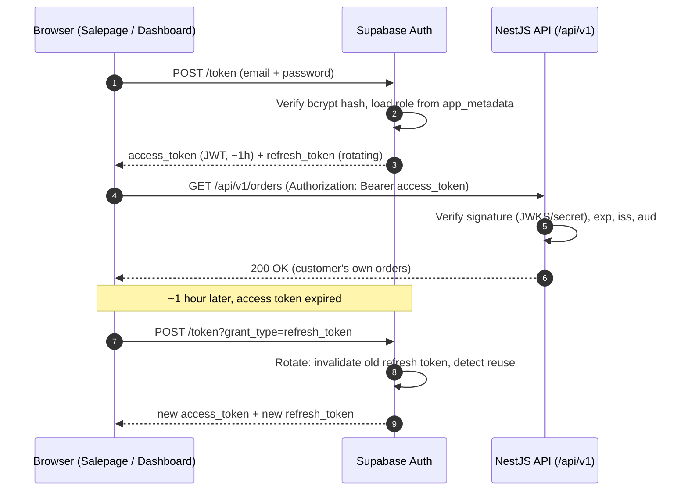
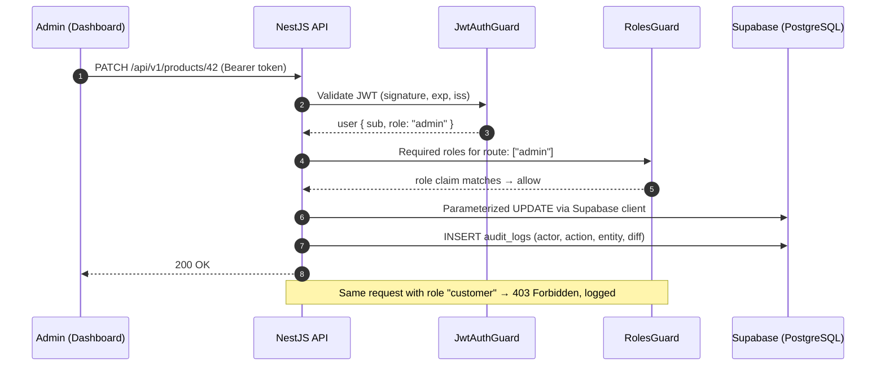

# Phase 8 — Security Design

**Project:** Cosmetics E-Commerce Platform (Online Perfume Store)
**Document status:** Approved for implementation
**Applies to:** `cosmeticsecommerce-server` (NestJS REST API), `cosmeticsecommerce-salepage` (Astro customer site), `cosmeticsecommerce-dashboard` (Nuxt 3 admin SPA)
**Related documents:** Phase 9 — DevOps & Deployment (`09-devops-deployment.md`)

---

## 1. Overview and Security Principles

This document defines the security architecture for the platform. Every control below is described with **why it is required** and **the concrete threat it mitigates**. The design follows these principles:

1. **Least privilege** — every actor (guest, customer, admin, service) gets the minimum access needed.
2. **Defense in depth** — no single control is trusted alone; validation, authentication, authorization, and logging layer on top of each other.
3. **Single trust boundary to the database** — only `cosmeticsecommerce-server` talks to Supabase. Frontends never hold privileged credentials.
4. **Secure by default** — deny-first CORS, whitelist-first validation, admin-only mutations.
5. **Delegate what specialists do better** — password storage and token issuance are delegated to Supabase Auth rather than reimplemented.

### Trust boundaries

| Zone | Components | Trust level |
|---|---|---|
| Public internet | Browsers of guests, customers, admins | Untrusted |
| Frontend hosting (Vercel/Netlify) | Astro salepage, Nuxt dashboard | Untrusted from the API's perspective (they run in the user's browser) |
| API (Render/Railway) | NestJS `/api/v1` | Trusted application tier |
| Supabase | PostgreSQL, Auth, Storage | Trusted data tier, reachable only from the API |

---

## 2. JWT Authentication

### Design

- Authentication is performed by **Supabase Auth**, which issues a **short-lived JWT access token (~1 hour)** and a refresh token on login/registration.
- The NestJS API **validates every access token** on protected routes using Supabase's JWKS endpoint (for asymmetric keys) or the shared JWT secret (for HS256 projects). Validation checks: signature, `exp`, `iss` (the Supabase project URL), and `aud`.
- The token is sent by clients as `Authorization: Bearer <access_token>`.
- The API never mints its own session tokens; there is exactly one token authority (Supabase Auth), which avoids two sources of truth for identity.

### Why it is required / threats mitigated

| Threat | How JWT auth mitigates it |
|---|---|
| **Impersonation** — an attacker calls the API pretending to be a customer or admin | Every protected request must carry a cryptographically signed token; forging one requires the signing key, which never leaves Supabase. |
| **Session theft with long exposure window** | Access tokens expire after ~1 hour, so a stolen token has a bounded useful lifetime even if refresh rotation (below) fails. |
| **Token tampering** (changing `role` or `sub` claims) | Signature verification via JWKS/secret rejects any modified payload. |
| **Replay against the wrong service** | `iss`/`aud` checks reject tokens issued for other Supabase projects or audiences. |

**Decision note:** ~1 hour is a deliberate balance. Shorter (5–15 min) reduces the theft window further but increases refresh traffic and the chance of mid-checkout token expiry; longer (24 h) is unacceptable for an application handling orders and admin actions.

---

## 3. Refresh Token Strategy

### Design

- Supabase Auth issues **rotating refresh tokens**: each refresh consumes the old token and returns a new pair. A previously used refresh token is rejected, and reuse detection revokes the token family.
- Refresh happens through the Supabase client (or via the API acting as a proxy), never by hand-rolled endpoints.

### Storage: cookie vs memory trade-off

This is the most nuanced client-side decision, and it differs per frontend:

| Option | Pros | Cons |
|---|---|---|
| **httpOnly, Secure, SameSite cookie** | Invisible to JavaScript → immune to XSS token theft; survives page reloads | Requires CSRF protection (Section 13); needs same-site or carefully configured cross-site cookie setup between Vercel frontends and the Render API domain |
| **In-memory (JS variable / store)** | Immune to CSRF (nothing auto-attached); simple with bearer APIs | Stolen by any successful XSS; lost on page reload → forces re-login or a silent-refresh dance |
| **localStorage** | Survives reloads, simple | Fully readable by XSS — **rejected** for refresh tokens |

**Decision:**

- **Astro salepage (customer site):** mostly static/SSR pages with limited client-side JS. Sessions are managed via the Supabase JS client using its default persistence, with the recommendation to configure **cookie-based session storage on the SSR boundary** where server rendering needs the session. Because the salepage's authenticated surface is small (cart, checkout, order history), the exposure is limited and the short access-token lifetime bounds damage.
- **Nuxt dashboard (admin SPA):** higher-value target (admin role). Access token is held **in memory** in the Pinia/auth store; the refresh token is kept in the Supabase client's storage with rotation enabled. On app boot the SPA performs a silent refresh. Admin sessions additionally get shorter idle logout in the UI.
- **localStorage for refresh tokens is prohibited** in both frontends.

### Why it is required / threats mitigated

| Threat | Mitigation |
|---|---|
| **Stolen refresh token reused indefinitely** | Rotation: each token is single-use; reuse triggers family revocation, logging the attacker and the victim out. |
| **XSS exfiltrating long-lived credentials** | No refresh tokens in localStorage; access tokens are short-lived; dashboard keeps access token in memory. |
| **Permanent sessions on shared devices** | Rotation plus Supabase session expiry forces periodic re-authentication. |

---

## 4. Role-Based Access Control (RBAC)

### Design

- Roles: **guest** (unauthenticated), **customer**, **admin**.
- The role is stored in two synchronized places:
  1. A **`roles`/profile table** in PostgreSQL — the source of truth, editable only by admin tooling.
  2. A **custom claim in the JWT** (`app_metadata.role`), injected at token issuance so the API can authorize without a DB round-trip per request.
- NestJS enforcement: a global `JwtAuthGuard` authenticates, then a `RolesGuard` reads a `@Roles('admin')` decorator on controllers/handlers and compares against the token claim. Routes without a roles decorator default to authenticated-customer or public per explicit annotation — **never implicit admin access**.
- Because roles live in `app_metadata` (server-controlled), users cannot self-elevate; `user_metadata` (user-editable) is never used for authorization.

### Permission matrix (reference)

| Resource / action | Guest | Customer | Admin |
|---|---|---|---|
| Browse products, categories | Read | Read | Read |
| Product CRUD | — | — | Full |
| Cart | Local only | Own cart | — |
| Place order (mock payment) | — | Own | — |
| View orders | — | Own only | All |
| Update order status | — | — | Yes |
| Manage users / roles | — | — | Yes |
| Upload product images | — | — | Yes |
| View audit logs | — | — | Yes |

The full matrix per endpoint lives in the API design document; guards must match it exactly.

### Why it is required / threats mitigated

| Threat | Mitigation |
|---|---|
| **Vertical privilege escalation** — a customer calling admin endpoints (create product, change order status) | `RolesGuard` rejects any token whose role claim does not match the required role; role claim is signed and server-assigned. |
| **Horizontal escalation** — customer A reading customer B's orders | Ownership checks in services filter by `user_id = token.sub` in addition to role checks (RBAC alone is not enough for object-level authorization — see OWASP A01). |
| **Role tampering** | Role is in `app_metadata` inside a signed JWT; changing it client-side invalidates the signature. |

---

## 5. Authentication Flow

## 6. Authorization Flow

---

## 7. Password Hashing

### Design

- Passwords are handled **exclusively by Supabase Auth**, which stores them hashed with **bcrypt** (salted, adaptive cost factor). The NestJS API and both frontends **never see, transmit onward, log, or store** a plaintext password; credentials go from the browser directly to Supabase Auth over TLS.

### Why plaintext is never stored

If the database leaks (SQL injection elsewhere, backup theft, insider access), plaintext passwords compromise not only this platform but every other site where users reused the password. bcrypt makes each guess computationally expensive and per-user salted, so bulk cracking and rainbow tables are impractical.

### Why delegation to Supabase is acceptable

- Rolling our own credential storage means owning salt generation, cost-factor tuning, timing-safe comparison, migration on parameter changes, and breach response — high-risk code with zero product value.
- Supabase Auth is a maintained, widely audited implementation on top of GoTrue; delegating follows the "don't build your own crypto/auth" industry norm.
- The residual risk (dependence on Supabase's security posture) is accepted and is smaller than the risk of a bespoke implementation by a small team.

### Threats mitigated

| Threat | Mitigation |
|---|---|
| Credential database leak → mass account takeover | bcrypt hashing with salt makes offline cracking expensive per password. |
| Credential stuffing across sites after a breach | Hashes are not reversible; leaked data does not reveal reusable passwords. |
| Passwords in logs or crash dumps | Plaintext never enters our API tier at all. |

---

## 8. Rate Limiting

### Design

Implemented with `@nestjs/throttler` on the API:

| Scope | Limit | Rationale |
|---|---|---|
| Global default (all `/api/v1` routes) | **100 requests / minute / IP** | Generous for normal browsing; blocks naive scraping and accidental client loops. |
| Auth-adjacent endpoints (login proxy, password reset trigger, registration) | **5 requests / minute / IP** | Brute force and credential stuffing operate at high request volume; 5/min makes online guessing useless. |
| Checkout / order creation | **10 requests / minute / user** | Prevents order-spam against the mock payment flow and inventory. |

Responses over the limit return `429 Too Many Requests` with a `Retry-After` header. Limits are keyed by IP for anonymous traffic and by user ID for authenticated traffic. Supabase Auth additionally applies its own built-in rate limits on token endpoints, giving two layers.

### Why it is required / threats mitigated

| Threat | Mitigation |
|---|---|
| **Brute-force login / credential stuffing** | 5/min on auth endpoints caps guessing throughput to a useless rate. |
| **Denial of service / resource exhaustion** (cheap, single-source) | Global cap protects DB connections and compute on the small Render/Railway instance. |
| **Enumeration** (probing user emails, product IDs) | Throttling slows automated enumeration enough to be detectable in logs. |

*Limitation:* IP-based limiting is weak against distributed attacks; that residual risk is accepted for this project size and partially offset by hosting-provider protections (see Risks).

---

## 9. API Validation (DTOs)

### Design

- Every request body/query/param is bound to a DTO validated by **`class-validator`** through a global `ValidationPipe` configured with:
  - `whitelist: true` — properties not declared on the DTO are silently stripped.
  - `forbidNonWhitelisted: true` — unknown properties cause a `400 Bad Request` instead of being ignored, surfacing malicious or buggy clients immediately.
  - `transform: true` — payloads are coerced to typed DTO instances (e.g., string → number for IDs), avoiding type-confusion bugs downstream.
- Constraints declared per field: email format, string lengths, positive integers for quantities/prices, enum membership for statuses, UUID format for IDs.

### Why it is required / threats mitigated

| Threat | Mitigation |
|---|---|
| **Mass assignment** — client sends `{"role":"admin"}` or `{"price":0}` on an update | Whitelisting strips or rejects undeclared fields; sensitive fields simply do not exist on customer-facing DTOs. |
| **Type confusion / logic bypass** — arrays where strings are expected, negative quantities | Typed transformation plus constraints reject malformed shapes before business logic runs. |
| **Oversized payloads** | Length limits on strings and a global body-size limit bound memory usage. |

---

## 10. Input Sanitization

### Design

Validation (shape) is complemented by sanitization (content):

- **Normalization:** trim whitespace, normalize email casing, strip control characters from free-text fields (names, addresses, review text) at the DTO layer.
- **No HTML accepted:** the platform has no rich-text input; any field containing HTML tags in user input is stored as inert text, never interpreted. This removes the need for an HTML-sanitizer dependency.
- **Contextual escaping on output** (see XSS, Section 12) is the primary defense; input sanitization is a second layer, not a substitute.
- File names of uploads are replaced with server-generated UUIDs (Section 11), so path characters (`../`, null bytes) in user-supplied names never reach the filesystem or Storage keys.

### Threats mitigated

| Threat | Mitigation |
|---|---|
| Stored XSS payloads in product reviews / addresses | Text stored inert + output encoding at render time. |
| Path traversal via file names | Server-generated object keys; user names used only as display metadata. |
| Log injection (newlines forging log entries) | Control characters stripped; structured JSON logging encodes values (see Phase 9). |

---

## 11. File Upload Security

### Design

Uploads (product images) are **admin-only** and flow through the API, never directly from the browser to Storage with broad credentials:

1. Dashboard sends the file to a guarded API endpoint (`@Roles('admin')`).
2. API validates:
   - **MIME type and magic bytes** — only `image/jpeg`, `image/png`, `image/webp`; the file's leading bytes must match the claimed type (extension alone is spoofable).
   - **Size limit** — max **5 MB** per image.
   - **Count/dimension sanity** — reject absurd dimensions to prevent decompression bombs.
3. API stores the object in a **private Supabase Storage bucket** under a server-generated UUID key.
4. Public product images are served through **long-lived public URLs on an images-only bucket** (or CDN); anything non-public (e.g., future invoices) is served via **time-limited signed URLs** generated by the API.

### Why it is required / threats mitigated

| Threat | Mitigation |
|---|---|
| **Malware / web-shell upload** | Type + magic-byte allowlist rejects executables and scripts; Storage never executes content and serves images with correct `Content-Type` and `X-Content-Type-Options: nosniff`. |
| **Storage exhaustion / cost attack** | Admin-only endpoint + 5 MB cap + rate limiting bound total volume. |
| **Unauthorized access to private files** | Private buckets; access only via API-issued signed URLs with short expiry. |
| **Path traversal / key collision** | UUID object keys generated server-side. |

---

## 12. SQL Injection & XSS Prevention

### SQL Injection Prevention

- All database access goes through the **Supabase client (PostgREST-backed query builder)**, which produces **parameterized queries**; user input is always bound as data, never concatenated into SQL text.
- No raw SQL string building anywhere in the API. If a raw query is ever unavoidable (reporting), it must use bound parameters and pass review.
- Combined with DTO validation (typed IDs, UUID checks), malformed input never reaches the query layer as executable syntax.

**Threat mitigated:** injection of `' OR 1=1 --`-style payloads reading or destroying data — historically the highest-impact web vulnerability class (OWASP A03).

### XSS Prevention

- **Output encoding by default:** Astro and Vue (Nuxt) both HTML-escape interpolated values. The rule is enforced in review: **`set:html` (Astro) and `v-html` (Vue) are banned** except for build-time, non-user content.
- **Content-Security-Policy** on both frontends restricting `script-src` to `'self'` (plus explicitly listed analytics/Sentry origins), `object-src 'none'`, `base-uri 'self'`. CSP is the backstop if an encoding mistake ships.
- API responses are always `application/json` with `X-Content-Type-Options: nosniff`, so the API itself cannot be used as an XSS vector via content sniffing.
- No user-generated HTML is ever stored or rendered (Section 10).

**Threat mitigated:** script injection stealing sessions or performing actions as the victim — especially critical on the **admin dashboard**, where a single XSS equals full store compromise.

---

## 13. CSRF Protection

### Design and rationale

- The API is a **bearer-token API**: the browser never automatically attaches the access token — client JS must explicitly set the `Authorization` header. A cross-site form or image tag therefore **cannot** make an authenticated request, which is what CSRF exploits. This is why bearer-token APIs are structurally less exposed to CSRF than cookie-session apps.
- CSRF protection **becomes mandatory the moment any authentication cookie is introduced** — specifically if the Astro salepage adopts httpOnly cookie sessions for SSR (Section 3). In that configuration:
  - Cookies are set with **`SameSite=Lax`** (blocks cross-site POSTs) and `Secure`.
  - State-changing SSR endpoints additionally verify **`Origin`/`Referer`** headers against the allowlist, or use a double-submit CSRF token.
- The API also rejects state-changing requests with unexpected `Content-Type` (only `application/json` accepted), which breaks simple-form CSRF vectors as an extra layer.

### Threat mitigated

A logged-in customer visiting a malicious site that silently submits `POST /api/v1/orders` or an admin whose browser is tricked into `DELETE /api/v1/products/42`. With bearer-only auth the attack fails outright; with cookies, SameSite + origin checks stop it.

---

## 14. CORS Policy

### Design

- The API sets an **explicit origin allowlist** — exactly two production origins:
  - `https://<salepage-domain>` (Astro on Vercel)
  - `https://<dashboard-domain>` (Nuxt on Vercel/Netlify)
  - Plus `http://localhost:<ports>` in non-production environments only, driven by config.
- **No wildcard (`*`)**, no origin reflection. Allowed methods and headers are enumerated (`GET, POST, PATCH, DELETE`, `Authorization`, `Content-Type`); `credentials: true` only if the cookie flow (Section 13) is enabled, and never together with a wildcard.
- Vercel preview URLs are handled via a validated pattern in staging config, never in production.

### Why it is required / threat mitigated

CORS does not stop server-to-server attackers, but it stops **malicious websites from reading API responses via the victim's browser** and, combined with credentials rules, prevents third-party origins from riding on cookies. A permissive `*` + credentials misconfiguration would effectively hand every website the user's session — the allowlist eliminates this class of mistake.

---

## 15. Security Headers

### Design

Applied via **`helmet`** middleware on the API and equivalent headers on the frontend hosts (Vercel config):

| Header | Value (production) | Threat mitigated |
|---|---|---|
| `Strict-Transport-Security` | `max-age=31536000; includeSubDomains` | SSL-stripping / downgrade to HTTP on hostile networks. |
| `X-Content-Type-Options` | `nosniff` | MIME sniffing turning uploads or JSON into executable content. |
| `Content-Security-Policy` | `frame-ancestors 'none'`; frontends add `script-src 'self' …` etc. (Section 12) | XSS payload execution; clickjacking via framing. |
| `X-Frame-Options` | `DENY` (legacy complement to `frame-ancestors`) | Clickjacking on older browsers. |
| `Referrer-Policy` | `strict-origin-when-cross-origin` | Leaking URLs (tokens in query strings must never exist anyway) to third parties. |
| `Permissions-Policy` | camera/microphone/geolocation disabled | Reduces impact of any injected script. |
| `X-Powered-By` | removed | Trivial fingerprinting of the stack. |

**Why:** headers are one-time, near-zero-cost mitigations that neutralize whole attack categories (clickjacking, sniffing, downgrade) regardless of application bugs — the cheapest defense-in-depth available.

---

## 16. Audit Logging

### Design

- An **`audit_logs` table** in PostgreSQL, written by the API (append-only; no UPDATE/DELETE grants for the application role).
- **What is logged:**
  - **Admin mutations:** product create/update/delete, order status changes, role changes, file uploads — with actor `user_id`, action, entity type/ID, before/after diff (excluding sensitive fields), timestamp, source IP.
  - **Auth events:** login success/failure (from Supabase Auth logs plus API-observed 401/403s), refresh-token reuse detections, role-check denials.
  - **Security signals:** rate-limit trips, `forbidNonWhitelisted` validation rejections on sensitive endpoints.
- **What is never logged:** passwords, full tokens, payment-like data. Tokens appear only as truncated hashes if needed for correlation.
- Retention: 1 year (project-appropriate), then purged.

### Why it is required / threats mitigated

| Threat / need | How audit logging helps |
|---|---|
| **Insider misuse / compromised admin account** | Every admin mutation is attributable and reviewable; anomalies (bulk deletes at 3 a.m.) are detectable. |
| **Incident forensics** | After a breach, the log answers *what was accessed and changed, by whom, when* — without it, recovery scope is guesswork. |
| **Repudiation** | Append-only records prevent "I never changed that order" disputes. |
| **Early attack detection** | Clusters of 401/403/429 and validation rejections reveal probing before it succeeds. |

---

## 17. OWASP Top 10 (2021) Mapping

| # | OWASP category | Controls in this design |
|---|---|---|
| A01 | Broken Access Control | RBAC guards + role claims (§4), object-level ownership checks, admin-only uploads (§11), deny-by-default routes |
| A02 | Cryptographic Failures | TLS everywhere (HSTS §15), bcrypt via Supabase (§7), signed JWTs (§2), signed URLs for private files (§11) |
| A03 | Injection | Parameterized queries via Supabase client (§12), DTO validation (§9), input sanitization (§10) |
| A04 | Insecure Design | Trust-boundary model (§1), single DB gateway, permission matrix (§4), threat-driven controls throughout |
| A05 | Security Misconfiguration | Helmet headers (§15), strict CORS allowlist (§14), config validation at boot (Phase 9), no service-role key in frontends |
| A06 | Vulnerable & Outdated Components | Dependabot/`npm audit` in CI (Phase 9), lockfiles, minimal dependency surface |
| A07 | Identification & Authentication Failures | Supabase Auth + short-lived JWTs (§2), refresh rotation (§3), auth rate limiting (§8) |
| A08 | Software & Data Integrity Failures | CI-only deploys with reviewed PRs (Phase 9), lockfile integrity, no unsigned dynamic code |
| A09 | Security Logging & Monitoring Failures | Audit logs (§16), structured logging + Sentry + uptime checks (Phase 9) |
| A10 | Server-Side Request Forgery | API makes no user-controlled outbound requests; image URLs are server-generated Storage keys only |

---

## 18. Risks

| # | Risk | Likelihood | Impact | Notes / residual handling |
|---|---|---|---|---|
| R1 | Supabase service-role key leakage (env mishandling, accidental commit) | Low | **Critical** — full DB bypass | Key exists only in API host env vars; secret scanning in CI; rotation runbook. |
| R2 | XSS on the admin dashboard | Low–Med | **High** — admin takeover | Encoding-by-default + `v-html` ban + CSP; dashboard treated as highest-value frontend. |
| R3 | Distributed brute force bypassing IP throttling | Medium | Medium | Supabase Auth's own limits as second layer; alerting on failed-login spikes. |
| R4 | Mock payment endpoint abused to create junk orders | Medium | Low–Med | Per-user checkout throttle; admin cleanup tooling; acceptable for university scope. |
| R5 | Dependency vulnerability (NestJS/Astro/Nuxt ecosystem) | Medium | Medium | Automated audit in CI, prompt patching cadence. |
| R6 | Misconfigured CORS/CSP in a rushed deploy | Low | Medium | Config validated at boot; headers asserted in an integration test. |
| R7 | Audit log growth / tampering | Low | Low–Med | Append-only grants, retention purge job. |

## 19. Recommendations

1. **Ship guards and validation globally on day one** — a global `ValidationPipe`, global auth guard with explicit `@Public()` opt-out, and helmet, before writing feature endpoints. Retrofitting security is where gaps appear.
2. **Add an integration test suite for the permission matrix** — one test per (role × sensitive endpoint) cell asserting 401/403/200; this is the cheapest guarantee against access-control regressions.
3. **Enable secret scanning** (GitHub push protection) on all three repos; the service-role key is the single most dangerous secret in the system.
4. **Review Supabase Auth settings explicitly:** enable refresh-token rotation and reuse detection, set access-token lifetime to 3600 s, and disable any unused OAuth providers.
5. **Treat the dashboard as production-critical:** shorter idle timeout, and consider requiring re-authentication for destructive actions (bulk delete, role changes).
6. **Document a key-rotation and incident-response runbook** (rotate service key, revoke sessions, review audit_logs) — even a one-page version turns a panic into a procedure.
7. **Defer, consciously:** WAF, MFA for admins, and Postgres Row-Level Security as a second enforcement layer are worthwhile future additions but out of scope for the initial release; record them as backlog items rather than silently omitting them.

---

*End of Phase 8 — Security Design.*
