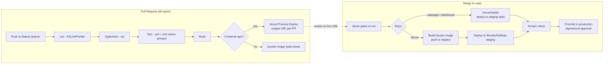

# Phase 9 — DevOps & Deployment

**Project:** Cosmetics E-Commerce Platform (Online Perfume Store)
**Document status:** Approved for implementation
**Applies to:** `cosmeticsecommerce-server` (NestJS API, Docker on Render/Railway), `cosmeticsecommerce-salepage` (Astro, Vercel; docs on GitHub Pages), `cosmeticsecommerce-dashboard` (Nuxt 3 SPA, Vercel/Netlify)
**Related documents:** Phase 8 — Security Design (`08-security-design.md`)

---

## 1. Overview

This document defines how the platform is built, configured, shipped, observed, and recovered. Guiding principles:

1. **Everything through CI** — no manual deploys; the pipeline is the only path to production.
2. **Configuration by environment variables** — code is identical across environments; only config differs (Twelve-Factor).
3. **Small-team pragmatism** — processes are sized for 2–4 developers; every alternative considered is weighed against team size.
4. **Fail loudly and early** — invalid config aborts boot; broken builds never deploy.

---

## 2. Environment Strategy

Three environments per component:

| Environment | Purpose | API host | Salepage / Dashboard | Supabase |
|---|---|---|---|---|
| **Local** | Development on developer machines | `localhost:3000` (Node or Docker) | `localhost:4321` / `localhost:3001` (dev servers) | Local Supabase CLI stack *or* a shared dev project |
| **Staging** | Integration testing, demo rehearsal, PR previews | Render/Railway staging service | Vercel preview deployments (per PR) + a persistent staging alias | Dedicated **staging Supabase project** |
| **Production** | Real users | Render/Railway production service | Production domains on Vercel/Netlify | Dedicated **production Supabase project** |

**Rules:**

- **Separate Supabase projects for staging and production** — never one project with shared tables. This isolates test data, allows destructive migration testing, and means a staging credential leak does not expose production data.
- Preview deployments (per-PR frontends) point at the **staging** API and staging Supabase, never production.
- Database migrations are applied to staging first, verified, then applied to production by the same scripted mechanism.

**Alternative considered:** a single Supabase project with schema prefixes — rejected; it saves nothing (free tier allows multiple projects) and makes an accidental `DELETE` in testing a production incident.

---

## 3. Environment Variables

### 3.1 Per-repository variables

**`cosmeticsecommerce-server` (API — the only holder of privileged secrets):**

| Variable | Example / notes | Secret? |
|---|---|---|
| `NODE_ENV` | `development` / `staging` / `production` | No |
| `PORT` | `3000` | No |
| `SUPABASE_URL` | `https://<project>.supabase.co` | No |
| `SUPABASE_ANON_KEY` | Public anon key, used for user-scoped calls | Low |
| `SUPABASE_SERVICE_ROLE_KEY` | **Server-side only. Bypasses RLS. Never in any frontend, never in client bundles, never in git.** | **Critical** |
| `SUPABASE_JWT_SECRET` (or JWKS URL) | For validating access tokens | **Critical** |
| `CORS_ORIGINS` | Comma-separated allowlist of the two frontend origins | No |
| `THROTTLE_TTL` / `THROTTLE_LIMIT` | `60` / `100` (see Phase 8 §8) | No |
| `LOG_LEVEL` | `debug` (local) / `info` (prod) | No |
| `SENTRY_DSN` | Error tracking | Low |

**`cosmeticsecommerce-salepage` (Astro):**

| Variable | Notes | Secret? |
|---|---|---|
| `PUBLIC_API_BASE_URL` | e.g. `https://api.<domain>/api/v1` | No |
| `PUBLIC_SUPABASE_URL` | For Supabase Auth client | No |
| `PUBLIC_SUPABASE_ANON_KEY` | Anon key only — safe by design for browsers, protected by Supabase Auth rules | Low |
| `PUBLIC_SENTRY_DSN` | Error tracking | Low |

**`cosmeticsecommerce-dashboard` (Nuxt 3):**

| Variable | Notes | Secret? |
|---|---|---|
| `NUXT_PUBLIC_API_BASE_URL` | API base URL | No |
| `NUXT_PUBLIC_SUPABASE_URL` | Auth client | No |
| `NUXT_PUBLIC_SUPABASE_ANON_KEY` | Anon key only | Low |
| `NUXT_PUBLIC_SENTRY_DSN` | Error tracking | Low |

### 3.2 Rules

- **The service role key exists in exactly one place per environment: the API host's secret store.** Any variable prefixed `PUBLIC_`/`NUXT_PUBLIC_` is bundled into client JavaScript and must be treated as world-readable — privileged keys must never carry these prefixes.
- Secrets live in provider dashboards (Render/Railway/Vercel env settings) and GitHub Actions **encrypted secrets**; never in `.env` files committed to git. Each repo ships a `.env.example` with names and placeholders only.
- GitHub push protection / secret scanning enabled on all three repos (see Phase 8, Risk R1).

---

## 4. Configuration Strategy

- The API uses **`@nestjs/config`** with a **validation schema evaluated at boot** (Joi or class-validator based): every required variable is declared with type and constraints (URL format, enum for `NODE_ENV`, numeric ranges for throttle values).
- **Missing or malformed configuration aborts startup with a named error** rather than failing at first request. Why: a deploy with a missing `SUPABASE_SERVICE_ROLE_KEY` should be a failed health check and automatic rollback, not a 500 storm an hour later.
- Config is exposed to the app via typed `ConfigService` accessors; no `process.env` reads scattered through business code.
- Frontends validate their `PUBLIC_*` variables at build time (a small check script in the build command), since a missing API URL should fail the Vercel build, not ship a broken site.

---

## 5. Git Flow / Branch Strategy

### Decision: GitHub Flow

- **`main` is always deployable.** Every change goes through a short-lived **feature branch** → **pull request** → **at least one review** → squash-merge to `main`.
- Branch naming: `feat/<scope>-
`, `fix/…`, `docs/…`, `chore/…`.
- `main` is protected: no direct pushes, required status checks (lint, typecheck, test, build) must pass, required review.
- Merging to `main` triggers deployment (staging automatically; production per Section 8).

### Why not full GitFlow

GitFlow (long-lived `develop`, `release/*`, `hotfix/*` branches) exists for products with scheduled release trains, parallel supported versions, and large teams. For a 2–4 person team continuously deploying three web apps it adds:

- **Merge overhead** — every change crosses two long-lived branches, doubling conflict surface.
- **Staleness** — `develop` drifts from production, so "works on develop" stops meaning anything.
- **Ceremony without benefit** — there are no parallel maintained versions of a SaaS-style web app; the release branch has nothing to hold.

GitHub Flow gives the same safety (protected main, reviewed PRs, CI gates) with one integration point. **Trade-off accepted:** no dedicated release-stabilization branch — mitigated by preview deployments and the staging environment doing that job.

---

## 6. Conventional Commits & SemVer

- All commits follow **Conventional Commits**: `feat:`, `fix:`, `docs:`, `refactor:`, `test:`, `chore:`, `ci:`, with `!`/`BREAKING CHANGE:` for breaking changes. Enforced lightly via a PR-title check (squash merges make the PR title the commit).
- **Why:** commit history becomes machine-readable — changelogs and version bumps can be generated, and reviewers can scan history by intent.
- **SemVer** applies per repo: `MAJOR` = breaking API contract change (e.g., `/api/v1` response shape), `MINOR` = new endpoints/features, `PATCH` = fixes. Versions are cut as git tags + GitHub Releases with generated changelogs.
- The REST API additionally carries its major version in the path (`/api/v1`), so a true breaking change means `/api/v2` alongside a MAJOR bump — frontends are never broken by surprise.

---

## 7. CI/CD Pipeline

Each repository has its own **GitHub Actions** workflow with the same skeleton: **lint → typecheck → test → build → deploy**.

### Per-repo specifics

| Repo | Test focus | Build artifact | Deploy target |
|---|---|---|---|
| `cosmeticsecommerce-server` | Unit tests (services, guards), permission-matrix integration tests (Phase 8) | **Docker image** (multi-stage: build → slim runtime, non-root user) | Render/Railway via image or connected repo deploy |
| `cosmeticsecommerce-salepage` | Component/unit tests, link check for docs | Static/SSR bundle; docs built to GitHub Pages | Vercel (site), GitHub Pages (docs) |
| `cosmeticsecommerce-dashboard` | Component/unit tests | SPA bundle | Vercel/Netlify |

### Pipeline rules

- `npm ci` with lockfiles for reproducible installs; `npm audit --audit-level=high` as a non-blocking-then-tightened step (dependency risk, Phase 8 A06).
- **Deploy previews:** every frontend PR gets a unique Vercel preview URL pointed at staging services — reviewers click the actual feature, not screenshots. This substitutes for a heavyweight QA stage.
- Docker image is built once and promoted (staging → production), not rebuilt per environment — the artifact tested is the artifact shipped.
- GitHub Pages docs deploy runs only when `docs/**` changes (path filter), keeping site deploys fast.

---

## 8. Deployment Strategy & Rollback

| Aspect | Frontends (Vercel/Netlify) | API (Render/Railway) |
|---|---|---|
| Unit of deploy | Immutable build per commit | Immutable Docker image per commit |
| Staging | Automatic on merge to `main` | Automatic on merge to `main` |
| Production | Promote via production alias / tagged release | Promote the staging-verified image tag; manual approval step in Actions |
| Zero-downtime | Inherent (atomic alias switch) | Provider health-check gated rollout: new instance must pass `/health` before traffic shifts |
| **Rollback** | One-click "redeploy previous build" / alias re-point (seconds) | Redeploy previous image tag (minutes); because images are immutable, rollback is exact |
| DB migrations | n/a | **Expand–migrate–contract**: additive migrations first, code deploy, destructive cleanup later — so a code rollback never faces a schema it cannot run on |

**Why immutable artifacts:** rollback becomes "run the old thing again," not "revert commits and hope the rebuild matches." This is the single biggest simplifier for incident response on a small team.

---

## 9. Logging

- **Structured JSON logs** on the API (`nestjs-pino` or equivalent): one JSON object per line with `timestamp`, `level`, `message`, `context`, `requestId`, `userId` (when authenticated), `path`, `statusCode`, `durationMs`.
- **Levels:** `error` (actionable failures), `warn` (degraded/suspicious: rate-limit trips, 403s), `info` (request summaries, lifecycle), `debug` (local only). Level set by `LOG_LEVEL` env var.
- **Correlation ID:** middleware assigns a UUID `requestId` per request (honoring an incoming `x-request-id`), included in every log line and returned in the response header — a user-reported error can be traced through logs and Sentry with one identifier.
- **Never logged:** passwords, tokens, full card-like data (mock payment payloads are treated as sensitive by habit). Aligns with Phase 8 §16.
- Logs are read via provider log streams (Render/Railway). **Alternative considered:** shipping to a hosted log platform (Logtail/Datadog) — deferred; provider retention plus Sentry covers project needs, revisit if retention becomes limiting.

---

## 10. Monitoring

- **Health endpoint:** `GET /health` on the API (via `@nestjs/terminus`): process liveness plus a Supabase connectivity check. Used by the hosting provider's health checks (deploy gating, restarts) and by uptime monitoring.
- **Uptime checks:** a free external monitor (UptimeRobot or Better Stack free tier) pings `/health`, the salepage, and the dashboard every 1–5 minutes; alerts via email to the team.
- **Provider metrics:** Render/Railway dashboards for CPU/memory/restart counts; Vercel analytics for frontend traffic and edge errors; Supabase dashboard for DB connections, slow queries, and storage usage.
- **Alert conditions (minimum set):** health check failing > 2 consecutive checks; Sentry error-rate spike; Supabase approaching connection or storage limits.
- **Alternative considered:** Prometheus + Grafana — rejected as operational overkill for one small API instance; provider metrics + uptime checks + Sentry give the same actionable signal at zero maintenance cost.

---

## 11. Error Tracking

- **Sentry (free tier)** across all three applications:
  - API: NestJS Sentry integration capturing unhandled exceptions and 5xx responses, tagged with `requestId`, release version, and environment.
  - Salepage & Dashboard: browser SDKs capturing runtime errors with source maps uploaded in CI, so minified stack traces resolve to real code.
- **Release tagging:** each deploy reports its git SHA/version to Sentry — "which deploy introduced this error" is answered automatically.
- **Why:** provider logs show *that* requests failed; Sentry shows *why*, with stack trace, breadcrumbs, and affected-user counts, and it deduplicates noise into issues. For a small team it replaces log spelunking as the first response to "the site is broken."
- Free-tier quota (limited events/month) is adequate at project scale; sampling can be lowered if exceeded.

---

## 12. Backup Strategy

| Layer | Mechanism | Frequency |
|---|---|---|
| PostgreSQL | **Supabase automated backups** (daily on the applicable plan) | Daily, managed |
| PostgreSQL (independent copy) | Scheduled **`pg_dump` export** via GitHub Actions cron (using a restricted connection string) to private storage / encrypted artifact | Weekly |
| Storage (product images) | Periodic bucket sync/export alongside the DB dump | Weekly |
| Schema & seed | **Migrations in git** — the schema is always reconstructible from the repo | Continuous |
| Configuration | `.env.example` in git + secrets documented in the ops runbook (names, locations — not values) | Continuous |

**Why the independent export:** Supabase's backups protect against data mistakes but live inside the same provider account. A weekly external dump protects against account lockout, project deletion, or provider-side failure — the classic "backups must survive the platform they back up" rule. **Restores are tested** at least once (documented drill): a backup that has never been restored is a hope, not a backup.

---

## 13. Disaster Recovery

### Targets (sized to the project — a university/portfolio production-standard system, not a revenue-critical store)

| Metric | Target | Rationale |
|---|---|---|
| **RPO** (max acceptable data loss) | **24 hours** (daily backups); worst case 7 days if only the external dump survives | Order volume is low; a day of loss is recoverable manually. |
| **RTO** (max acceptable downtime) | **4 hours** for full-stack recovery; minutes for single-component rollback | All components redeploy from git + registry; the DB restore dominates the time. |

### Recovery scenarios

| Scenario | Response |
|---|---|
| Bad deploy (API or frontend) | Rollback to previous immutable artifact (Section 8) — minutes. |
| Bad migration / data corruption | Restore Supabase backup to a new project or point-in-time; repoint `SUPABASE_URL`; replay any recoverable recent writes. |
| Supabase project lost | Create new project, run migrations from git, restore latest `pg_dump`, re-upload Storage export, rotate all keys, update API env vars. |
| Hosting provider outage (Render/Vercel) | Frontends: redeploy to alternate static host in minutes. API: Docker image is provider-agnostic — deploy the same image to Railway/Fly.io; only env vars and DNS change. |
| Leaked service-role key | Rotate key in Supabase, redeploy API with new secret, review `audit_logs` (Phase 8 runbook). |

The full runbook (step-by-step commands, secret locations, contact points) is maintained as a short ops document in the salepage docs; the drill is rehearsed once before final delivery.

---

## 14. Scalability Strategy

Current scale is small; the design keeps the cheap doors open rather than pre-building for load:

1. **Stateless API → horizontal scaling.** The NestJS API keeps no session or in-process state (JWTs carry identity; data lives in Supabase). Scaling is therefore "increase instance count" on Render/Railway behind the provider load balancer — no code change. *Kept honest by rule:* no in-memory caches that matter for correctness, no local file writes.
2. **CDN-first frontends.** Astro and the Nuxt SPA are static/edge-served on Vercel's CDN — they scale automatically and put near-zero load on the API for browsing traffic. Product pages render from static/ISR content where possible so catalog reads don't hit the API at all.
3. **Database:** indexes on foreign keys and hot query columns (`orders.user_id`, `products.category_id`, `order_items.order_id`) from day one — the cheapest performance work is done at design time. Supabase's built-in **PgBouncer pooling** protects connection limits as API instances grow. Later stages, in order of need: query optimization from slow-query logs → compute upgrade (vertical) → **read replicas** for read-heavy catalog traffic → caching layer (CDN/API-level) — explicitly deferred until measurements justify them.
4. **Rate limiting note:** with multiple API instances, the in-memory throttler becomes per-instance; acceptable initially, moving to a shared store (Redis) is the known upgrade if instance count grows.
5. **What we deliberately do not build now:** microservices, message queues, Kubernetes, Redis. A modular NestJS monolith on managed hosting outperforms all of them in team velocity at this scale, and the module boundaries are the future extraction seams if ever needed.

---

## 15. Risks

| # | Risk | Likelihood | Impact | Mitigation |
|---|---|---|---|---|
| R1 | Free-tier limits (Render sleep/cold starts, Supabase pausing inactive projects, Sentry quota) | **High** | Medium — slow first requests, paused staging DB | Uptime pings keep services warm; document limits; small paid tier for the demo/production window. |
| R2 | Secret leakage via misconfigured env (service key in a `PUBLIC_` var or committed `.env`) | Low | **Critical** | Naming convention + boot validation + secret scanning; reviewed in every PR touching config. |
| R3 | Config drift between staging and production | Medium | Medium | Single documented variable list (Section 3); boot-time validation fails fast on gaps. |
| R4 | Migration applied to production without staging pass | Low | High | Migrations run only via the scripted CI path, staging-first by pipeline order. |
| R5 | Vendor lock-in (Supabase-specific Auth/Storage APIs) | Medium | Medium | Accepted trade-off for velocity; DB is standard Postgres and exports weekly, so data is portable even if code isn't. |
| R6 | Untested backups | Medium | High | Mandatory restore drill (Section 12) before delivery. |
| R7 | Single API instance as availability bottleneck | Medium | Medium | Health-check auto-restart now; horizontal scale is a dial, not a project (Section 14). |

## 16. Recommendations

1. **Set up CI gates and branch protection before feature work** — pipelines added late get bypassed; added first, they are invisible habit.
2. **Do the restore drill early**, not before the deadline: restore the staging DB from a dump once, write down the minutes it took — that number is your real RTO.
3. **Keep one `ENVIRONMENTS.md`-style ops page** (variable list, secret locations, deploy/rollback commands, DR steps) — the difference between a 20-minute incident and a lost evening.
4. **Enable Dependabot on all three repos** with weekly grouped updates; small continuous upgrades beat one giant painful migration.
5. **Budget one small paid tier** (Render starter or equivalent) for the graded/production window to avoid cold-start embarrassment during demos — the highest-value dollars in the project.
6. **Tag a release for every production promotion** — the changelog and Sentry release correlation come free once Conventional Commits are in place.
7. **Defer consciously:** Redis-backed throttling, log aggregation, read replicas, and blue/green beyond provider defaults are all recorded as backlog items with their triggers (instance count > 1, log retention pain, measured DB read saturation) rather than built speculatively.

---

*End of Phase 9 — DevOps & Deployment.*
