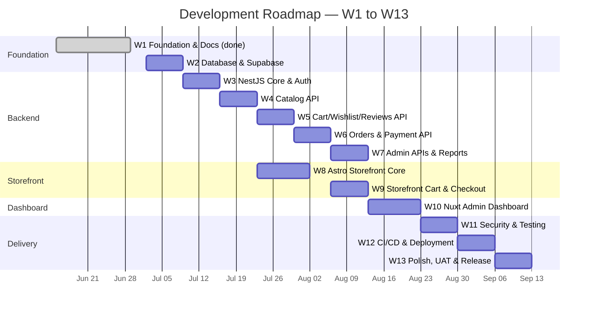

# Phase 11 — Development Roadmap

**Project:** Cosmetics E-Commerce Platform (Online Perfume Store)
**Version:** 1.0
**Date:** 2026-07-02
**Status:** Approved

---

## 1. Overview

The project is delivered as **13 workshops (W1–W13)**, each a focused milestone with a goal, testable acceptance criteria, and explicit dependencies. Order of attack: documentation and foundations first, then backend from the data layer outward, then the customer storefront, then the admin dashboard, then hardening, delivery, and release. The backend leads the frontends so every UI workshop consumes a real, documented API.

**Repos:** `server` = `cosmeticsecommerce-server` · `salepage` = `cosmeticsecommerce-salepage` · `dashboard` = `cosmeticsecommerce-dashboard`

### Timeline (Mermaid Gantt)

> Note: W8 can start in parallel with W5–W7 once the catalog API (W4) is stable — useful if frontend and backend work is split between team members.

### Summary Table

| # | Workshop | Repo(s) | Complexity | Est. Hours | Depends On | Status |
|---|----------|---------|------------|------------|------------|--------|
| W1 | Foundation, docs, repo setup | all | M | 30–40 | — | ✅ Complete |
| W2 | Database schema + Supabase | server | M | 20–30 | W1 | Pending |
| W3 | NestJS core (config, auth, guards, errors) | server | L | 30–40 | W2 | Pending |
| W4 | Catalog API | server | M | 25–35 | W3 | Pending |
| W5 | Cart / wishlist / reviews API | server | M | 25–35 | W4 | Pending |
| W6 | Orders + mock payment + inventory API | server | L | 35–45 | W5 | Pending |
| W7 | Admin APIs + reports | server | L | 35–45 | W6 | Pending |
| W8 | Astro storefront core | salepage | L | 35–45 | W4 | Pending |
| W9 | Storefront cart / checkout / profile | salepage | L | 30–40 | W6, W8 | Pending |
| W10 | Nuxt admin dashboard | dashboard | L | 40–50 | W7 | Pending |
| W11 | Security hardening + testing | all | L | 30–40 | W9, W10 | Pending |
| W12 | CI/CD + deployment + monitoring | all | M | 20–30 | W11 | Pending |
| W13 | Polish, UAT, final release | all | M | 20–30 | W12 | Pending |

Total estimate: **~375–485 hours**.

---

## 2. Workshops

### W1 — Foundation, Documentation & Repository Setup ✅ COMPLETE

- **Goal:** Establish the project's plan, design, and repositories so all later work has a documented target.
- **Objectives:** Complete phase docs 01–10; create the three GitHub repositories; set up branch protection, PR templates, `README.md`, `CONTRIBUTING.md`, `.env.example` in each repo; publish docs to GitHub Pages.
- **Scope — In:** All documentation phases 01–10, ADR-001, repo scaffolding, GitHub Pages setup.
- **Scope — Out:** Any application code.
- **Deliverables:** `docs/01`–`docs/10` published; three initialized repos; contribution workflow live.
- **Acceptance Criteria:** ✅ All met — docs 01–10 merged to `main` and rendering on GitHub Pages; all three repos exist with README, CONTRIBUTING, and protected `main`; ADR-001 accepted.
- **Dependencies:** None.
- **Complexity:** M (~30–40 h). **Repos:** all.

---

### W2 — Database Schema & Supabase Setup

- **Goal:** A running Supabase project with the complete schema migrated and seeded, ready for the API to build on.
- **Objectives:** Create Supabase project (dev + prod); implement all tables from `04-database-design.md` as versioned migrations; configure Supabase Auth (email/password) and Storage buckets (product images, banners); write seed script (brands, categories, ~30 perfume products, admin user).
- **Scope — In:** Migrations for users/profiles, products, brands, categories, inventory, carts, cart_items, wishlists, reviews, orders, order_items, payments, coupons, banners; indexes and FK constraints; storage bucket policies; seed data.
- **Scope — Out:** Row-level API logic, any NestJS code, RLS beyond storage defaults (API-mediated access is the model).
- **Deliverables:** Migration files in `server` repo; seed script (`npm run seed`); Supabase projects configured; ERD in `docs/04` verified against actual schema.
- **Acceptance Criteria:**
  - Fresh database + `migrate && seed` completes without error and yields browsable catalog data.
  - Every relationship in the ERD exists as an FK constraint; orphan inserts are rejected.
  - A test user can sign up via Supabase Auth and appears in the profiles table.
  - Image upload to the product bucket succeeds; public read URL works.
- **Dependencies:** W1. **Complexity:** M (~20–30 h). **Repos:** server.

---

### W3 — NestJS Core: Config, Auth, Guards, Error Handling

- **Goal:** A production-shaped NestJS skeleton every feature module plugs into.
- **Objectives:** Bootstrap NestJS with `/api/v1` global prefix; typed config module with env validation; Supabase JWT validation strategy; `AuthGuard` + `RolesGuard` (guest/customer/admin); global exception filter with a consistent error envelope; global `ValidationPipe`; Swagger setup at `/api/v1/docs`; health endpoint; Dockerfile.
- **Scope — In:** Auth endpoints (register, login, refresh, me — delegating to Supabase Auth), role decorators, request logging, CORS config, error envelope `{ statusCode, message, error, path, timestamp }`.
- **Scope — Out:** Any business/domain endpoints; rate limiting (W11).
- **Deliverables:** Running API container; auth module; guards; exception filter; Swagger UI live; `docker build` works.
- **Acceptance Criteria:**
  - `POST /api/v1/auth/register` + `login` return a Supabase JWT; `GET /auth/me` with that token returns the profile; without it returns 401.
  - An admin-only test route returns 403 for a customer token, 200 for admin.
  - Invalid DTO input returns 400 with the standard error envelope.
  - Swagger UI lists all auth endpoints with schemas; `GET /health` returns 200.
- **Dependencies:** W2. **Complexity:** L (~30–40 h). **Repos:** server.

---

### W4 — Catalog API: Products, Brands, Categories

- **Goal:** The public catalog readable via a complete, documented, filterable API.
- **Objectives:** CRUD modules for products, brands, categories (writes admin-guarded); public list/detail endpoints with pagination, search (name/description), filters (brand, category, price range), and sorting; product image URLs from Supabase Storage.
- **Scope — In:** `GET /products` (paginated + `?search=&brand=&category=&minPrice=&maxPrice=&sort=`), `GET /products/:slug`, brand/category list + detail, admin-guarded POST/PATCH/DELETE for all three, slug generation.
- **Scope — Out:** Reviews on the detail payload (W5), stock mutation (W6), admin bulk tooling (W7).
- **Deliverables:** Three feature modules with e2e happy-path tests; Swagger docs for all endpoints; seeded data browsable via API.
- **Acceptance Criteria:**
  - `GET /api/v1/products?search=oud&sort=price_asc&page=1&limit=12` returns correct, correctly ordered, paginated results with `total` metadata.
  - Guest can read everything; guest/customer POST to `/products` returns 401/403.
  - Product detail returns brand, category, images, and price; unknown slug returns 404 in the standard envelope.
  - e2e tests for list/filter/detail/authz pass in CI-runnable form (`npm run test:e2e`).
- **Dependencies:** W3. **Complexity:** M (~25–35 h). **Repos:** server.

---

### W5 — Cart, Wishlist & Reviews API

- **Goal:** Customer engagement features complete server-side.
- **Objectives:** Cart module (get, add item, update quantity, remove, clear) bound to the authenticated customer; wishlist add/remove/list; reviews (create with rating 1–5 + comment, list per product, one review per customer per purchased product, delete own review); product rating aggregate.
- **Scope — In:** All endpoints customer-guarded except public review listing; validation (quantity ≥ 1, stock-aware add-to-cart, rating bounds); review eligibility check (must have a delivered order containing the product — verify against orders schema now, enforce fully after W6).
- **Scope — Out:** Cart-to-order conversion (W6), admin review moderation (W7), guest carts (client-side only, documented in `06-frontend-design.md`).
- **Deliverables:** Cart, wishlist, review modules; e2e tests; Swagger updated.
- **Acceptance Criteria:**
  - Add-to-cart beyond available stock returns 400 with a clear message.
  - Cart totals (line totals, subtotal) are computed server-side and correct.
  - Duplicate wishlist add is idempotent; second review for the same product returns 409.
  - `GET /products/:slug` now includes `avgRating` and `reviewCount` consistent with posted reviews.
- **Dependencies:** W4. **Complexity:** M (~25–35 h). **Repos:** server.

---

### W6 — Orders, Mock Payment & Inventory API

- **Goal:** The full purchase lifecycle: checkout → payment → stock decrement → trackable order.
- **Objectives:** Checkout endpoint converting the cart to an order (address, coupon application, totals snapshot); mock payment endpoint (deterministic success/failure via test card numbers) with payment records; order status machine (`pending → paid → processing → shipped → delivered`, plus `cancelled`); customer order list/detail/tracking; transactional inventory decrement on payment; coupon validation (active, not expired, min order, usage limit).
- **Scope — In:** `POST /checkout`, `POST /payments/:orderId/pay` (mock), `GET /orders`, `GET /orders/:id`, `POST /orders/:id/cancel` (pre-shipment only), stock restore on cancel, price snapshot in order_items.
- **Scope — Out:** Real payment gateway (permanently out — mock by design, see PRD), admin order management (W7), email notifications (stretch, W13).
- **Deliverables:** Orders, payments, coupons(validation), inventory modules; e2e test covering the full happy path and payment-failure path; Swagger updated.
- **Acceptance Criteria:**
  - Full flow test passes: add to cart → checkout with valid coupon → mock pay → order is `paid`, cart is empty, stock decremented by exact quantities, totals match snapshot.
  - Mock payment with the failure card leaves the order `pending` and stock untouched.
  - Concurrent checkout of the last unit: exactly one order succeeds (transaction/row-lock verified by test).
  - Cancelling a `paid` order restores stock; cancelling a `shipped` order returns 400.
  - Expired or usage-exhausted coupon returns 400 with a specific error code.
- **Dependencies:** W5. **Complexity:** L (~35–45 h). **Repos:** server.

---

### W7 — Admin APIs & Reports

- **Goal:** Every back-office capability available as admin-guarded API, completing the backend.
- **Objectives:** Admin order management (list/filter, status transitions); customer management (list, detail, activate/deactivate); inventory adjustment endpoints with audit reason; banners CRUD; coupons CRUD; review moderation (hide/delete); dashboard summary endpoint (revenue, order counts, top products, low-stock alerts); sales report endpoints (by date range, by product, by category; CSV export).
- **Scope — In:** All above under `/api/v1/admin/*`, admin role enforced by `RolesGuard`; report queries with date-range validation.
- **Scope — Out:** Any UI (W10); scheduled/emailed reports (out of scope for v1).
- **Deliverables:** Admin modules; report SQL/queries; e2e tests for authz and report correctness; Swagger complete for the entire API surface.
- **Acceptance Criteria:**
  - Every `/admin/*` endpoint returns 403 for a customer token.
  - Invalid order status transition (e.g., `delivered → processing`) returns 400.
  - Sales report totals for a seeded, known dataset match hand-calculated values exactly.
  - CSV export downloads with correct headers and row counts.
  - Swagger UI now documents 100% of the v1 API surface.
- **Dependencies:** W6. **Complexity:** L (~35–45 h). **Repos:** server.

---

### W8 — Astro Storefront Core: Home, Listing, Detail, SEO

- **Goal:** A fast, SEO-ready customer-facing catalog consuming the live API.
- **Objectives:** Astro + Tailwind project per `06-frontend-design.md`/`07-uiux-design.md`; layout, nav, footer; home page (hero banners from API, featured products); product listing with search/filter/sort/pagination wired to W4 endpoints; product detail (gallery, price, rating, reviews list); SEO (meta tags, Open Graph, JSON-LD Product schema, sitemap, canonical URLs); responsive design.
- **Scope — In:** Guest-browsable experience end to end; typed API client generated from OpenAPI JSON; image optimization; 404 page.
- **Scope — Out:** Anything requiring auth (W9); admin (W10).
- **Deliverables:** Deployed preview on Vercel; Lighthouse report; API client package/module.
- **Acceptance Criteria:**
  - Home, listing, and detail render real API data; filters/search/pagination update results correctly.
  - Lighthouse (mobile) on the product detail page: Performance ≥ 90, SEO ≥ 95, Accessibility ≥ 90.
  - JSON-LD validates in Google's Rich Results test; sitemap.xml lists all product URLs.
  - Layout is usable at 360 px, 768 px, and 1440 px widths.
- **Dependencies:** W4 (can run parallel to W5–W7). **Complexity:** L (~35–45 h). **Repos:** salepage.

---

### W9 — Storefront Cart, Checkout & Profile

- **Goal:** A customer can complete the entire purchase journey in the browser.
- **Objectives:** Auth UI (register, login, logout) against W3 endpoints; JWT/session handling; cart page (guest cart in localStorage, merged into server cart on login); wishlist page; checkout flow (address form, coupon field, order summary, mock payment form); order confirmation; profile with order history and order tracking view; review submission on delivered items.
- **Scope — In:** All customer-authenticated pages; client + server validation mirroring API rules; error states (payment failure, out-of-stock at checkout).
- **Scope — Out:** Admin features; real payment.
- **Deliverables:** Complete customer journey on Vercel preview; guest-cart merge logic; review submission UI.
- **Acceptance Criteria:**
  - Manual UAT script passes: register → browse → add to cart as guest → login (cart merges, no lost/duplicated items) → apply coupon → checkout → mock pay → see confirmation → track order in profile.
  - Payment-failure card shows a recoverable error and preserves the cart/order state per W6 semantics.
  - All forms show field-level validation errors; no unhandled API error surfaces as a blank screen.
  - Auth pages redirect correctly (guarded pages → login → back to origin).
- **Dependencies:** W6, W8. **Complexity:** L (~30–40 h). **Repos:** salepage.

---

### W10 — Nuxt Admin Dashboard

- **Goal:** Admins run the entire store from a single SPA.
- **Objectives:** Nuxt 3 + Pinia app with admin-only login and route middleware; dashboard home (KPI cards, revenue chart, recent orders, low-stock list from W7 summary endpoint); CRUD screens for products (with image upload to Supabase Storage), brands, categories, banners, coupons; inventory adjustments; order management (list, filter, detail, status updates); customer list/detail; review moderation; sales reports with date-range picker and CSV download.
- **Scope — In:** Every admin feature exposed by W7; Pinia stores per domain; optimistic/refetch data handling; confirmation dialogs on destructive actions.
- **Scope — Out:** Customer-facing anything; role management UI beyond the two fixed roles.
- **Deliverables:** Deployed dashboard; all admin CRUD flows working against the live API.
- **Acceptance Criteria:**
  - Non-admin login attempt is rejected with a clear message; deep links to admin routes redirect unauthenticated users to login.
  - Product create with image upload appears on the storefront within one refresh.
  - Order status change in dashboard is visible in the customer's order tracking view.
  - Report screen numbers match W7 API values; CSV downloads.
  - Destructive actions (delete product, deactivate customer) require confirmation.
- **Dependencies:** W7. **Complexity:** L (~40–50 h). **Repos:** dashboard.

---

### W11 — Security Hardening & Testing

- **Goal:** The system verifiably meets `08-security-design.md` and has a regression safety net.
- **Objectives:** Implement/verify rate limiting (auth + checkout endpoints), helmet/security headers, strict CORS allowlist, input sanitization review, secrets audit (nothing in Git, all in env); backend unit tests for services with business logic (orders, coupons, inventory, cart totals) to ≥ 70% coverage on those modules; e2e suite covering all critical paths; frontend smoke tests for checkout and admin login; dependency audit (`npm audit`) clean of high/critical.
- **Scope — In:** OWASP top-10 checklist pass against `08-security-design.md`; IDOR tests (customer A cannot read customer B's order/cart); JWT expiry/refresh behavior tests.
- **Scope — Out:** Penetration testing by third parties; load testing beyond a basic smoke (out of scope for v1).
- **Deliverables:** Test suites runnable via single commands per repo; security checklist document appended to `docs/08`; fixed findings list.
- **Acceptance Criteria:**
  - IDOR test: `GET /orders/:id` for another customer's order returns 404/403.
  - 6th rapid login attempt within the window returns 429.
  - `npm audit --audit-level=high` passes in all three repos.
  - Unit coverage on orders/coupons/inventory/cart services ≥ 70%; full e2e suite green.
  - Security headers verified (CSP, HSTS-ready, no `x-powered-by`).
- **Dependencies:** W9, W10. **Complexity:** L (~30–40 h). **Repos:** all.

---

### W12 — CI/CD, Deployment & Monitoring

- **Goal:** Every merge to `main` deploys automatically to production per `09-devops-deployment.md`.
- **Objectives:** GitHub Actions per repo (lint → test → build; server also builds/pushes Docker image); server auto-deploy to Render/Railway with prod Supabase env; salepage auto-deploy to Vercel; dashboard deploy; prod env vars configured; uptime monitoring + health-check alerting; API/error logging review; deployment guide validated by executing it from scratch.
- **Scope — In:** Pipelines, prod environment provisioning, rollback procedure test, `docs/09` corrections found during real deployment.
- **Scope — Out:** Blue-green/canary deploys; infrastructure-as-code (overkill for this footprint).
- **Deliverables:** Green pipelines on all repos; production URLs live; monitoring dashboard/alerts; updated deployment guide.
- **Acceptance Criteria:**
  - A PR with a failing test cannot merge (required checks enforced).
  - Merge to `main` in each repo reaches production with no manual steps beyond approval.
  - Prod smoke test passes: storefront lists products from prod API; admin can log in to prod dashboard.
  - Killing the API health check triggers an alert within 5 minutes.
  - Rollback to the previous server image executed and verified once.
- **Dependencies:** W11. **Complexity:** M (~20–30 h). **Repos:** all.

---

### W13 — Polish, UAT & Final Release

- **Goal:** Ship v1.0: polished, user-accepted, fully documented.
- **Objectives:** Full UAT against the user stories in `docs/02` with at least two non-team testers; fix all critical/major findings; UI polish pass (empty states, loading states, copy, favicon/OG images); cross-browser check (Chrome, Safari, Firefox, mobile Safari/Chrome); final docs sweep (README accuracy, Swagger completeness, screenshots in docs); tag `v1.0.0` in all repos; project retrospective.
- **Scope — In:** Bug fixes, polish, doc corrections, release tagging, demo dataset refresh.
- **Scope — Out:** Any new feature (hard freeze — new ideas go to a v2 backlog file).
- **Deliverables:** UAT report with findings and resolutions; `v1.0.0` tags; final published docs; v2 backlog; retrospective notes.
- **Acceptance Criteria:**
  - 100% of user stories pass UAT or are explicitly waived with sign-off.
  - Zero known critical/major bugs open at tag time.
  - A newcomer can follow the README of each repo to a running local setup without help.
  - Production demo walkthrough (guest → purchase → admin fulfills order) completes live without errors.
- **Dependencies:** W12. **Complexity:** M (~20–30 h). **Repos:** all.

---

## 3. Risk Register

| ID | Risk | Likelihood | Impact | Mitigation | Owner |
|----|------|------------|--------|------------|-------|
| R1 | Supabase free-tier limits (pausing, storage, connections) hit during dev/demo | Medium | High | Keep dev data small; document wake-up step; connection pooling in NestJS; verify limits in W2 | Backend lead |
| R2 | Scope creep in admin features (W7/W10 are the largest workshops) | High | Medium | Hard scope lists per workshop; new ideas go to v2 backlog; feature freeze at W13 | Project lead |
| R3 | API contract churn breaks frontends mid-build | Medium | Medium | Frontends consume generated OpenAPI client; breaking changes require coordinated PRs + note in PR title (per ADR-001) | Tech lead |
| R4 | Inventory race conditions at checkout (oversell) | Medium | High | Transactional decrement with row locking in W6; explicit concurrency test in W6 acceptance criteria | Backend lead |
| R5 | Team schedule slippage (university deadlines) | High | Medium | W8 parallelizable after W4; per-workshop hour estimates reviewed weekly; cut order defined (reviews moderation UI, CSV export, banners are first cuts) | Project lead |
| R6 | Free hosting cold starts hurt demo/Lighthouse scores | Medium | Low | Astro static-first rendering minimizes API dependence for first paint; keep-alive ping; demo warm-up checklist | DevOps |
| R7 | Security gaps found late (W11) forcing rework | Low | High | Guards/validation/error envelope built in W3 (not bolted on); `08-security-design.md` checklist consulted during every backend workshop | Tech lead |
| R8 | Mock payment misread as production-ready by stakeholders | Low | Low | Labeled "TEST MODE" in all UIs; documented in PRD and README | Product owner |

---

## 4. Definition of Done — Whole Project

Version 1.0 is done when all of the following hold:

**Functionality**
- [ ] All W1–W13 acceptance criteria met and demonstrated.
- [ ] Every user story in `docs/02-system-analysis.md` passes UAT or has a signed waiver.
- [ ] Complete customer journey works in production: browse → search → detail → cart → coupon → checkout → mock payment → order tracking → review.
- [ ] Complete admin journey works in production: login → manage catalog/inventory/banners/coupons → process an order through all statuses → view dashboard and export a sales report.

**Quality**
- [ ] All unit and e2e suites green in CI; coverage targets from W11 met.
- [ ] No known critical or major bugs; `npm audit` clean of high/critical in all repos.
- [ ] Security checklist from `docs/08-security-design.md` fully verified (authz on every admin route, IDOR-safe, rate-limited auth, standard error envelope, no secrets in Git).
- [ ] Lighthouse targets met on the storefront (Performance ≥ 90, SEO ≥ 95, Accessibility ≥ 90, mobile).

**Delivery**
- [ ] All three apps deployed to production with automated pipelines; a merge to `main` deploys without manual steps.
- [ ] Health monitoring and alerting active; rollback procedure tested once.
- [ ] `v1.0.0` tagged in all three repositories.

**Documentation**
- [ ] Docs 01–11 published on GitHub Pages and consistent with the shipped system.
- [ ] Swagger UI documents 100% of the API surface.
- [ ] Each repo's README takes a newcomer from clone to running app, verified by someone who didn't write it.
- [ ] All ADRs for significant decisions recorded in `docs/adr/`; retrospective and v2 backlog written.

---

*Previous: [10 — Documentation Plan](./10-documentation-plan.md)*
