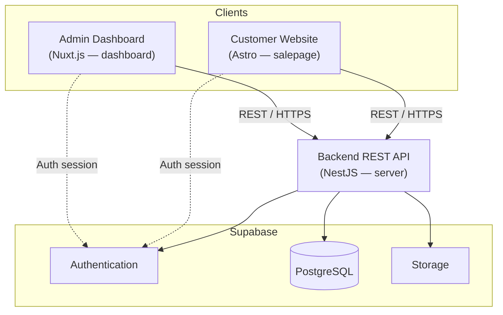

# System Architecture

## Components

- **Customer Website (Astro)** — public storefront; browse, cart, checkout.
- **Admin Dashboard (Nuxt.js)** — staff management UI.
- **Backend API (NestJS)** — REST API; business logic; single integration point to Supabase.
- **Supabase**
  - **Authentication** — customer & admin sessions.
  - **PostgreSQL** — products, orders, customers.
  - **Storage** — product images/media.

## Data Flow

1. A client (customer or admin) calls the NestJS API over HTTPS.
2. The API authorizes via Supabase Auth, reads/writes PostgreSQL, and stores media in Storage.
3. Responses return to the client as JSON.
