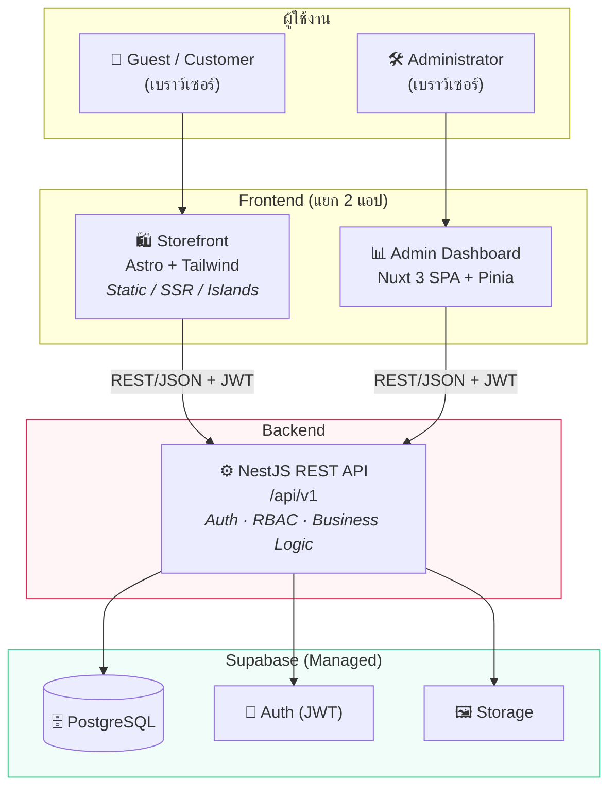
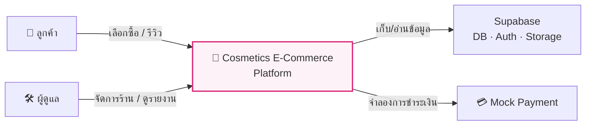
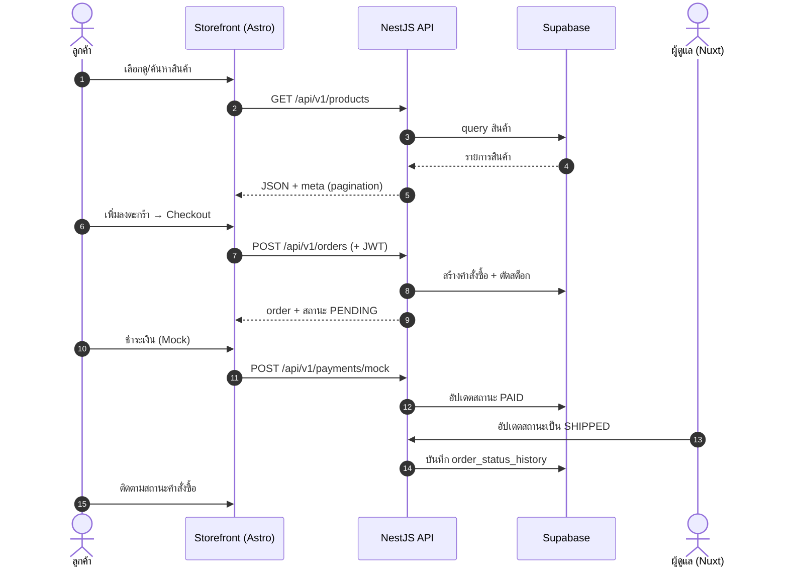

<!-- หน้านี้คือ Landing Page ของ Documentation เผยแพร่ผ่าน GitHub Pages (source: /docs) -->

<div align="center">

# 🌸 Cosmetics E-Commerce Platform

### แพลตฟอร์มอีคอมเมิร์ซสำหรับร้านจำหน่ายน้ำหอม (Perfume)

*ออกแบบและพัฒนาตามมาตรฐาน Production-Ready — Clean Architecture · Security by Design · SEO-First*

[](#-technology-stack)
[](#-technology-stack)
[](#-technology-stack)
[](#-technology-stack)
[](#-สารบัญเอกสาร-documentation-navigation)

</div>

---

## ภาพรวมของโครงการ (Project Overview)

**Cosmetics E-Commerce Platform** คือระบบร้านค้าออนไลน์สำหรับจำหน่าย **น้ำหอม (Perfume)** ที่ออกแบบให้ใกล้เคียงกับระบบใช้งานจริงในเชิงพาณิชย์มากที่สุด แม้จะเป็นโครงการในรายวิชา แต่ทุกการตัดสินใจเชิงสถาปัตยกรรมยึดตามหลักวิศวกรรมซอฟต์แวร์สมัยใหม่ ทั้ง **Scalability, Maintainability, Security และ Future Extensibility**

ระบบแยกออกเป็น **3 Repository อิสระ** ที่รับผิดชอบคนละหน้าที่อย่างชัดเจน สื่อสารกันผ่าน REST API เพียงช่องทางเดียว ทำให้แต่ละส่วนพัฒนา ทดสอบ และ deploy ได้แยกกันโดยไม่กระทบกัน

> **หลักการสำคัญ:** มีเพียง **Backend API (NestJS)** เท่านั้นที่เชื่อมต่อกับ Supabase โดยตรง — ฝั่ง Frontend ทั้งสอง (Storefront และ Admin) จะไม่แตะฐานข้อมูลเอง แต่เรียกผ่าน API เท่านั้น เพื่อรวมศูนย์ Business Logic และความปลอดภัยไว้ที่จุดเดียว

---

## แนะนำผลิตภัณฑ์และธุรกิจ (Business Overview)

ร้านจำหน่ายน้ำหอมออนไลน์ที่รองรับผู้ใช้งาน **3 กลุ่มหลัก** ได้แก่ ลูกค้าทั่วไป (Guest), สมาชิก (Member) และผู้ดูแลระบบ (Administrator)

- **ฝั่งลูกค้า** สามารถเลือกดูสินค้า ค้นหา ดูรายละเอียด เพิ่มลงตะกร้า สั่งซื้อ ชำระเงิน (จำลอง) ติดตามสถานะคำสั่งซื้อ เขียนรีวิว และบันทึกสินค้าที่ชอบไว้ใน Wishlist
- **ฝั่งผู้ดูแล** จัดการสินค้า แบรนด์ หมวดหมู่ สต็อก คำสั่งซื้อ ลูกค้า แบนเนอร์ คูปอง พร้อมดู Dashboard และออกรายงานยอดขาย

โมเดลธุรกิจเป็นแบบ **B2C Retail** เน้นประสบการณ์การเลือกซื้อน้ำหอมที่ต้อง "ให้ข้อมูลกลิ่นและอารมณ์แบรนด์" ได้ดี จึงให้ความสำคัญกับหน้าสินค้าที่โหลดเร็วและ SEO สูงเป็นพิเศษ

---

## ปัญหาที่ระบบต้องการแก้ไข (Problem Statement)

| ปัญหา | ผลกระทบ | แนวทางที่ระบบแก้ |
|---|---|---|
| ร้านน้ำหอมรายเล็กไม่มีหน้าร้านออนไลน์ที่ค้นเจอใน Google | เสียโอกาสการขายให้แพลตฟอร์มใหญ่ | Storefront แบบ Static/SSR เน้น SEO และความเร็ว |
| ลูกค้าเลือกน้ำหอมออนไลน์ยากเพราะดมกลิ่นไม่ได้ | อัตรา conversion ต่ำ ตีกลับสินค้าสูง | หน้า Product Detail ข้อมูลกลิ่น/โน้ต + รีวิวจากผู้ซื้อจริง |
| การจัดการสต็อกและคำสั่งซื้อด้วยมือเกิดข้อผิดพลาด | ขายเกินสต็อก ส่งผิด | ระบบ Inventory + Order พร้อมบันทึกการเคลื่อนไหวสต็อก |
| ขาดข้อมูลเชิงธุรกิจในการตัดสินใจ | สั่งของผิด วางแผนการตลาดไม่ได้ | Dashboard + Sales Report สำหรับผู้ดูแล |

---

## วัตถุประสงค์ของโครงการ (Project Objectives)

1. ออกแบบและพัฒนาระบบอีคอมเมิร์ซแบบ **end-to-end** ครอบคลุมตั้งแต่ Business Analysis จนถึง Deployment
2. ใช้สถาปัตยกรรมแบบ **แยกความรับผิดชอบ (Separation of Concerns)** ผ่าน 3 repository อิสระ
3. ประยุกต์ใช้หลัก **Clean Architecture, SOLID และ Security by Design** ในระดับที่เหมาะสมกับขนาดโครงการ
4. สร้างประสบการณ์ผู้ใช้ที่ **เร็ว, SEO ดี, Responsive และ Accessible (WCAG 2.1 AA)**
5. จัดทำ **เอกสารระดับมืออาชีพ** ที่ใช้เป็นทั้งงานส่งอาจารย์และ Portfolio ได้

---

## ✨ คุณสมบัติหลักของระบบ (Key Features)

<table>
<tr>
<td width="50%" valign="top">

**🛍️ สำหรับลูกค้า (Customer)**
- เลือกดูและค้นหาสินค้า พร้อมตัวกรอง/จัดเรียง
- หน้ารายละเอียดสินค้า + รีวิว
- ตะกร้าสินค้า & Wishlist
- สั่งซื้อ + ชำระเงิน (Mock Payment)
- ติดตามสถานะคำสั่งซื้อ
- โปรไฟล์และประวัติการสั่งซื้อ

</td>
<td width="50%" valign="top">

**🛠️ สำหรับผู้ดูแล (Admin)**
- จัดการสินค้า / แบรนด์ / หมวดหมู่
- จัดการสต็อก (Inventory)
- จัดการคำสั่งซื้อและลูกค้า
- จัดการแบนเนอร์ & คูปอง
- Dashboard ภาพรวมธุรกิจ
- รายงานยอดขาย (Sales Report)

</td>
</tr>
</table>

---

## 👥 กลุ่มผู้ใช้งาน (Target Users)

| บทบาท | สิทธิ์การเข้าถึง | คำอธิบาย |
|---|---|---|
| **Guest** | อ่านอย่างเดียว (สินค้า/รีวิว) + ตะกร้าชั่วคราว | ผู้เยี่ยมชมที่ยังไม่ล็อกอิน |
| **Customer (Member)** | สั่งซื้อ, รีวิว, wishlist, จัดการโปรไฟล์ | สมาชิกที่ลงทะเบียนแล้ว |
| **Administrator** | จัดการทั้งระบบ + รายงาน | ทีมงานร้าน |

รายละเอียด Permission Matrix แบบเต็มดูได้ที่ [เอกสาร System Analysis](./02-system-analysis.md)

---

## 🧰 Technology Stack

| ชั้น | เทคโนโลยี | เหตุผลโดยย่อ |
|---|---|---|
| **Backend API** | NestJS · TypeScript | โครงสร้าง modular, DI, guards/interceptors พร้อมใช้ |
| **Storefront** | Astro · TypeScript · Tailwind CSS | Static/SSR เพื่อ SEO และความเร็ว, Islands สำหรับส่วน interactive |
| **Admin Dashboard** | Nuxt 3 (Vue 3) · TypeScript · Tailwind · Pinia | SPA หลัง auth เหมาะกับหน้าจัดการข้อมูลหนัก ๆ |
| **Database / Auth / Storage** | Supabase (PostgreSQL, Auth JWT, Storage) | Managed backend ลดงาน infra, JWT + Storage ครบในตัว |
| **Docs** | Markdown + Mermaid (GitHub Pages) | Docs-as-code, diagram แสดงผลได้โดยไม่ต้องใช้รูปภายนอก |

---

## 📦 โครงสร้าง Repository (Repository Structure)

```text
Cosmetics E-Commerce Platform
├── cosmeticsecommerce-server     # Backend REST API (NestJS + Supabase)  → แหล่ง Business Logic เดียว
├── cosmeticsecommerce-salepage   # Customer Website (Astro)  → repo นี้ + เอกสารใน /docs
└── cosmeticsecommerce-dashboard  # Admin Dashboard (Nuxt 3)
```

| Repository | หน้าที่ | Stack | Deploy |
|---|---|---|---|
| [`cosmeticsecommerce-server`](https://github.com/mangguy/cosmeticsecommerce-server) | Backend REST API `/api/v1` | NestJS + Supabase | Docker → Render/Railway |
| [`cosmeticsecommerce-salepage`](https://github.com/mangguy/cosmeticsecommerce-salepage) | เว็บไซต์ลูกค้า + เอกสาร | Astro + Tailwind | Vercel + GitHub Pages |
| [`cosmeticsecommerce-dashboard`](https://github.com/mangguy/cosmeticsecommerce-dashboard) | แดชบอร์ดผู้ดูแล | Nuxt 3 + Pinia | Vercel / Netlify |

---

## 🏗️ System Architecture

สถาปัตยกรรมแบบ **แยก 3 บริการ** โดย Frontend ทั้งสองสื่อสารกับระบบผ่าน **NestJS API เท่านั้น** ส่วน API เป็นตัวกลางเดียวที่คุยกับ Supabase



**เหตุผลของการแยก 3 repo:** แต่ละส่วนมี lifecycle การพัฒนา, ทีม และ deployment ที่ต่างกัน — Storefront เน้น SEO/ความเร็ว, Admin เน้นความหนาแน่นของข้อมูล, API เน้นความถูกต้องของ Business Logic การแยก repo ทำให้ deploy และปรับสเกลอิสระได้ (เปรียบเทียบทางเลือก monorepo และ trade-offs อยู่ใน [System Architecture](./03-system-architecture.md) และ [ADR-001](./10-documentation-plan.md))

---

## 🔭 High-Level Architecture Diagram (System Context)



---

## 🔄 Project Workflow

กระบวนการหลักตั้งแต่ลูกค้าเลือกสินค้าจนถึงผู้ดูแลจัดส่ง



---

## 🗺️ Development Roadmap

โครงการแบ่งเป็น **13 Workshops** ตั้งแต่วางรากฐานจนถึง Production Release รายละเอียดเต็มพร้อม Acceptance Criteria อยู่ใน [เอกสาร Roadmap](./11-roadmap.md)

```mermaid
gantt
    title Development Roadmap (ภาพรวม)
    dateFormat  X
    axisFormat %s
    section รากฐาน
    W1 Setup & Docs (เสร็จแล้ว)     :done, w1, 0, 1
    W2 Database & Supabase          :w2, after w1, 1
    section Backend API
    W3 NestJS Core (Auth/Guards)    :w3, after w2, 1
    W4 Catalog API                  :w4, after w3, 1
    W5 Cart/Wishlist/Reviews        :w5, after w4, 1
    W6 Orders + Mock Payment        :w6, after w5, 1
    W7 Admin APIs + Reports         :w7, after w6, 1
    section Frontend
    W8 Astro Storefront Core        :w8, after w7, 1
    W9 Cart/Checkout/Profile        :w9, after w8, 1
    W10 Nuxt Admin Dashboard        :w10, after w9, 1
    section ปิดโครงการ
    W11 Security + Testing          :w11, after w10, 1
    W12 CI/CD + Deployment          :w12, after w11, 1
    W13 Polish + UAT + Release      :w13, after w12, 1
```



---

## 📚 สารบัญเอกสาร (Documentation Navigation)

เอกสารสถาปัตยกรรมฉบับเต็ม จัดเรียงตามลำดับ Phase

| # | เอกสาร | เนื้อหา |
|---|---|---|
| 1 | [Business Analysis](./01-business-analysis.md) | โมเดลธุรกิจ, personas, customer journey, KPIs |
| 2 | [System Analysis](./02-system-analysis.md) | Requirements, Permission Matrix, User Stories, Use Cases, Business Rules |
| 3 | [System Architecture](./03-system-architecture.md) | C4 diagrams, deployment, auth/authorization flow |
| 4 | [Database Design](./04-database-design.md) | ER diagram, ตาราง, index, audit & soft-delete |
| 5 | [Backend Design](./05-backend-design.md) | โครงสร้าง NestJS + REST API ฉบับเต็ม |
| 6 | [Frontend Design](./06-frontend-design.md) | Astro storefront + Nuxt admin |
| 7 | [UI/UX Design](./07-uiux-design.md) | Sitemap, wireframes, design system, accessibility |
| 8 | [Security Design](./08-security-design.md) | JWT, RBAC, OWASP Top 10, security headers |
| 9 | [DevOps & Deployment](./09-devops-deployment.md) | Environments, CI/CD, monitoring, backup/DR |
| 10 | [Documentation Plan](./10-documentation-plan.md) | PRD/BRD/SRS, ADR template + ADR-001 |
| 11 | [Development Roadmap](./11-roadmap.md) | 13 Workshops พร้อม Acceptance Criteria |

**ลิงก์ด่วนตามที่อาจารย์ขอ:**
📄 [PRD](./10-documentation-plan.md) · 🏗️ [Architecture](./03-system-architecture.md) · 🗄️ [Database Design](./04-database-design.md) · 🔌 [API Documentation](./05-backend-design.md) · 🎓 [Workshops](./11-roadmap.md)

<details>
<summary>เอกสารเวอร์ชันเดิม (Legacy — ถูกแทนที่ด้วยเอกสาร Phase ด้านบนแล้ว)</summary>

[Analysis](./analysis.md) · [Design](./design.md) · [PRD (เดิม)](./prd.md) · [Architecture (เดิม)](./architecture.md)

</details>

---

<div align="center">

### 🌸 Cosmetics E-Commerce Platform

ระบบอีคอมเมิร์ซร้านน้ำหอม · ออกแบบตามมาตรฐาน Production-Ready

*University Project — จัดทำเป็นเอกสารระดับมืออาชีพเพื่อการนำเสนอและใช้เป็น Portfolio*

Backend: NestJS · Storefront: Astro · Admin: Nuxt 3 · Data: Supabase

<sub>เอกสารทั้งหมดเขียนแบบ Docs-as-Code (Markdown + Mermaid) เผยแพร่ผ่าน GitHub Pages</sub>

</div>
